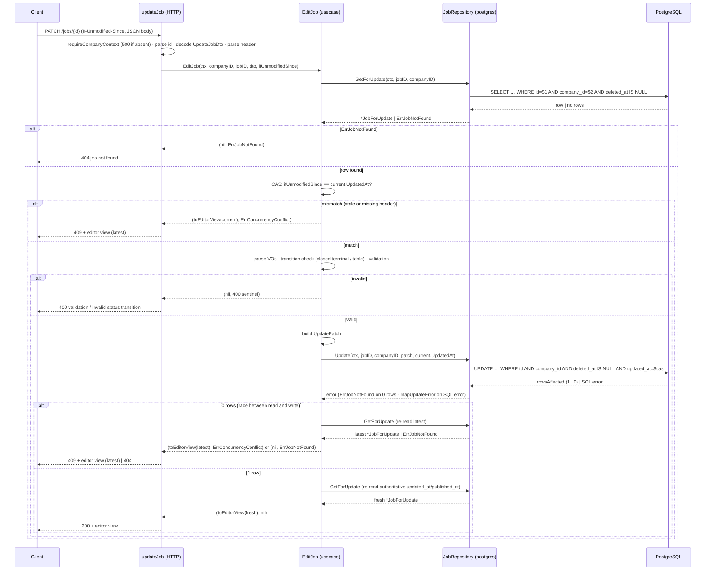

# Design: `jobs-write-side`

Status: design. Grounded by `openspec/changes/jobs-write-side/proposal.md`, `exploration.md`, and the delta spec `openspec/changes/jobs-write-side/specs/jobs/spec.md`. The delta spec is authoritative for observable behavior; this document turns that behavior into component-level architecture. Locked business decisions (PATCH partial, any-recruiter gate, closed terminal, CAS via `If-Unmodified-Since` RFC 3339, same-company 404, editor DTO as a separate type, no migration, no POST) are **not** re-opened here.

---

## 1. Context and scope

The `jobs` slice is read-only today (`GET /jobs`, `GET /jobs/{id}`), backed by two visibility-narrowed sqlc queries (`SearchJobs`, `GetJobByID`) that only surface `status='published' AND deleted_at IS NULL AND company.status='active'`. This change adds the first write endpoint, `PATCH /jobs/{id}`, with a company-scoped, non-visibility-narrowed read-for-write query (`GetJobForUpdate`), a conditional CAS `UPDATE` (`UpdateJob`), a use case (`EditJob`), repository port methods, DTOs, and a gated route in `main.go`.

Reference slice: `companies` (hexagonal vertical slice). All new code follows its patterns (`MemberHandlers()` accessor, same-company guard in SQL, `:execrows` 0-rows → `Err*NotFound`, `map*Error` SQLSTATE mapping, flat `classify*Error` HTTP dispatch).

**No migration.** The `jobs` table already carries every column the write path needs. Any schema hardening (a `salary_min <= salary_max` CHECK, non-empty `title`/`description` CHECK) is explicitly **OUT of scope**; those two rules are enforced in the use case only.

---

## 2. Decisions at a glance

| # | Decision | Choice |
|---|---|---|
| D1 | `GetJobForUpdate` return shape | New narrow write projection `entities.JobForUpdate` (not the read `Job`). |
| D2 | `UpdatePatch` value type | Domain `repositories.UpdatePatch` with a generic tri-state `valueobjects.Optional[T]` for the nullable trio. |
| D3 | SQL design | `GetJobForUpdate :one` (company-scoped, non-visibility-narrowed); `UpdateJob :execrows` with `COALESCE`-based partial SET, flag-based nullable SET, atomic `published_at` via `COALESCE(published_at, now())`, CAS in `WHERE updated_at = $cas`. |
| D4 | `mapUpdateError` / 0-rows | `23514` → `ErrInvalidStatusTransition` (defense-in-depth); 0-rows → `ErrJobNotFound` in the adapter, re-interpreted as `ErrConcurrencyConflict` by the use case (which already read the row). |
| D5 | Use case flow | `GetJobForUpdate → CAS compare → VO parse → transition check → validation → build patch → Update → re-read → editor view`. |
| D6 | HTTP layer | `JobHandlers()` accessor mirroring `MemberHandlers()`; `updateJob` reads `CompanyContext` fail-closed 500; `classifyError` extended. |
| D7 | DTOs | `UpdateJobDto` (body, raw + tri-state nullable, no `company_id`/`updated_at`); `JobEditorViewDto` embeds `company{id,name}` and carries `status` + `updated_at` (RFC 3339). |
| D8 | `main.go` wiring | Split public mount; add `r.With(requireAuth, requireRecruiter).Patch("/jobs/{id}", …)`; hoist `requireRecruiter`/`requireAuth`. |
| D9 | Status-only PATCH | Works with zero field changes; returns the editor view. |
| D10 | Tests | RED-first unit tests (VO parse, transition table, CAS compare, use case steps, adapter helpers, handler) + build-tagged integration tests for the SQL. |

---

## 3. Domain layer

### 3.1 Write projection entity — `entities.JobForUpdate` (D1)

The read `Job` entity is a **pure read model**: it has no `UpdatedAt`, and its `Company` is populated from a `companies` JOIN. Reusing it for the write path would (a) leave `UpdatedAt` unpopulated on the read path, (b) carry the search-only `Rank` field into a write flow that never uses it, and (c) blur the visibility contract.

We therefore introduce a **separate, narrow write projection** in the domain entities package. It carries exactly what `EditJob` needs: the current `status` and `updated_at` (for the CAS compare and transition table), the editable columns (to validate against the current row and to project the editor view), `published_at` (for the editor view + transition side effects), and `company{id,name}` (for the embedded editor-view company).

```go
// JobForUpdate is the narrow write projection returned by
// JobRepository.GetForUpdate. It is deliberately NOT the read `Job`
// entity: it is company-scoped and non-visibility-narrowed, carries
// UpdatedAt for the CAS precondition, and has no search Rank.
type JobForUpdate struct {
    ID             uuid.UUID
    Title          string
    Description    string
    WorkMode       valueobjects.WorkMode
    EmploymentType valueobjects.EmploymentType
    Seniority      valueobjects.Seniority
    JobStatus      valueobjects.JobStatus
    Location       *string
    SalaryMin      *int
    SalaryMax      *int
    SalaryCurrency valueobjects.SalaryCurrency
    PublishedAt    *time.Time
    UpdatedAt      time.Time
    Company        CompanyRef // {ID, Name}
}
```

- **Rationale**: minimal change consistent with hexagonal layout — no factory, no pollution of the read model; the adapter maps the sqlc row into it (same as `toEntity` today).
- **Alternative considered**: extend `Job` with `CompanyID` + `UpdatedAt`. Rejected: `UpdatedAt` would be zero on the read path and the write projection would inherit `Rank` and the JOIN shape for a purpose it does not serve.

### 3.2 New sentinels — `entities`

```go
var ErrConcurrencyConflict  = errors.New("concurrency conflict")          // CAS mismatch → 409
var ErrInvalidStatusTransition = errors.New("invalid status transition") // illegal transition / terminal row → 400

var ErrEmptyTitle          = errors.New("title must not be empty")          // 400 validation
var ErrEmptyDescription    = errors.New("description must not be empty")    // 400 validation
var ErrInvalidSalaryRange  = errors.New("salary_min must be <= salary_max") // 400 validation
```

- `ErrConcurrencyConflict` and `ErrInvalidStatusTransition` are pinned by the proposal.
- The three field-validation sentinels are a **refinement** of the proposal's "validation errors stay use-case-level (no sentinel)" note. The HTTP layer uses a flat `errors.Is` dispatch (the `classifyMemberError` pattern), which requires distinguishable sentinels to map 400 vs 500 *and* to name the failing field (spec "error message naming the failing field"). Without sentinels the dispatcher cannot tell a validation error from a 500. These stay in the domain (not the repository), consistent with `ErrJobNotFound`.

### 3.3 Tri-state presence type — `valueobjects.Optional[T]` (D2)

The spec requires distinguishing **absent** from **explicit JSON `null`** for exactly three nullable fields (`location`, `salary_min`, `salary_max`). A plain `*string`/`*int` cannot express that (both absent and null decode to `nil`). We add a small generic tri-state type in `domain/valueobjects` (used by both the input DTO and the repository patch):

```go
// Optional is a tri-state presence for a PATCH field:
//   - Absent:  Set == false (key missing from the JSON body)
//   - Null:    Set == true && Valid == false (key present as JSON null)
//   - Value:   Set == true && Valid == true
type Optional[T any] struct {
    Set   bool
    Valid bool
    Value T
}

func (o *Optional[T]) UnmarshalJSON(data []byte) error {
    o.Set = true
    if bytes.Equal(bytes.TrimSpace(data), []byte("null")) {
        o.Valid = false
        return nil
    }
    var v T
    if err := json.Unmarshal(data, &v); err != nil {
        return err
    }
    o.Valid = true
    o.Value = v
    return nil
}
```

- **Why `valueobjects`**: the type must be usable from `application/dtos` (input) and `domain/repositories` (patch) without inverting the dependency (`domain` must not import `application`). `valueobjects` is already imported by both, and the codebase already uses generics (`optEnum`).
- **Alternative considered**: `**string` / `**int` double pointers, or `Set` boolean pairs. Rejected as harder to read and more error-prone than one small generic type.

### 3.4 Repository port — `repositories.JobRepository` (D2)

```go
// UpdatePatch is the column patch built by the use case. Pointers mean
// "present, set this value" (nil = absent); the three nullable fields use
// Optional[T] to express clear-to-null. Status is a pointer: nil = leave
// the status column untouched.
type UpdatePatch struct {
    Title          *string
    Description    *string
    WorkMode       *valueobjects.WorkMode
    EmploymentType *valueobjects.EmploymentType
    Seniority      *valueobjects.Seniority
    SalaryCurrency *valueobjects.SalaryCurrency
    Location       valueobjects.Optional[string]
    SalaryMin      valueobjects.Optional[int]
    SalaryMax      valueobjects.Optional[int]
    Status         *valueobjects.JobStatus
}

type JobRepository interface {
    Search(ctx context.Context, p SearchParams) ([]entities.Job, error)
    GetByID(ctx context.Context, id uuid.UUID) (*entities.Job, error)

    // GetForUpdate is the non-visibility-narrowed, company-scoped read used
    // ONLY by the gated write path. 0 rows (non-existent, cross-company,
    // soft-deleted) → entities.ErrJobNotFound.
    GetForUpdate(ctx context.Context, id, companyID uuid.UUID) (*entities.JobForUpdate, error)

    // Update applies the patch atomically, guarded by (id, company_id,
    // deleted_at IS NULL) and CAS `updated_at = casUpdatedAt`.
    // 0 rows → entities.ErrJobNotFound (the adapter is dumb); the use case
    // re-interprets that as ErrConcurrencyConflict because it already read
    // the row via GetForUpdate.
    Update(ctx context.Context, id, companyID uuid.UUID, patch UpdatePatch, casUpdatedAt time.Time) error
}
```

The existing `Search`/`GetByID` methods are unchanged.

---

## 4. Application layer

### 4.1 Input DTO — `dtos.UpdateJobDto` (D7)

The handler decodes the request body **directly into this DTO** (no separate raw request struct). Unknown JSON keys (`id`, `company_id`, `created_at`, `published_at`, `search_vector`, `deleted_at`, `updated_at`) are silently dropped by `encoding/json`, which is exactly the "immutable/ignored fields" behavior the spec pins.

```go
type UpdateJobDto struct {
    Title          *string                      `json:"title"`
    Description    *string                      `json:"description"`
    WorkMode       *string                      `json:"work_mode"`
    EmploymentType *string                      `json:"employment_type"`
    Seniority      *string                      `json:"seniority"`
    Location       valueobjects.Optional[string] `json:"location"`
    SalaryMin      valueobjects.Optional[int]    `json:"salary_min"`
    SalaryMax      valueobjects.Optional[int]    `json:"salary_max"`
    SalaryCurrency *string                      `json:"salary_currency"`
    Status         *string                      `json:"status"`
}
```

- `company_id` and `updated_at` are intentionally **absent** from the struct: `company_id` comes from `CompanyContext`, `updated_at` comes from the `If-Unmodified-Since` header.
- Non-nullable fields (`title`, `description`, the four closed-set VOs, `status`) use `*string`: `null` and absent both decode to `nil` → treated as "not provided". The spec only requires null-vs-absent discrimination for the three nullable fields; treating `null` for a non-nullable field as "untouched" is acceptable and not contradicted by the spec.
- `Optional[string]`/`Optional[int]` for the nullable trio gives the required tri-state decoding.

### 4.2 Editor view DTO — `dtos.JobEditorViewDto` (D7)

```go
type JobEditorViewDto struct {
    ID             string     `json:"id"`
    Title          string     `json:"title"`
    Description    string     `json:"description"`
    WorkMode       string     `json:"work_mode"`
    EmploymentType string     `json:"employment_type"`
    Seniority      string     `json:"seniority"`
    Location       *string    `json:"location,omitempty"`
    SalaryMin      *int       `json:"salary_min,omitempty"`
    SalaryMax      *int       `json:"salary_max,omitempty"`
    SalaryCurrency string     `json:"salary_currency"`
    PublishedAt    *time.Time `json:"published_at,omitempty"`
    Status         string     `json:"status"`
    UpdatedAt      time.Time  `json:"updated_at"`
    Company        CompanyDto `json:"company"`
}
```

- **Embeds `company{id,name}`** (reuses `CompanyDto` from `searchJobsDto.go`). The spec pins the editor view as "the fields the public read item carries" plus `status` and `updated_at`; the public read item (`SearchJobsItem`) carries `company{id,name}` and `published_at`, so the editor view keeps both. This also lets the editor UI render company context without a second fetch and keeps the `409` body a true superset of the read item.
- **`updated_at` wire format is RFC 3339** with full precision. `time.Time` marshals via Go's default RFC 3339Nano, which round-trips the DB `TIMESTAMPTZ` value exactly (Postgres `now()` is microsecond precision, ≤6 fractional digits). This round-trip is what makes the CAS token survive `client → parse → server compare`; a whole-second format would drop precision and cause spurious 409s.
- `SearchJobsItem` is **not** modified; the editor view is a separate DTO (spec requirement).

### 4.3 Use case — `usecases.EditJob` (D5, D9)

```go
func (s *JobService) EditJob(
    ctx context.Context,
    companyID, jobID uuid.UUID,
    in dtos.UpdateJobDto,
    ifUnmodifiedSince time.Time,
) (*dtos.JobEditorViewDto, error)
```

Return contract: on success and on `ErrConcurrencyConflict` the view is non-nil; on any other error the view is nil.

Exact step order (see sequence diagram §7):

1. **Read for update** — `repo.GetForUpdate(ctx, jobID, companyID)`.
   - `ErrJobNotFound` → return `(nil, ErrJobNotFound)` (404; covers cross-company / soft-deleted / non-existent).
   - other error → propagate (500).
2. **CAS compare** — `if !ifUnmodifiedSince.Equal(current.UpdatedAt)` → return `(toEditorView(current), entities.ErrConcurrencyConflict)` (409). A missing/malformed header is parsed to `time.Time{}` by the handler, which never equals a real `UpdatedAt`, so this same branch yields the spec's "missing header → 409".
3. **VO parse** — parse `status` (if present) and the four closed-set fields (if present) via `valueobjects.Parse*`. Unknown value → return the VO sentinel (`ErrInvalidJobStatus`, `ErrInvalidWorkMode`, …) → 400 validation.
4. **Transition check** — first, `if current.JobStatus == valueobjects.Closed` → return `ErrInvalidStatusTransition` (closed is terminal **and immutable**; the spec's "closed is terminal" scenario rejects *any* body on a closed row, including a field-only edit with no `status`). Otherwise, if a new status is present and `!isTransitionAllowed(current.JobStatus, newStatus)` → `ErrInvalidStatusTransition`.
5. **Validation** — `title`/`description`, when present, must be non-empty after trim (`ErrEmptyTitle` / `ErrEmptyDescription`); `salary_min`/`salary_max`, when **both present and non-null**, must satisfy `min <= max` (`ErrInvalidSalaryRange`).
6. **Build patch** — fold the parsed values into `repositories.UpdatePatch` (store trimmed `title`/`description`).
7. **Update** — `repo.Update(ctx, jobID, companyID, patch, current.UpdatedAt)`.
   - `ErrJobNotFound` → the row changed/disappeared between read and write. Re-read `GetForUpdate`:
     - re-read succeeds → return `(toEditorView(latest), ErrConcurrencyConflict)` (409).
     - re-read `ErrJobNotFound` → return `(nil, ErrJobNotFound)` (404; the row is gone).
   - `ErrInvalidStatusTransition` (from the DB CHECK, defense-in-depth) → propagate (400).
   - other error → propagate (500).
8. **Re-read and project** — `repo.GetForUpdate` again to obtain the authoritative post-update `updated_at`/`status`/`published_at` (the DB `now()`), then return `(toEditorView(fresh), nil)` (200).

Transition table (pure helper in the use case, unit-tested):

```go
func isTransitionAllowed(from, to valueobjects.JobStatus) bool {
    switch from {
    case valueobjects.Draft:     return to == valueobjects.Draft || to == valueobjects.Published
    case valueobjects.Published: return to == valueobjects.Published || to == valueobjects.Closed
    case valueobjects.Closed:    return false // terminal
    default:                     return false
    }
}
```

**Absent vs null vs invalid, per field** (resolves D5):

| Field | Absent (key missing) | Null (`"field":null`) | Invalid value |
|---|---|---|---|
| `title` / `description` | untouched | treated as absent (untouched) | empty-after-trim → `ErrEmptyTitle`/`ErrEmptyDescription` |
| `work_mode` / `employment_type` / `seniority` / `salary_currency` | untouched | treated as absent | unknown → VO sentinel → 400 |
| `status` | untouched (no transition check, except terminal) | treated as absent | unknown → `ErrInvalidJobStatus`; known-but-illegal → `ErrInvalidStatusTransition` |
| `location` / `salary_min` / `salary_max` | untouched | clear to `NULL` | (N/A for `location`; wrong JSON type → 400 invalid JSON body) |

---

## 5. Persistence (sqlc)

### 5.1 `GetJobForUpdate :one` (D3)

Non-visibility-narrowed, company-scoped, soft-delete-excluded. Joined to `companies` **only** for `name` (the editor view embeds `company{id,name}`). No `status='published'`, no `c.status='active'` (the write path must see drafts/closed and non-active companies).

```sql
-- name: GetJobForUpdate :one
SELECT
    j.id,
    j.title,
    j.description,
    j.location,
    j.work_mode,
    j.employment_type,
    j.seniority,
    j.salary_min,
    j.salary_max,
    j.salary_currency,
    j.status,
    j.published_at,
    j.updated_at,
    j.company_id,
    c.name AS company_name
FROM jobs j
JOIN companies c ON c.id = j.company_id
WHERE j.id = $1
  AND j.company_id = $2
  AND j.deleted_at IS NULL;
```

### 5.2 `UpdateJob :execrows` (D3)

Partial `SET` via `COALESCE` for the non-nullable fields (they can never be null-cleared, so "not provided" = SQL NULL → `COALESCE(NULL, col) = col`), and via `CASE WHEN <flag>` for the three nullable fields (flag true + value NULL ⇒ clear; flag true + value ⇒ set; flag false ⇒ unchanged). Status is a single nullable param; `published_at` is set atomically in the same statement using `COALESCE(published_at, now())` so `draft → published` sets it once and `published → published`/`published → closed` preserve it.

```sql
-- name: UpdateJob :execrows
UPDATE jobs
SET
    title           = COALESCE(sqlc.narg('title')::text,           title),
    description     = COALESCE(sqlc.narg('description')::text,     description),
    work_mode       = COALESCE(sqlc.narg('work_mode')::text,       work_mode),
    employment_type = COALESCE(sqlc.narg('employment_type')::text, employment_type),
    seniority       = COALESCE(sqlc.narg('seniority')::text,       seniority),
    salary_currency = COALESCE(sqlc.narg('salary_currency')::text, salary_currency),
    location        = CASE WHEN sqlc.arg('set_location')::boolean
                           THEN sqlc.narg('location')::text
                           ELSE location END,
    salary_min      = CASE WHEN sqlc.arg('set_salary_min')::boolean
                           THEN sqlc.narg('salary_min')::int
                           ELSE salary_min END,
    salary_max      = CASE WHEN sqlc.arg('set_salary_max')::boolean
                           THEN sqlc.narg('salary_max')::int
                           ELSE salary_max END,
    status          = COALESCE(sqlc.narg('status')::text, status),
    published_at    = CASE WHEN sqlc.narg('status')::text = 'published'
                           THEN COALESCE(published_at, now())
                           ELSE published_at END,
    updated_at      = now()
WHERE id         = sqlc.arg('id')::uuid
  AND company_id = sqlc.arg('company_id')::uuid
  AND deleted_at IS NULL
  AND updated_at = sqlc.arg('cas_token')::timestamptz;
```

Key points:

- **CAS in the WHERE** (`updated_at = cas_token`) is the atomic race-free guard. This single statement is the write transaction's atomic unit: the compare and the mutate happen together, so a concurrent writer cannot slip in between (optimistic concurrency, no explicit `BEGIN`/`FOR UPDATE` needed).
- **`published_at` atomicity**: the spec's DB invariant is `CHECK (status <> 'published' OR published_at IS NOT NULL)`. Setting `published_at = COALESCE(published_at, now())` only when `status` becomes `'published'` keeps that invariant **and** preserves `published_at` on `published → published` (spec table side effect). Note the task's illustrative `CASE WHEN $status='published' THEN now() …` is deliberately refined to `COALESCE(published_at, now())` so `published → published` does not reset the timestamp (the spec pins "published_at preserved").
- **Never touched**: `search_vector` (Postgres STORED generated), `company_id`, `created_at`, `id`, `deleted_at`.
- `sqlc.narg('status')` appears twice; sqlc dedupes it to one placeholder (same as the existing `sqlc.narg('q')` in `SearchJobs`).
- The CAS token and status are **separate parameters** (no flag needed): `status` is a nullable text param (`pgtype.Text`, `Valid:false` = absent), `cas_token` is a required `timestamptz` param. A single nullable status param is sufficient because "status absent" is already expressed by `Valid:false`; a separate `set_status` flag would be redundant.

Generated `UpdateJobParams` (field order follows first appearance; the adapter fills named fields):

```go
type UpdateJobParams struct {
    Title          pgtype.Text
    Description    pgtype.Text
    WorkMode       pgtype.Text
    EmploymentType pgtype.Text
    Seniority      pgtype.Text
    SalaryCurrency pgtype.Text
    SetLocation    bool
    Location       pgtype.Text
    SetSalaryMin   bool
    SalaryMin      pgtype.Int4
    SetSalaryMax   bool
    SalaryMax      pgtype.Int4
    Status         pgtype.Text
    ID             uuid.UUID
    CompanyID      uuid.UUID
    CasToken       pgtype.Timestamptz
}
```

`backend/internal/db/jobs.sql.go` is regenerated via `sqlc generate` (never hand-edited).

---

## 6. Infrastructure

### 6.1 Postgres adapter — `postgres.JobRepository` (D4)

Adds `GetForUpdate` and `Update` to the existing adapter (which keeps the `*db.Queries` field; no new `pgxpool.Pool` dependency is needed since there is no explicit transaction):

```go
func (r *JobRepository) GetForUpdate(ctx context.Context, id, companyID uuid.UUID) (*entities.JobForUpdate, error) {
    row, err := r.queries.GetJobForUpdate(ctx, db.GetJobForUpdateParams{ID: id, CompanyID: companyID})
    if err != nil {
        if errors.Is(err, pgx.ErrNoRows) {
            return nil, entities.ErrJobNotFound
        }
        return nil, err
    }
    j, err := toJobForUpdateEntity(row)
    if err != nil {
        return nil, err
    }
    return &j, nil
}

func (r *JobRepository) Update(ctx context.Context, id, companyID uuid.UUID, patch repositories.UpdatePatch, casUpdatedAt time.Time) error {
    rows, err := r.queries.UpdateJob(ctx, buildUpdateJobParams(id, companyID, patch, casUpdatedAt))
    if err != nil {
        return mapUpdateError(err)
    }
    if rows == 0 {
        return entities.ErrJobNotFound
    }
    return nil
}
```

**0-rows vs 409 (D4)**: the adapter is intentionally dumb — `Update` returns `ErrJobNotFound` on 0 rows, matching the `UpdateMemberRole` convention. The use case has *already* read the row via `GetForUpdate` (so it knows the row exists in the caller's company); therefore a 0-row `Update` can only mean the row changed between read and write, and the use case re-interprets `ErrJobNotFound` as `ErrConcurrencyConflict` (re-reading to fetch the latest version for the 409 body). This is the simplest correct option: no re-read in the adapter, no second query to distinguish 404 from 409 inside `Update`.

**`mapUpdateError`**:

```go
func mapUpdateError(err error) error {
    if err == nil {
        return nil
    }
    var pgErr *pgconn.PgError
    if errors.As(err, &pgErr) {
        switch pgErr.Code {
        case "23514": // check_violation → the only realistic CHECK is the published_integrity guard
            return entities.ErrInvalidStatusTransition
        }
    }
    return err // 23503 (FK) not applicable here (no FK write); unknown → 500
}
```

- `23514` → `ErrInvalidStatusTransition` is **defense-in-depth**: the use case blocks illegal transitions, and the SQL `COALESCE(published_at, now())` already prevents the only CHECK that could trip, so this branch is unreachable via the designed flow (it guards future regressions).
- `23503` (FK) is not applicable — `UpdateJob` neither inserts nor reassigns `company_id`.
- Anything else passes through → 500.

`toJobForUpdateEntity` maps `db.GetJobForUpdateRow` → `entities.JobForUpdate` (parses VOs, maps `pgtype` optionals, `UpdatedAt` via a `pgTimestamptzToTime`-style helper). `buildUpdateJobParams` maps `repositories.UpdatePatch` → `db.UpdateJobParams` (described in §5.2).

### 6.2 HTTP handler — `jobHandler.go` (D6)

Mirror `MemberHandlers()`:

```go
type JobHandlers struct {
    ListJobs  http.HandlerFunc
    GetJob    http.HandlerFunc
    UpdateJob http.HandlerFunc
}

func (h *JobHandler) JobHandlers() JobHandlers {
    return JobHandlers{
        ListJobs:  http.HandlerFunc(h.listJobs),
        GetJob:    http.HandlerFunc(h.getJob),
        UpdateJob: http.HandlerFunc(h.updateJob),
    }
}
```

`updateJob`:

```go
func (h *JobHandler) updateJob(w http.ResponseWriter, r *http.Request) {
    cc, ok := requireCompanyContext(w, r) // fail-closed 500 if absent
    if !ok {
        return
    }
    id, err := uuid.Parse(chi.URLParam(r, "id"))
    if err != nil {
        httpjson.WriteError(w, http.StatusBadRequest, "invalid job id")
        return
    }
    var in dtos.UpdateJobDto
    if err := json.NewDecoder(r.Body).Decode(&in); err != nil {
        httpjson.WriteError(w, http.StatusBadRequest, "invalid JSON body")
        return
    }
    ifUnmodifiedSince := parseIfUnmodifiedSince(r.Header.Get("If-Unmodified-Since"))

    view, err := h.service.EditJob(r.Context(), cc.CompanyID, id, in, ifUnmodifiedSince)
    if err != nil {
        if errors.Is(err, entities.ErrConcurrencyConflict) {
            httpjson.WriteJSON(w, http.StatusConflict, view) // latest editor view
            return
        }
        h.classifyAndWriteError(w, r, err)
        return
    }
    httpjson.WriteJSON(w, http.StatusOK, view)
}
```

- `requireCompanyContext` is a new helper mirroring `memberHandler.go::requireCompanyContext`: reads `security.CompanyContextFromContext`, fail-closed `500 internal` on `ok=false` (a routing misconfiguration must be loud, not a misleading 401).
- `parseIfUnmodifiedSince` returns `time.Time{}` for absent or malformed header values (folded into the normal CAS-mismatch 409 path — a malformed token can never match, same outcome as stale).
- The 409 body is written directly from the returned `view` (the spec pins "same editor view shape as 200").

`classifyError` extends the flat dispatch:

```go
case errors.Is(err, entities.ErrJobNotFound):            return 404, "job not found"
case errors.Is(err, entities.ErrConcurrencyConflict):    return 409, "conflict"          // fallback; handler writes view first
case errors.Is(err, entities.ErrInvalidStatusTransition):return 400, "invalid status transition"
case errors.Is(err, entities.ErrEmptyTitle):             return 400, "title must not be empty"
case errors.Is(err, entities.ErrEmptyDescription):       return 400, "description must not be empty"
case errors.Is(err, entities.ErrInvalidSalaryRange):     return 400, "salary_min must be less than or equal to salary_max"
case errors.Is(err, valueobjects.ErrInvalidWorkMode):    return 400, "invalid work_mode"
case errors.Is(err, valueobjects.ErrInvalidEmploymentType): return 400, "invalid employment_type"
case errors.Is(err, valueobjects.ErrInvalidSeniority):   return 400, "invalid seniority"
case errors.Is(err, valueobjects.ErrInvalidSalaryCurrency): return 400, "invalid salary_currency"
case errors.Is(err, valueobjects.ErrInvalidJobStatus):   return 400, "invalid status"
default:                                                  return 500, "internal server error"
```

The `updateJob` handler special-cases `ErrConcurrencyConflict` **before** `classifyAndWriteError` so the 409 writes the editor view, not the generic `{"error":"conflict"}`.

### 6.3 Composition root — `cmd/api/main.go` (D8)

Current wiring keeps the public mount `r.Mount("/jobs", jobHandler.Routes())` (GETs only) and constructs `requireRecruiter`/`requireOwner` inside the `/me` route block. Changes:

1. **Hoist** `requireAuth` and `requireRecruiter` to `run()` scope (they are now needed by both `/me/*` and the jobs write route):

```go
requireAuth := identityhttp.RequireAuth(verifier)
requireRecruiter := identityhttp.RequireCompanyRole(identityUserRepo, memberRepo, valueobjects.RecruiterRole)
```

`identityUserRepo` and `memberRepo` are already wired earlier in `run()`; `requireRecruiter` is the same gate the `/me/company` subtree uses (owner passes because `MemberRole` is ordinal).

2. **Keep** the public mount unchanged, and **add** the gated write route on the root router (outside `/me`):

```go
r.Mount("/jobs", jobHandler.Routes()) // public GETs — unchanged

jobHandlers := jobHandler.JobHandlers()
r.With(requireAuth, requireRecruiter).Patch("/jobs/{id}", jobHandlers.UpdateJob)
```

3. Inside the `/me` block, drop the now-hoisted `requireRecruiter := …` line and reuse the hoisted `requireAuth` in `r.Use(requireAuth)` (functionally identical to today's inline `r.Use(identityhttp.RequireAuth(verifier))`). `requireOwner` stays local to `/me`.

- **No other route moves.** `GET /jobs` and `GET /jobs/{id}` stay public via `Routes()`. The write route is per-method mounted (`r.With(...).Patch(...)`), so a future refactor back to a single `chi.Mount("/jobs", …)` subrouter cannot silently expose it — the proposal's routing-split risk is mitigated by the accessor + explicit line here.
- The route shares `/jobs/{id}` with the public `GET /jobs/{id}`; chi routes by method, so `GET` hits the public mount and `PATCH` hits the gated route.

---

## 7. Sequence diagram — `EditJob` flow



---

## 8. Error taxonomy (HTTP)

| Outcome | Status | Body |
|---|---|---|
| `{id}` not a valid UUID | 400 | `{"error":"invalid job id"}` |
| Illegal transition / terminal row | 400 | `{"error":"invalid status transition"}` |
| Unknown VO / empty title/description / salary range | 400 | `{"error":"<field-naming message>"}` |
| No/invalid `Authorization` | 401 | (from `RequireAuth`) |
| Not a member / role too low | 403 | (from `RequireCompanyRole`) |
| Row not visible to the caller's company (cross-company / soft-deleted / non-existent) | 404 | `{"error":"job not found"}` |
| `If-Unmodified-Since` mismatch or missing | 409 | **editor view** of the latest row |
| Anything else | 500 | `{"error":"internal server error"}` |

The 404 is identical for cross-company and non-existent (same body shape) — the IDOR defense, mirroring `UpdateMemberRole`.

---

## 9. Tests plan (RED-first sketch for the tasks phase)

Strict TDD applies (`strict_tdd: true`): every production change is preceded by a failing test. Note that adding `GetForUpdate`/`Update` to the port **breaks compilation** of the existing `stubRepo` in `handler_test.go`; the stub gains the two methods as part of the first GREEN step (or the RED test is the compile error itself, which is acceptable under strict TDD as long as the new methods are then implemented).

1. **Unit — VO/tri-state** (`domain/valueobjects/optional_test.go`): `Optional.UnmarshalJSON` absent (`Set=false`) / null (`Set=true,Valid=false`) / value (`Set=true,Valid=true`) / wrong type → error.
2. **Unit — transition table** (`application/usecases/updateJob_test.go`): all 9 cells of `isTransitionAllowed` plus the terminal/immutable rule.
3. **Unit — CAS compare**: `ifUnmodifiedSince.Equal(updatedAt)` matching / stale / zero-token cases (RED-first before `EditJob`).
4. **Unit — use case steps** (`EditJob` with a stub repo): 404 propagation; CAS mismatch → 409 + view; closed-terminal → 400; illegal transition → 400; empty title/description → 400; salary range → 400; unknown VO → 400; null vs absent (location clear vs untouched); status-only PATCH → 200 + view; success → re-read + 200 view; `Update` returns `ErrJobNotFound` → re-read → 409.
5. **Unit — adapter helpers** (`infrastructure/postgres/jobRepository_test.go`): `buildUpdateJobParams` (absent vs null vs value → correct `pgtype` flags); `toJobForUpdateEntity` (VO parse, optional mapping, `UpdatedAt`); `mapUpdateError` (`23514` → `ErrInvalidStatusTransition`, unknown pass-through).
6. **Handler tests** (`infrastructure/http/…`): `httptest` + `chi.Mux`. A `newUpdateJobRouter` helper injects `CompanyContext` directly (mirroring `memberHandler_test.go`) for the business scenarios (cross-company 404, CAS 409 with view body, terminal 400, null vs absent, owner-passes is a middleware concern); a separate test mounts `RequireAuth` with a local deny verifier and asserts no-`Authorization` → 401; `RequireCompanyRole` gate scenarios reuse stubbed identity/member repos (mirroring the members slice stubs).
7. **Integration — SQL** (`infrastructure/postgres/jobRepository_integration_test.go`, `//go:build integration`): `GetJobForUpdate` (draft/closed visible, cross-company 404, soft-deleted 404, non-active-company visible); `UpdateJob` (partial update leaves absent fields intact, explicit null clears location/salary, CAS mismatch → 0 rows, draft→published sets `published_at`, published→published preserves it, published→closed keeps it, same-company guard).

---

## 10. Out of scope (explicit)

- **No migration** and **no schema hardening**: a `salary_min <= salary_max` CHECK and non-empty `title`/`description` CHECK are explicitly OUT of scope; both rules are enforced in the use case only.
- No `POST /jobs`, no re-open (`closed → {draft,published}`), no soft-delete endpoint, no events/notifications, no change to `GET /jobs` / `GET /jobs/{id}` / `SearchJobsItem`, no `search_vector` changes.

## 11. Risks and rollout

- **Routing split**: mitigated by the per-method `JobHandlers()` accessor + explicit `r.With(requireAuth, requireRecruiter).Patch(...)`; a handler test asserts no-`Authorization` → 401.
- **CAS precision**: `updated_at` must round-trip RFC 3339 (full precision). The editor view uses `time.Time` (RFC 3339Nano) and the handler parses the header with `time.Parse(time.RFC3339, …)`; whole-second truncation would cause spurious 409s.
- **Domain-only validation**: `salary_min <= salary_max` and non-empty title/description are not DB-enforced; a partial patch setting only `salary_min` can transiently produce `min > max` against the existing `salary_max` (the spec only pins the "both present" rule, so this slice does not add a stricter final-state check).
- **Rollback**: revert the merge commit — no migration, no schema change, no new package; reverting `main.go` removes the route and the read paths keep working.
