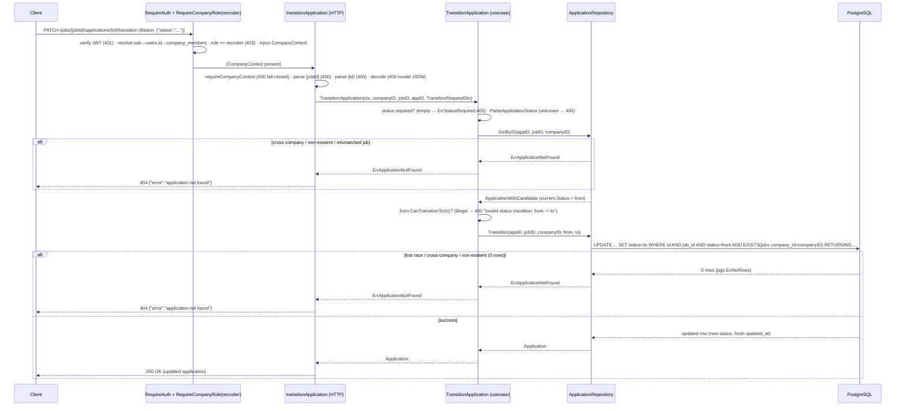

# Design: `applications` — Job Applications (candidate submit + recruiter pipeline)

Status: design. Grounded by `openspec/changes/applications/proposal.md` and the full spec `openspec/changes/applications/specs/applications/spec.md`. The spec is authoritative for observable behavior (26 requirements / 107 scenarios — the task's own count is correct; the spec agent's "27" was off by one, this document verifies 26/107). This document turns that behavior into component-level architecture.

Reference slice: `jobs-soft-delete` (archived at `openspec/changes/archive/2026-08-25-jobs-soft-delete/`) is the canonical reference for this design: the atomic active-company CTE gate, the `mapCreateError`/`mapUpdateError`/`mapSoftDeleteError` ordering discipline (`pgx.ErrNoRows` BEFORE `errors.As`), the per-method handler accessor (`JobHandlers`), the AST route guards in `main_test.go`, and the port-extension + stub-repair unit. `jobs-reopen` / `jobs-create` / `jobs-write-side` (archived) supplied the active-company guard and same-company invariant precedents this change inherits. The candidates slice supplies the identity resolution seam (`cognitoSub → users.id` via `identity.UserRepository.GetByCognitoSub`) and the `/me/*` handler pattern.

Locked decisions are **not** re-opened here:

- Full pipeline slice: `POST /jobs/{jobId}/applications` (apply), `GET /me/applications` (candidate), `GET /jobs/{jobId}/applications` (recruiter list), `GET /jobs/{jobId}/applications/{id}` (recruiter detail), `PATCH /jobs/{jobId}/applications/{id}/transition` (recruiter transition).
- Transition matrix: `submitted→in_review→{rejected,hired}`; `submitted→{rejected,hired}` → `400`; `rejected`/`hired` TERMINAL; NO CAS on transitions — `WHERE status = expected_status` guard, lost race → `ErrApplicationNotFound` → `404`.
- Apply eligibility: atomic `INSERT ... WHERE EXISTS (SELECT 1 FROM jobs JOIN companies WHERE jobs.status='published' AND jobs.deleted_at IS NULL AND companies.status='active') RETURNING id` — gate miss → `404 job not applicable`; `UNIQUE(job_id,candidate_id)` violation → `409 already applied` (`mapCreateError`: `pgx.ErrNoRows` BEFORE `23505`).
- Candidate identity from JWT `sub` → `users.id` (no IDOR). Rule #2 extends to the recruiter side (`CompanyContext.company_id` ownership; cross-company → `404`).
- `cv_s3_key` + `anonymized_at` NULL-only (no write path). `source` optional (NULL if absent). No withdraw. No per-stage timestamps. No `audit_events`. 100-row hard cap lists (no pagination).
- Recruiter detail joins `candidate_profiles` (left join): `professional_title` + `years_of_experience` ONLY (PII minimization — NOT salary/birth_date).
- Soft-deleted job applications remain visible AND transitionable to the owning recruiter; applying to a soft-deleted job → `404`.
- Jobs port NOT extended — cross-feature SQL in the applications adapter. Hexagonal layout `backend/internal/features/applications/`. Migration `00010`. UNIQUE plain.

---

## 1. Context and scope

The repo already ships the full jobs read + write surface (`jobs` feature: public read, gated PATCH/POST/DELETE with CAS + active-company gate + same-company invariant), the `company_members` slice (recruiter/owner roles), the candidates self-service `/me/profile` slice (IDOR-resistant `sub → users.id` resolution), and `RequireAuth` on the `/me/*` subtree. What is missing is the bounded context that ties a candidate to a job: the **application**. This slice delivers the first end-to-end, reviewable slice of that context.

The slice is deliberately minimal:

- **Schema**: migration `00010_create_applications.sql` materializes `docs/modelo-de-datos-proyecto-04.md` §3.8 verbatim (columns, CHECKs, UNIQUE, both B-tree indexes).
- **Candidate apply**: `POST /jobs/{jobId}/applications` behind `RequireAuth`, resolving `cognitoSub → users.id`, with the atomic SQL eligibility gate and `UNIQUE(job_id,candidate_id)` dedupe.
- **Candidate self-view**: `GET /me/applications` behind `RequireAuth` (mounted inside the existing `/me` subtree), listing the caller's applications with a thin `job` summary, NOT redacted by `jobs.deleted_at`.
- **Recruiter queue/detail/transition**: `GET /jobs/{jobId}/applications`, `GET /jobs/{jobId}/applications/{id}`, `PATCH /jobs/{jobId}/applications/{id}/transition` behind `RequireAuth` + `RequireCompanyRole(recruiter)`, scoped by `CompanyContext.company_id` in SQL (no existence leak).
- **Infrastructure**: a new `applications` vertical slice under `backend/internal/features/applications/` (domain / application / infrastructure), a new sqlc query file, and a new gated subtree mounted on the ROOT router.

**No change** to the jobs port, jobs service, jobs handler, the public `/jobs`/`/jobs/{id}` mount, the candidates profile shape, or the `identity.UserRepository` seam (reused, not extended). Cross-feature SQL (the apply gate and the recruiter-list/detail/transition joins) lives entirely inside the applications adapter.

---

## 2. Decisions at a glance

| # | Decision | Choice |
|---|---|---|
| D1 | `CreateApplication` SQL shape | `:one`; `INSERT ... SELECT ... WHERE EXISTS (gate) RETURNING id, ...` — the predicate and the write are one statement (no TOCTOU). Gate miss → `pgx.ErrNoRows` → `ErrJobNotApplicable`. |
| D2 | `mapCreateError` | `pgx.ErrNoRows` → `ErrJobNotApplicable` (BEFORE `errors.As`); `23505` → `ErrAlreadyApplied`; `23503` → `ErrInvalidApplicationReference` (400, defense-in-depth); `23514` → `ErrInvalidStatusTransition` (400, defense-in-depth). |
| D3 | `TransitionStatus` SQL shape | `:one`; `UPDATE ... SET status=to WHERE id AND job_id AND status=from AND EXISTS(jobs.company_id=company_id) RETURNING ...`. 0 rows → `pgx.ErrNoRows` → `ErrApplicationNotFound` (lost race / cross-company / non-existent / mismatched job — indistinguishable, no CAS). |
| D4 | `mapTransitionError` | `pgx.ErrNoRows` → `ErrApplicationNotFound`; `23514` → `ErrInvalidStatusTransition`; no `23503`/`23505`. |
| D5 | Recruiter list 404-vs-empty | Two-step in the adapter: `GetJobForApplicationsScope :one` (0 rows → `ErrApplicationNotFound`) then `ListApplicationsByJob :many`. Only the LIST has the ambiguity; detail/transition already scope in a single statement. |
| D6 | Status VO + matrix | `valueobjects.ApplicationStatus` enum + `ParseApplicationStatus` + `CanTransitionTo` (pure function); one sentinel `ErrInvalidStatusTransition`, wrapped `%w: <from> -> <to>` for the named illegal-transition body. |
| D7 | Port surface | `ApplicationRepository` = `Create`, `GetByID`, `ListByJob`, `ListByCandidate`, `Transition` (exact signatures in §5.3). |
| D8 | Use cases | `ApplyJob`, `ListMyApplications`, `ListApplicationsByJob`, `GetApplicationDetail`, `TransitionApplication`; own `ErrUnknownSubject` seam (mirrors candidates); request-first transition validation. |
| D9 | Handlers + routes | `ApplicationHandlers` per-method accessor; apply subtree `With(requireAuth).Post(...)`, recruiter subtree `With(requireAuth, requireRecruiter).Route("/jobs/{jobId}/applications", ...)`, both on the ROOT router; `GET /me/applications` inside the existing `/me` subtree. |
| D10 | sqlc regen | `queries/applications.sql` → `internal/db/applications.sql.go` + `querier.go` entry (6 queries). |
| D11 | Migration `00010` | DDL matches §3.8 verbatim; `Down` = `DROP TABLE applications`. |
| D12 | Candidate snippet PII | Left-join `candidate_profiles` for `professional_title` + `years_of_experience` only; `users.full_name` for the name; no salary/birth_date/phone/email. |
| D13 | Adapter seam | Narrow `Querier` interface (like identity/company_member) so the two-step `ListByJob` and the `map*Error` dispatchers are unit-testable without Postgres. |

---

## 3. Architectural decisions (ADR)

### D1 — `CreateApplication` atomic eligibility gate: `INSERT ... SELECT ... WHERE EXISTS`

**Context.** The locked decision is an atomic apply gate mirroring the jobs read-side visibility predicate. A read-then-write (`GetJob` in Go, then `INSERT`) would reopen the TOCTOU window the spec forbids ("the eligibility check is atomic with the INSERT"). The `jobs` port must NOT be extended, so the gate reads `jobs` and `companies` in the same SQL statement that writes the `applications` row.

**Decision.** Add a `:one` query:

```sql
-- name: CreateApplication :one
-- Atomic apply + eligibility gate for POST /jobs/{jobId}/applications.
-- The visibility predicate lives entirely in SQL (no Go-level read between
-- middleware and INSERT). A zero-row outcome (draft / closed / soft-deleted
-- job, suspended / pending_verification / missing company, or non-existent
-- job) surfaces as pgx.ErrNoRows and the adapter maps it to
-- ErrJobNotApplicable (404 "job not applicable" — single body shape, no leak).
--
-- status is NOT inserted: the DB DEFAULT 'submitted' applies, so the row is
-- born in the closed vocabulary's start state and no client write path can
-- set a different value on create.
INSERT INTO applications (id, job_id, candidate_id, source, cover_letter)
SELECT
    sqlc.arg('id')::uuid,
    sqlc.arg('job_id')::uuid,
    sqlc.arg('candidate_id')::uuid,
    sqlc.narg('source')::text,
    sqlc.narg('cover_letter')::text
WHERE EXISTS (
    SELECT 1
    FROM jobs j
    JOIN companies c ON c.id = j.company_id
    WHERE j.id = sqlc.arg('job_id')::uuid
      AND j.status = 'published'
      AND j.deleted_at IS NULL
      AND c.status = 'active'
)
RETURNING id, job_id, candidate_id, status, source, cover_letter, created_at, updated_at;
```

- `INSERT ... SELECT` with the scalar constants produces exactly one row when the `WHERE EXISTS` predicate is true, zero rows otherwise → `RETURNING` yields the row or nothing → `pgx.ErrNoRows` on gate miss.
- `cv_s3_key` and `anonymized_at` are NOT in the INSERT column list and NOT in the `RETURNING` list — the reserved columns stay NULL and never reach the wire (D11).
- `status` is excluded from the INSERT so the `DEFAULT 'submitted'` wins; `RETURNING status` reports the persisted `'submitted'`.
- `source`/`cover_letter` are `sqlc.narg` (nullable): absent on the wire → SQL NULL.

sqlc orders params by first textual appearance: `id`, then `job_id` (SELECT), `candidate_id`, `source`, `cover_letter`; `job_id` reappears in the WHERE but is already bound. Generated shape (confirmed at regen time):

```go
type CreateApplicationParams struct {
    ID          uuid.UUID   `json:"id"`
    JobID       uuid.UUID   `json:"job_id"`
    CandidateID uuid.UUID   `json:"candidate_id"`
    Source      pgtype.Text `json:"source"`
    CoverLetter pgtype.Text `json:"cover_letter"`
}

type CreateApplicationRow struct {
    ID          uuid.UUID
    JobID       uuid.UUID
    CandidateID uuid.UUID
    Status      string
    Source      pgtype.Text
    CoverLetter pgtype.Text
    CreatedAt   pgtype.Timestamptz
    UpdatedAt   pgtype.Timestamptz
}
```

**Alternatives considered.**

1. **`GetJobForApply` Go read + plain `INSERT`** — rejected: reintroduces the read-then-write TOCTOU window and would require extending the jobs port (a locked non-goal). The gate MUST live inside the INSERT.
2. **A `WITH eligible AS (...)` CTE + `INSERT ... FROM eligible`** — rejected as a needless shape difference; the `INSERT ... SELECT ... WHERE EXISTS` is the locked shape and is simpler to read.
3. **A separate active-company pre-check in the adapter** — rejected for the same TOCTOU reason; the `companies.status='active'` predicate belongs in the same statement.

### D2 — `mapCreateError`: `pgx.ErrNoRows` first, then `23505`/`23503`/`23514`

**Decision.** A distinct dispatcher for the applications `Create` (an INSERT, so it inherits Create's error surface):

```go
func mapCreateError(err error) error {
	if err == nil {
		return nil
	}
	// Gate miss: the atomic WHERE EXISTS produced 0 rows. Checked BEFORE
	// errors.As so a 23505 unique violation can never be shadowed by the
	// gate-miss branch (the locked ordering from jobs-soft-delete D3).
	if errors.Is(err, pgx.ErrNoRows) {
		return entities.ErrJobNotApplicable
	}
	var pgErr *pgconn.PgError
	if errors.As(err, &pgErr) {
		switch pgErr.Code {
		case "23505": // unique_violation on applications_job_candidate_unique
			return entities.ErrAlreadyApplied
		case "23503": // foreign_key_violation (job_id / candidate_id) — defense-in-depth
			return entities.ErrInvalidApplicationReference
		case "23514": // check_violation (status / source) — defense-in-depth
			return valueobjects.ErrInvalidStatusTransition
		}
	}
	return err
}
```

- **`pgx.ErrNoRows` BEFORE `errors.As`** — the locked discipline. `pgx.ErrNoRows` is not a `*pgconn.PgError`, so there is no type-overlap conflict; the ordering is pinned by a unit test so the gate-miss branch never swallows the `23505` branch.
- **`23505 → ErrAlreadyApplied` (409)** is the live dedupe branch: `UNIQUE(job_id, candidate_id)` is plain (not partial) because `applications` does not soft-delete in this slice (locked decision).
- **`23503 → ErrInvalidApplicationReference` (400)** is defense-in-depth: the atomic gate already filters `jobs.id`, so a `job_id` FK miss is unreachable, and the `candidate_id` FK target is the JWT-resolved `users.id`. This is a **correction to the proposal §7.3** which sketched `23503 → ErrJobNotFound`; the design-phase pin is `23503 → 400`, so a distinct sentinel is used (NOT the jobs `ErrJobNotFound` which means 404, and NOT `ErrApplicationNotFound`).
- **`23514 → ErrInvalidStatusTransition` (400)** is defense-in-depth: `status` is never written on create (DB DEFAULT) and `source` is VO-parsed before SQL, so neither CHECK can trip on the designed flow.

**Alternatives considered.**

1. **Map `23503 → ErrJobNotFound`** (proposal sketch) — rejected: it would collide with the 404 taxonomy and mislead the client; the design pin is 400.
2. **Fold the create and transition dispatchers into one `mapError`** — rejected on convention grounds (one dispatcher per write operation, mirroring `jobs`); the two queries have different error surfaces.

### D3 — `TransitionStatus` SQL guard: `UPDATE ... WHERE status = expected` with company scope

**Decision.** A `:one` query; no CAS (locked):

```sql
-- name: TransitionStatus :one
-- Recruiter transition with the same-company invariant + the lost-race
-- status guard (no CAS — design D3). The WHERE narrows to (id, job_id,
-- status = expected_from) and scopes the owning job to the caller's company
-- via EXISTS. 0 rows → pgx.ErrNoRows → ErrApplicationNotFound (lost race /
-- cross-company / non-existent / mismatched job — indistinguishable, 404).
--
-- No deleted_at / status filter on jobs: transitions on soft-deleted jobs'
-- applications remain legal (historical pipeline).
UPDATE applications a
SET status     = sqlc.arg('to_status')::text,
    updated_at = now()
WHERE a.id        = sqlc.arg('id')::uuid
  AND a.job_id    = sqlc.arg('job_id')::uuid
  AND a.status    = sqlc.arg('from_status')::text
  AND EXISTS (
      SELECT 1
      FROM jobs j
      WHERE j.id = a.job_id
        AND j.company_id = sqlc.arg('company_id')::uuid
  )
RETURNING id, job_id, candidate_id, status, source, cover_letter, created_at, updated_at;
```

- The `WHERE status = from_status` is the lost-race guard: a concurrent transition already advanced the row, so this UPDATE matches 0 rows → `pgx.ErrNoRows` → `ErrApplicationNotFound` → 404 (spec "concurrent transition … exactly one 200, the other 404").
- The `EXISTS(jobs.company_id = company_id)` is the same-company invariant encoded in SQL (no Go pre-check that would leak the row's existence). Cross-company / non-existent / mismatched `job_id` all collapse to 0 rows.
- **No `jobs.deleted_at IS NULL` and no `jobs.status` filter** — soft-deleted jobs' applications remain transitionable (locked).
- The use case already read the row (`GetByID`) to learn `from_status` and enforce the matrix; this UPDATE re-scopes and re-guards the write atomically (defense-in-depth against the read/write gap).

sqlc arg order by first appearance: `to_status` (SET), `id` (WHERE), `job_id`, `from_status`, `company_id`. Generated:

```go
type TransitionStatusParams struct {
    ToStatus   string    `json:"to_status"`
    ID         uuid.UUID `json:"id"`
    JobID      uuid.UUID `json:"job_id"`
    FromStatus string    `json:"from_status"`
    CompanyID  uuid.UUID `json:"company_id"`
}
```

**Alternatives considered.**

1. **CAS via `If-Unmodified-Since`** — rejected by the locked decision: status moves are low-contention and monotonic in the happy path, and the response projects the new state (no editor view to send on a stale view).
2. **Transition matrix encoded in the SQL CASE** (e.g. `WHERE (from, to) IN (...)` or a second CHECK) — rejected: the spec pins the matrix to the use case ("the DB does NOT add a separate transition CHECK").
3. **`:execrows` + `RowsAffected()`** — rejected: `UPDATE ... RETURNING` with `:one` gives the updated row back in one round trip; `:execrows` would force a second read for the 200 body.

### D4 — `mapTransitionError`: `pgx.ErrNoRows` → `ErrApplicationNotFound`, `23514` defense-in-depth

```go
func mapTransitionError(err error) error {
	if err == nil {
		return nil
	}
	if errors.Is(err, pgx.ErrNoRows) {
		return entities.ErrApplicationNotFound // lost race / cross-company / non-existent / mismatched job
	}
	var pgErr *pgconn.PgError
	if errors.As(err, &pgErr) {
		switch pgErr.Code {
		case "23514": // check_violation on applications_status_check — defense-in-depth
			return valueobjects.ErrInvalidStatusTransition
		}
	}
	return err
}
```

- **No `23503`** (the UPDATE does not change FKs) and **no `23505`** (the UPDATE does not touch the UNIQUE pair).
- `23514 → ErrInvalidStatusTransition` is defense-in-depth: the use case already VO-parses `to_status`, so the DB `applications_status_check` cannot trip on the designed flow.

**Alternatives considered.** Reusing `mapCreateError` — rejected: the two queries have different designed outcomes (`ErrJobNotApplicable` vs `ErrApplicationNotFound`) and different FK surfaces; isolation keeps future drift contained.

### D5 — Recruiter list 404-vs-empty: two-step scope check + list

**Context.** `GET /jobs/{jobId}/applications` MUST return `404 application not found` for a cross-company or non-existent job, but `200 {"applications":[]}` for an own-company job with zero applications. A single `:many` query returns an empty set for both, so the two outcomes are indistinguishable at the adapter without an extra signal.

**Decision.** The adapter's `ListByJob` method runs two sqlc calls:

1. `GetJobForApplicationsScope :one` — scope check:
   ```sql
   -- name: GetJobForApplicationsScope :one
   -- Same-company scope check for the recruiter list (design D5). Reads jobs
   -- directly (cross-feature SQL in the applications adapter; the jobs port is
   -- NOT extended). No deleted_at / status filter: soft-deleted jobs remain
   -- recruiter-accessible.
   SELECT id
   FROM jobs
   WHERE id = sqlc.arg('job_id')::uuid
     AND company_id = sqlc.arg('company_id')::uuid;
   ```
   0 rows → `pgx.ErrNoRows` → `ErrApplicationNotFound` (cross-company / non-existent).
2. `ListApplicationsByJob :many` — the actual listing (below). A scope hit with an empty list is the own-company zero-applications case → empty non-nil slice.

This two-step is a read-only path (no atomicity requirement: the scope check targets a `jobs` row that is never hard-deleted in this slice, so a soft-delete between step 1 and step 2 does not change visibility — soft-deleted jobs' applications remain recruiter-visible anyway).

**Only the list needs this.** `GetByID` and `TransitionStatus` each scope in their single statement (`WHERE id AND job_id AND company_id`) and return 0 rows → `ErrApplicationNotFound`; they have no "empty vs missing" ambiguity. This asymmetry is the core of D5.

**Alternatives considered.**

1. **A single `:many` query that returns a leading sentinel row** (e.g. a UNION with a scope flag) — rejected as sqlc-hostile and harder to map.
2. **A `:one` query that JSON-aggregates the list** — rejected as over-engineering; it fights sqlc and the "explicit column list" convention.
3. **Let the list return `200 []` for cross-company** — rejected: the spec pins cross-company → 404 (no existence leak).

### D6 — `ApplicationStatus` VO + transition matrix as a pure function

`valueobjects.ApplicationStatus` is a closed enum (zero value `UnknownApplicationStatus` invalid):

```go
type ApplicationStatus int

const (
	UnknownApplicationStatus ApplicationStatus = iota
	Submitted
	InReview
	Rejected
	Hired
)

// String returns the canonical lowercase wire value; Unknown → "unknown_status".
// ParseApplicationStatus trims + lowercases and returns valueobjects.ErrInvalidStatusTransition
// on any value outside the closed set (the spec's "unknown status value" body is
// "invalid status transition" — the same sentinel, unwrapped).

// CanTransitionTo is the transition matrix as a pure function:
func (s ApplicationStatus) CanTransitionTo(to ApplicationStatus) bool {
	switch s {
	case Submitted:
		return to == InReview
	case InReview:
		return to == Rejected || to == Hired
	default:
		return false // Rejected/Hired terminal; self-transitions impossible
	}
}
```

- The matrix naturally rejects `submitted→{rejected,hired}`, `in_review→submitted`, `rejected/hired→anything`, and every self-transition (`submitted→submitted`, `in_review→in_review`) because the switch only admits the three legal edges.
- `valueobjects.ErrInvalidStatusTransition = errors.New("invalid status transition")` is the single sentinel for BOTH the unknown-status parse and the illegal matrix. The use case wraps it for the named body:

  ```go
  if !from.CanTransitionTo(to) {
      return nil, fmt.Errorf("%w: %s -> %s", valueobjects.ErrInvalidStatusTransition, from, to)
  }
  ```

  The HTTP classifier maps `errors.Is(err, ErrInvalidStatusTransition)` → `400` with `err.Error()` as the body, yielding exactly the two spec shapes: `"invalid status transition"` (unknown, unwrapped) and `"invalid status transition: submitted -> rejected"` (illegal, wrapped).

**Alternatives considered.**

1. **A second sentinel `ErrInvalidApplicationStatus` for parse** — rejected: the wire body is identical ("invalid status transition"); one sentinel keeps the classifier a single branch.
2. **A `map[[2]ApplicationStatus]bool` transition table** — rejected: a `switch` on the `from` state is shorter, allocation-free, and self-documenting for a 3-edge matrix.

### D7 — Port surface: `ApplicationRepository`

```go
// repositories.ApplicationRepository is the persistence port. Cross-feature
// reads (jobs / companies / users / candidate_profiles) are performed inside
// the adapter's SQL; no other feature's port is extended.
type ApplicationRepository interface {
	// Create atomically inserts an application guarded by the eligibility
	// predicate (published + deleted_at IS NULL + active company). Errors:
	//   entities.ErrJobNotApplicable         (gate miss, pgx.ErrNoRows)
	//   entities.ErrAlreadyApplied           (23505 unique)
	//   entities.ErrInvalidApplicationReference (23503, defense-in-depth)
	//   valueobjects.ErrInvalidStatusTransition (23514, defense-in-depth)
	Create(ctx context.Context, params CreateParams) (*entities.Application, error)

	// GetByID scopes by (id, job_id, company_id) and returns the row + PII-
	// minimized candidate snippet. 0 rows → entities.ErrApplicationNotFound.
	GetByID(ctx context.Context, id, jobID, companyID uuid.UUID) (*entities.ApplicationWithCandidate, error)

	// ListByJob returns the job's applications (same-company scope), ordered
	// created_at DESC, capped at 100. Cross-company/non-existent job →
	// entities.ErrApplicationNotFound (two-step D5); empty → non-nil slice.
	ListByJob(ctx context.Context, jobID, companyID uuid.UUID) ([]entities.ApplicationWithCandidate, error)

	// ListByCandidate returns the caller's own applications with a job summary,
	// ordered created_at DESC, capped at 100. NOT redacted by jobs.deleted_at.
	ListByCandidate(ctx context.Context, candidateID uuid.UUID) ([]entities.MyApplication, error)

	// Transition advances the row from `from` to `to`, guarded by (id, job_id,
	// company_id, status = from). 0 rows → entities.ErrApplicationNotFound.
	Transition(ctx context.Context, id, jobID, companyID uuid.UUID, from, to valueobjects.ApplicationStatus) (*entities.Application, error)
}

type CreateParams struct {
	ID          uuid.UUID
	JobID       uuid.UUID
	CandidateID uuid.UUID
	Source      *valueobjects.ApplicationSource
	CoverLetter *string
}
```

Domain read models (pragmatic projections, mirroring jobs' `entities.Job` + embedded `CompanyRef`):

```go
type Application struct {
	ID          uuid.UUID
	JobID       uuid.UUID
	CandidateID uuid.UUID
	Status      valueobjects.ApplicationStatus
	Source      *valueobjects.ApplicationSource
	CoverLetter *string
	CreatedAt   time.Time
	UpdatedAt   time.Time
}

type CandidateSnippet struct { // PII-minimized (D12)
	UserID            uuid.UUID
	FullName          string
	ProfessionalTitle *string
	YearsOfExperience *int
}

type JobSummary struct { // candidate's thin pointer back to the job
	ID          uuid.UUID
	Title       string
	CompanyID   uuid.UUID
	CompanyName string
}

type ApplicationWithCandidate struct { // recruiter list + detail
	Application
	Candidate CandidateSnippet
}

type MyApplication struct { // candidate's own list
	Application
	Job JobSummary
}
```

### D8 — Use cases: signatures, identity seam, validation ordering

`ApplicationService` mirrors `CandidateService`:

```go
var ErrUnknownSubject = errors.New("unknown JWT subject") // own sentinel, mirrors candidates

type ApplicationRepoPort interface {
	Create(ctx context.Context, params repositories.CreateParams) (*entities.Application, error)
	GetByID(ctx context.Context, id, jobID, companyID uuid.UUID) (*entities.ApplicationWithCandidate, error)
	ListByJob(ctx context.Context, jobID, companyID uuid.UUID) ([]entities.ApplicationWithCandidate, error)
	ListByCandidate(ctx context.Context, candidateID uuid.UUID) ([]entities.MyApplication, error)
	Transition(ctx context.Context, id, jobID, companyID uuid.UUID, from, to valueobjects.ApplicationStatus) (*entities.Application, error)
}

func NewApplicationService(repo ApplicationRepoPort, userRepo identityrepositories.UserRepository) *ApplicationService

// resolveUserID is the IDOR-resistant boundary: cognitoSub → users.id; identity
// ErrUserNotFound → ErrUnknownSubject (401). Mirrors candidates resolveUserID.
```

Use cases:

```go
// ApplyJob — resolve → validate body → atomic create.
func (s *ApplicationService) ApplyJob(ctx context.Context, cognitoSub string, jobID uuid.UUID, in dtos.ApplyRequestDto) (*entities.Application, error)

// ListMyApplications — resolve → ListByCandidate.
func (s *ApplicationService) ListMyApplications(ctx context.Context, cognitoSub string) ([]entities.MyApplication, error)

// ListApplicationsByJob — company-scoped read.
func (s *ApplicationService) ListApplicationsByJob(ctx context.Context, companyID, jobID uuid.UUID) ([]entities.ApplicationWithCandidate, error)

// GetApplicationDetail — company-scoped read.
func (s *ApplicationService) GetApplicationDetail(ctx context.Context, companyID, jobID, applicationID uuid.UUID) (*entities.ApplicationWithCandidate, error)

// TransitionApplication — request-first validation, then matrix, then guarded write.
func (s *ApplicationService) TransitionApplication(ctx context.Context, companyID, jobID, applicationID uuid.UUID, in dtos.TransitionRequestDto) (*entities.Application, error)
```

`ApplyJob` body validation (trim-then-validate, store trimmed):

```go
func normalizeCoverLetter(in *string) (*string, error) {
	if in == nil {
		return nil, nil
	}
	trimmed := strings.TrimSpace(*in)
	if trimmed == "" {
		return nil, entities.ErrCoverLetterEmpty
	}
	if utf8.RuneCountInString(trimmed) > 2000 {
		return nil, entities.ErrCoverLetterTooLong
	}
	return &trimmed, nil
}
```

The 2000 bound is **rune count** (the spec says "characters"); `utf8.RuneCountInString` is the correct interpretation, not `len()` (byte count).

`TransitionApplication` request-first ordering (D8 pin):

```go
func (s *ApplicationService) TransitionApplication(ctx context.Context, companyID, jobID, applicationID uuid.UUID, in dtos.TransitionRequestDto) (*entities.Application, error) {
	// 1. Request shape first (no DB read on a malformed request).
	if strings.TrimSpace(in.Status) == "" {
		return nil, entities.ErrStatusRequired
	}
	to, err := valueobjects.ParseApplicationStatus(in.Status)
	if err != nil {
		return nil, valueobjects.ErrInvalidStatusTransition // generic (unwrapped)
	}

	// 2. Learn the current status (scoped read; 404 on cross-company/non-existent).
	current, err := s.repo.GetByID(ctx, applicationID, jobID, companyID)
	if err != nil {
		return nil, err // ErrApplicationNotFound
	}

	// 3. Matrix enforcement in the domain layer.
	from := current.Status
	if !from.CanTransitionTo(to) {
		return nil, fmt.Errorf("%w: %s -> %s", valueobjects.ErrInvalidStatusTransition, from, to)
	}

	// 4. Guarded write; lost race → ErrApplicationNotFound → 404.
	return s.repo.Transition(ctx, applicationID, jobID, companyID, from, to)
}
```

**Validation ordering rationale.** The request shape (`status` required + parseable) is validated before the DB read so a malformed request never costs a query and never leaks whether the target exists. `400` (bad request) is not existence-leaking, so this ordering is safe. The matrix needs the current status, so it runs after `GetByID`; the guarded write runs last.

### D9 — Handlers + routes: per-method accessor, gated subtrees on the ROOT router

`ApplicationHandler` exposes a per-method accessor (`JobHandlers` precedent):

```go
type ApplicationHandlers struct {
	ApplyToJob            http.HandlerFunc // POST   /jobs/{jobId}/applications            (RequireAuth only)
	ListMyApplications    http.HandlerFunc // GET    /me/applications                       (RequireAuth, inside /me)
	ListJobApplications   http.HandlerFunc // GET    /jobs/{jobId}/applications            (recruiter)
	GetApplication        http.HandlerFunc // GET    /jobs/{jobId}/applications/{id}       (recruiter)
	TransitionApplication http.HandlerFunc // PATCH  /jobs/{jobId}/applications/{id}/transition (recruiter)
}
```

Composition root (`cmd/api/main.go`) wiring:

```go
appHandlers := appHandler.ApplicationHandlers()

// Candidate apply — RequireAuth ONLY (candidate's company membership is NOT
// consulted). Mounted on the ROOT router so the public /jobs mount can't reach it.
r.With(requireAuth).Post("/jobs/{jobId}/applications", appHandlers.ApplyToJob)

// Recruiter subtree — RequireAuth + RequireCompanyRole(recruiter). Mounted on
// the ROOT router (NOT under r.Mount("/jobs", ...)).
r.With(requireAuth, requireRecruiter).Route("/jobs/{jobId}/applications", func(r chi.Router) {
	r.Get("/", appHandlers.ListJobApplications)
	r.Get("/{id}", appHandlers.GetApplication)
	r.Patch("/{id}/transition", appHandlers.TransitionApplication)
})

// Inside the existing /me subtree (already gated by requireAuth):
//   r.Get("/applications", appHandlers.ListMyApplications)
```

- `requireAuth` and `requireRecruiter` are the already-hoisted variables in `run()`; the recruiter subtree reuses `requireRecruiter` (min role = `RecruiterRole`, so `owner` passes via the `role >= minRole` ordinal).
- The apply subtree and recruiter subtree are on the ROOT router, structurally separate from `r.Mount("/jobs", jobHandler.Routes())`. The public mount is GET-only with single-segment `/{id}`, so `POST /jobs/{jobId}/applications` and the two-segment/three-segment recruiter paths are never served by the public mount.
- `GET /me/applications` is mounted inside the existing `r.Route("/me", ...)` block, so it inherits `requireAuth` (already covered by `TestRequireAuth_MountedOnMeRoutes`).

Handlers are thin. `applyToJob` = `requireSub` (401) → parse `jobId` (400) → decode body (400) → `ApplyJob` → 201/4xx/5xx. Recruiter handlers = `requireCompanyContext` (500 fail-closed) → parse `jobId`/`id` (400) → decode (transition only) → use case → classify. `requireSub` and `requireCompanyContext` are re-implemented locally (their sources are unexported in candidates/jobs http packages) — "a little copying is better than a little dependency".

Single classifier `classifyApplicationError` (flat `errors.Is` chain):

```go
func classifyApplicationError(err error) (int, string) {
	switch {
	case errors.Is(err, usecases.ErrUnknownSubject):
		return http.StatusUnauthorized, "unauthenticated"
	case errors.Is(err, entities.ErrApplicationNotFound):
		return http.StatusNotFound, "application not found"
	case errors.Is(err, entities.ErrJobNotApplicable):
		return http.StatusNotFound, "job not applicable"
	case errors.Is(err, entities.ErrAlreadyApplied):
		return http.StatusConflict, "already applied"
	case errors.Is(err, entities.ErrStatusRequired):
		return http.StatusBadRequest, "status is required"
	case errors.Is(err, valueobjects.ErrInvalidStatusTransition):
		return http.StatusBadRequest, err.Error() // "invalid status transition" or "…: <from> -> <to>"
	case errors.Is(err, entities.ErrCoverLetterEmpty):
		return http.StatusBadRequest, "cover_letter must not be empty"
	case errors.Is(err, entities.ErrCoverLetterTooLong):
		return http.StatusBadRequest, "cover_letter must be at most 2000 characters"
	case errors.Is(err, valueobjects.ErrInvalidSource):
		return http.StatusBadRequest, "invalid source"
	case errors.Is(err, entities.ErrInvalidApplicationReference):
		return http.StatusBadRequest, "invalid application reference"
	default:
		return http.StatusInternalServerError, "internal server error"
	}
}
```

### D10 — sqlc regen

`go tool sqlc generate` produces `backend/internal/db/applications.sql.go` (6 SQL constants + params/row types + methods) and adds 6 entries to `backend/internal/db/querier.go`. The row types are `db.CreateApplicationRow`, `db.GetApplicationByIDRow`, `db.ListApplicationsByJobRow`, `db.ListMyApplicationsRow`, `db.TransitionStatusRow`, `db.GetJobForApplicationsScopeRow` (per-query naming, matching `db.CreateJobRow`/`db.GetJobByIDRow`). Field names are pinned by the SQL aliases; a sqlc naming drift fails the adapter compile.

### D11 — Migration `00010_create_applications.sql` matches §3.8 verbatim

The migration wraps §3.8 in goose blocks. The table DDL is byte-for-byte the design doc's §3.8 (columns `id/job_id/candidate_id/status/source/cover_letter/cv_s3_key/anonymized_at/created_at/updated_at`, named CHECKs `applications_status_check`/`applications_source_check`, plain `UNIQUE` `applications_job_candidate_unique`, two B-tree indexes `applications_by_job_idx`/`applications_by_candidate_idx`). `Down` = `DROP TABLE applications` (indexes and the implicit unique index drop with the table — a clean drop, no other table references `applications`).

**§3.8 source (authoritative)** — `docs/modelo-de-datos-proyecto-04.md` §3.8:

```sql
CREATE TABLE applications (
    id            UUID PRIMARY KEY,
    job_id        UUID NOT NULL REFERENCES jobs (id),
    candidate_id  UUID NOT NULL REFERENCES users (id),
    status        TEXT NOT NULL DEFAULT 'submitted'
        CONSTRAINT applications_status_check
        CHECK (status IN ('submitted', 'in_review', 'rejected', 'hired')),
    source        TEXT
        CONSTRAINT applications_source_check
        CHECK (source IN ('referral', 'linkedin', 'job_board', 'direct', 'other')),
    cover_letter  TEXT,
    cv_s3_key     TEXT,
    anonymized_at TIMESTAMPTZ,
    created_at    TIMESTAMPTZ NOT NULL DEFAULT now(),
    updated_at    TIMESTAMPTZ NOT NULL DEFAULT now(),

    CONSTRAINT applications_job_candidate_unique UNIQUE (job_id, candidate_id)
);

CREATE INDEX applications_by_job_idx
    ON applications (job_id, status, created_at DESC);
CREATE INDEX applications_by_candidate_idx
    ON applications (candidate_id, created_at DESC);
```

### D12 — Candidate snippet PII minimization

The recruiter list/detail join `users` (for `full_name`) and `candidate_profiles` (LEFT JOIN) and project ONLY `user_id`, `full_name`, `professional_title`, `years_of_experience`. The SQL selects exactly those three candidate columns plus the application columns; nothing from `salary_*`, `birth_date`, `phone`, `email`, `skills`, `languages`, `expected_salary*`, `education_level`, `city`, `address`, or `bio` is selected. A candidate without a `candidate_profiles` row renders `professional_title`/`years_of_experience` as SQL NULL → `nil` on the wire.

### D13 — Adapter seam: narrow `Querier`

The applications adapter uses a narrow `Querier` interface (identity/company_member precedent, not the jobs `*db.Queries` direct handle), so the two-step `ListByJob` and the `map*Error` dispatchers are unit-testable without Postgres:

```go
type Querier interface {
	CreateApplication(ctx context.Context, arg db.CreateApplicationParams) (db.CreateApplicationRow, error)
	GetApplicationByID(ctx context.Context, arg db.GetApplicationByIDParams) (db.GetApplicationByIDRow, error)
	ListApplicationsByJob(ctx context.Context, arg db.ListApplicationsByJobParams) ([]db.ListApplicationsByJobRow, error)
	ListMyApplications(ctx context.Context, arg db.ListMyApplicationsParams) ([]db.ListMyApplicationsRow, error)
	TransitionStatus(ctx context.Context, arg db.TransitionStatusParams) (db.TransitionStatusRow, error)
	GetJobForApplicationsScope(ctx context.Context, arg db.GetJobForApplicationsScopeParams) (db.GetJobForApplicationsScopeRow, error)
}
var _ Querier = (*db.Queries)(nil)
```

The adapter has no transactional path (every operation is a single statement), so `*db.Queries` is sufficient at the composition root; the narrow seam exists only for tests.

---

## 4. Sequence diagrams

### 4.1 `POST /jobs/{jobId}/applications` — apply flow (identity → atomic gate → 201/404/409)

```mermaid
sequenceDiagram
    participant C as Client
    participant MW as RequireAuth
    participant H as applyToJob (HTTP)
    participant UC as ApplyJob (usecase)
    participant UR as identity.UserRepository
    participant R as ApplicationRepository
    participant DB as PostgreSQL

    C->>MW: POST /jobs/{jobId}/applications (Bearer, body)
    MW->>MW: verify JWT (401) · inject Claims
    MW->>H: (Claims present)
    H->>H: requireSub (401) · parse {jobId} UUID (400) · decode body (400 invalid JSON)
    H->>UC: ApplyJob(ctx, sub, jobID, ApplyRequestDto)

    UC->>UR: GetByCognitoSub(sub)
    alt unknown sub
        UR-->>UC: ErrUserNotFound
        UC-->>H: ErrUnknownSubject
        H-->>C: 401 unauthenticated
    end
    UR-->>UC: users.id = candidateID

    UC->>UC: normalize cover_letter (empty→400, >2000→400) · ParseApplicationSource (unknown→400)
    UC->>R: Create(CreateParams{id=v7, jobID, candidateID, source, coverLetter})
    R->>DB: INSERT ... SELECT ... WHERE EXISTS(jobs published + deleted_at IS NULL + companies active) RETURNING id,... 

    alt gate miss (draft/closed/soft-deleted/suspended/pending/non-existent)
        DB-->>R: 0 rows (pgx.ErrNoRows)
        R-->>UC: ErrJobNotApplicable
        UC-->>H: ErrJobNotApplicable
        H-->>C: 404 {"error":"job not applicable"}
    else duplicate (23505 unique job_id,candidate_id)
        DB-->>R: unique_violation
        R-->>UC: ErrAlreadyApplied
        UC-->>H: ErrAlreadyApplied
        H-->>C: 409 {"error":"already applied"}
    else success
        DB-->>R: row (status='submitted', server id/created_at/updated_at)
        R-->>UC: Application
        UC-->>H: Application
        H-->>C: 201 Created (full application row; no cv_s3_key/anonymized_at)
    end
```

### 4.2 `PATCH /jobs/{jobId}/applications/{id}/transition` — transition flow



---

## 5. Exact code-level shapes

### 5.1 Domain value objects (NEW)

- `domain/valueobjects/applicationStatus.go` — `ApplicationStatus` enum, `String`, `ParseApplicationStatus`, `CanTransitionTo`, `ErrInvalidStatusTransition`.
- `domain/valueobjects/applicationSource.go` — `ApplicationSource` enum (`Referral|LinkedIn|JobBoard|Direct|Other`), `String`, `ParseApplicationSource` (trim + lowercase, case-insensitive like `ParseMemberRole`), `ErrInvalidSource`.

### 5.2 Domain entities (NEW)

- `domain/entities/application.go` — `Application`, `CandidateSnippet`, `JobSummary`, `ApplicationWithCandidate`, `MyApplication` (§3 D7) + sentinels:

  ```go
  var (
      ErrApplicationNotFound         = errors.New("application not found")
      ErrJobNotApplicable            = errors.New("job not applicable")
      ErrAlreadyApplied              = errors.New("already applied")
      ErrInvalidApplicationReference = errors.New("invalid application reference")
      ErrCoverLetterEmpty            = errors.New("cover_letter must not be empty")
      ErrCoverLetterTooLong          = errors.New("cover_letter must be at most 2000 characters")
      ErrStatusRequired              = errors.New("status is required")
  )
  ```

### 5.3 Domain repository port (NEW)

`domain/repositories/applicationRepository.go` — `ApplicationRepository` + `CreateParams` (§3 D7).

### 5.4 Application use cases (NEW)

- `application/usecases/applicationService.go` — `ErrUnknownSubject`, `ApplicationRepoPort`, `NewApplicationService`, `resolveUserID`.
- `application/usecases/applyToJob.go` — `ApplyJob` + `normalizeCoverLetter`.
- `application/usecases/listMyApplications.go` — `ListMyApplications`.
- `application/usecases/listApplicationsByJob.go` — `ListApplicationsByJob`.
- `application/usecases/getApplicationDetail.go` — `GetApplicationDetail`.
- `application/usecases/transitionApplication.go` — `TransitionApplication`.

### 5.5 Application DTOs (NEW)

`application/dtos/applicationDtos.go`:

```go
type ApplyRequestDto struct {
	Source      *string `json:"source"`
	CoverLetter *string `json:"cover_letter"`
	// id/job_id/candidate_id/status/cv_s3_key/anonymized_at/created_at/updated_at
	// are intentionally absent → encoding/json ignores them (server-managed).
}

type TransitionRequestDto struct {
	Status string `json:"status"`
}

type ApplicationResponse struct {
	ID          string    `json:"id"`
	JobID       string    `json:"job_id"`
	CandidateID string    `json:"candidate_id"`
	Status      string    `json:"status"`
	Source      *string   `json:"source"`       // null when NULL (no omitempty)
	CoverLetter *string   `json:"cover_letter"` // null when NULL
	CreatedAt   time.Time `json:"created_at"`
	UpdatedAt   time.Time `json:"updated_at"`
}

type CandidateSnippetDto struct {
	UserID            string  `json:"user_id"`
	FullName          string  `json:"full_name"`
	ProfessionalTitle *string `json:"professional_title"`
	YearsOfExperience *int    `json:"years_of_experience"`
}

type ApplicationListItemDto struct { // recruiter list + detail
	ID          string             `json:"id"`
	JobID       string             `json:"job_id"`
	CandidateID string             `json:"candidate_id"`
	Status      string             `json:"status"`
	Source      *string            `json:"source"`
	CoverLetter *string            `json:"cover_letter"`
	CreatedAt   time.Time          `json:"created_at"`
	UpdatedAt   time.Time          `json:"updated_at"`
	Candidate   CandidateSnippetDto `json:"candidate"`
}

type MyApplicationListItemDto struct { // candidate's own list (no candidate_id)
	ID          string        `json:"id"`
	JobID       string        `json:"job_id"`
	Status      string        `json:"status"`
	Source      *string       `json:"source"`
	CoverLetter *string       `json:"cover_letter"`
	CreatedAt   time.Time     `json:"created_at"`
	UpdatedAt   time.Time     `json:"updated_at"`
	Job         JobSummaryDto `json:"job"`
}

type JobSummaryDto struct {
	ID      string          `json:"id"`
	Title   string          `json:"title"`
	Company CompanySummaryDto `json:"company"`
}
type CompanySummaryDto struct {
	ID   string `json:"id"`
	Name string `json:"name"`
}

type MyApplicationsResponse struct {
	Applications []MyApplicationListItemDto `json:"applications"`
}
type RecruiterApplicationsResponse struct {
	Applications []ApplicationListItemDto `json:"applications"`
}
```

`cv_s3_key` and `anonymized_at` never appear in any DTO. All list DTO slices are built with `make(..., 0, len(...))` so JSON renders `[]` not `null`.

### 5.6 sqlc queries (NEW)

`db/queries/applications.sql` — the six queries in §3 (D1, D3, D5, plus `ListApplicationsByJob`, `ListMyApplications`, `GetApplicationByID`):

```sql
-- name: ListApplicationsByJob :many
SELECT
    a.id, a.job_id, a.candidate_id, a.status, a.source, a.cover_letter,
    a.created_at, a.updated_at,
    u.full_name AS candidate_full_name,
    cp.professional_title AS candidate_professional_title,
    cp.years_of_experience AS candidate_years_of_experience
FROM applications a
JOIN jobs j ON j.id = a.job_id
JOIN users u ON u.id = a.candidate_id
LEFT JOIN candidate_profiles cp ON cp.user_id = a.candidate_id
WHERE a.job_id      = sqlc.arg('job_id')::uuid
  AND j.company_id  = sqlc.arg('company_id')::uuid
ORDER BY a.created_at DESC, a.id DESC
LIMIT 100;

-- name: GetApplicationByID :one
-- (same column list as ListApplicationsByJob, plus the id/job_id/company_id scope)
SELECT
    a.id, a.job_id, a.candidate_id, a.status, a.source, a.cover_letter,
    a.created_at, a.updated_at,
    u.full_name AS candidate_full_name,
    cp.professional_title AS candidate_professional_title,
    cp.years_of_experience AS candidate_years_of_experience
FROM applications a
JOIN jobs j ON j.id = a.job_id
JOIN users u ON u.id = a.candidate_id
LEFT JOIN candidate_profiles cp ON cp.user_id = a.candidate_id
WHERE a.id        = sqlc.arg('id')::uuid
  AND a.job_id    = sqlc.arg('job_id')::uuid
  AND j.company_id = sqlc.arg('company_id')::uuid;

-- name: ListMyApplications :many
SELECT
    a.id, a.job_id, a.candidate_id, a.status, a.source, a.cover_letter,
    a.created_at, a.updated_at,
    j.title AS job_title,
    c.id   AS company_id,
    c.name AS company_name
FROM applications a
JOIN jobs j ON j.id = a.job_id
JOIN companies c ON c.id = j.company_id
WHERE a.candidate_id = sqlc.arg('candidate_id')::uuid
ORDER BY a.created_at DESC, a.id DESC
LIMIT 100;
```

(`ORDER BY ... DESC, a.id DESC` adds a deterministic tiebreaker; the index `applications_by_job_idx`/`applications_by_candidate_idx` still serve the `created_at DESC` sort.)

### 5.7 Infrastructure postgres adapter (NEW)

`infrastructure/postgres/applicationRepository.go` — `Querier` seam + `ApplicationRepository` + `mapCreateError`/`mapTransitionError`/`mapGetError` + `build*Params` + `to*Entity` mappers + the two-step `ListByJob`:

```go
func (r *ApplicationRepository) ListByJob(ctx context.Context, jobID, companyID uuid.UUID) ([]entities.ApplicationWithCandidate, error) {
	if _, err := r.queries.GetJobForApplicationsScope(ctx, db.GetJobForApplicationsScopeParams{JobID: jobID, CompanyID: companyID}); err != nil {
		return nil, mapGetError(err) // pgx.ErrNoRows → ErrApplicationNotFound
	}
	rows, err := r.queries.ListApplicationsByJob(ctx, db.ListApplicationsByJobParams{JobID: jobID, CompanyID: companyID})
	if err != nil {
		return nil, err
	}
	out := make([]entities.ApplicationWithCandidate, 0, len(rows))
	for _, row := range rows {
		item, err := toApplicationWithCandidate(row)
		if err != nil {
			return nil, err
		}
		out = append(out, item)
	}
	return out, nil
}
```

`mapGetError` = `pgx.ErrNoRows → entities.ErrApplicationNotFound`, else pass-through (for `GetByID` and the scope check).

### 5.8 Infrastructure HTTP handler (NEW)

`infrastructure/http/applicationHandler.go` — `ApplicationHandler`, `NewApplicationHandler`, `ApplicationHandlers` accessor, the five handler methods, `classifyApplicationError`/`classifyAndWriteApplicationError`, `requireSub`, `requireCompanyContext`, and the `toApplicationResponse`/`toApplicationListItem`/`toMyApplicationListItem` projections.

### 5.9 `cmd/api/main.go` (MOD)

- Wire `appRepo := applicationspostgres.NewApplicationRepository(queries)`, `appService := applicationsusecases.NewApplicationService(appRepo, identityUserRepo)`, `appHandler := applicationshttp.NewApplicationHandler(appService)`.
- Add the apply route + recruiter subtree + `/me/applications` (§3 D9).

### 5.10 `cmd/api/main_test.go` (MOD) — AST route guards

- `TestApplicationApply_BehindRequireAuth` — AST walk finds `With(requireAuth).Post("/jobs/{jobId}/applications", …)`; asserts the inner `With(...)` references `requireAuth` AND does NOT reference `requireRecruiter` (the apply is RequireAuth-only, per spec).
- `TestApplicationRoutes_AllRecruiterGated` — AST walk finds `With(requireAuth, requireRecruiter).Route("/jobs/{jobId}/applications", fn)`; asserts the inner `With(...)` references BOTH `requireAuth` and `requireRecruiter`, and that the `Route` callback (FuncLit) declares `Get` and `Patch` mutations (every method on the subtree is inside the gated `Route`). Mirrors `TestJobsSoftDeleteRoute_MountedBehindGates`.

`GET /me/applications` is covered by the existing `TestRequireAuth_MountedOnMeRoutes` (mounted inside the `/me` subtree).

---

## 6. Stub inventory (new port — every implementer created in lockstep)

The port is **new**, so there is no existing compile break to repair; the RED is the use-case/adapter test referencing port methods before the port exists. Every implementer is authored with its test.

| # | Type | Definition file | Satisfies | Behavior |
|---|---|---|---|---|
| 1 | `stubApplicationRepo` | `application/usecases/*_test.go` (shared in package) | `usecases.ApplicationRepoPort` | programmable `createErr/getByIDErr/listByJobErr/listByCandidateErr/transitionErr` + call capture (ids, params, from/to) |
| 2 | `stubUserRepo` | `application/usecases/*_test.go` | `identityrepositories.UserRepository` | `GetByCognitoSub` programmable (`*entities.User`, err); only `GetByCognitoSub` is used |
| 3 | `stubApplicationRepo` (handler) | `infrastructure/http/applicationHandler_test.go` | `usecases.ApplicationRepoPort` | programmable errors + capture |
| 4 | `stubUserRepo` (handler) | `infrastructure/http/applicationHandler_test.go` | `identityrepositories.UserRepository` | programmable (handler tests build the service) |
| 5 | `stubQuerier` | `infrastructure/postgres/applicationRepository_test.go` | `postgres.Querier` (adapter seam) | programmable per-query returns/errors (esp. scope-check vs list) |
| — | `postgres.ApplicationRepository` | `infrastructure/postgres/applicationRepository.go` | `repositories.ApplicationRepository` (and `usecases.ApplicationRepoPort` structurally) | real implementation (D1–D5) |

The domain `repositories.ApplicationRepository` and the use-case `ApplicationRepoPort` have identical method sets; the adapter satisfies both structurally. The narrow `usecases.ApplicationRepoPort` keeps use-case tests free of the full port import.

---

## 7. Test inventory (RED-first, strict TDD)

`strict_tdd: true` (§config). Each behavior has a RED test pre-dating its GREEN implementation.

### Phase A — domain VOs + entities (unit)

1. **RED** `TestApplicationStatus_String` — each status → canonical string; `UnknownApplicationStatus` → `"unknown_status"`.
2. **RED** `TestParseApplicationStatus` — valid inputs (`submitted`/`in_review`/`rejected`/`hired`, incl. case/whitespace tolerance); invalid (`"withdrawn"`, `""`) → `ErrInvalidStatusTransition`.
3. **RED** `TestApplicationStatus_CanTransitionTo` — the full 4×4 matrix: the three legal edges true; every self-transition false; `rejected`/`hired` → anything false; `submitted→{rejected,hired}` false; `in_review→submitted` false.
4. **RED** `TestParseApplicationSource` — valid 5 sources (case/whitespace tolerant); `"newspaper"` → `ErrInvalidSource`.
5. **RED** `TestApplicationSentinels_Distinct` — the entities sentinels are pairwise distinct (mirrors identity `sentinels_test.go`).

### Phase B — migration (SQL, `//go:build integration`)

`infrastructure/postgres/migration_00010_test.go`:

6. **RED/GREEN** `TestMigration00010_UpCreatesNamedObjects` — `applications`, `applications_status_check`, `applications_source_check`, `applications_job_candidate_unique`, `applications_by_job_idx`, `applications_by_candidate_idx` all exist.
7. **RED/GREEN** `TestMigration00010_DownDropsTableAndIndexes` — after down, table + both indexes gone (clean drop).
8. **RED/GREEN** `TestApplications_RequiredFieldsRejectNull` — `job_id`/`candidate_id` NULL rejected.
9. **RED/GREEN** `TestApplications_StatusDefaultsSubmitted` — insert `(id, job_id, candidate_id)` → `status='submitted'`, server timestamps.
10. **RED/GREEN** `TestApplications_StatusCheckRejectsUnknown` — `'withdrawn'` → 23514.
11. **RED/GREEN** `TestApplications_SourceCheckRejectsUnknown` — `'newspaper'` → 23514.
12. **RED/GREEN** `TestApplications_UniqueJobCandidate` — duplicate `(job_id,candidate_id)` → 23505.
13. **RED/GREEN** `TestApplications_CvS3KeyAnonymizedAtNullable` — columns exist as `TEXT NULL`/`TIMESTAMPTZ NULL` and are unset by the write path.

### Phase C — use cases (unit)

14. **RED** `TestApplyJob_Success` — resolves sub → candidateID, `Create` called with parsed source/trimmed cover_letter + v7 id, returns application.
15. **RED** `TestApplyJob_UnknownSubReturnsUnknownSubject` — `GetByCognitoSub → ErrUserNotFound` → `ErrUnknownSubject`; `Create` NOT called.
16. **RED** `TestApplyJob_CoverLetterEmpty` / `TestApplyJob_CoverLetterTooLong` / `TestApplyJob_CoverLetterExactly2000` — `ErrCoverLetterEmpty` / `ErrCoverLetterTooLong` / accepted; `Create` NOT called on the two failures.
17. **RED** `TestApplyJob_UnknownSource` — `ErrInvalidSource`; `Create` NOT called.
18. **RED** `TestApplyJob_CreateErrorsPropagate` — `ErrJobNotApplicable` / `ErrAlreadyApplied` pass through untouched.
19. **RED** `TestListMyApplications_Success` / `_UnknownSub` / `_EmptyListNonNil` — resolves and calls `ListByCandidate`; empty list is non-nil.
20. **RED** `TestListApplicationsByJob_Success` / `_ScopeErrorPropagates` — `ListByJob` called with `(jobID, companyID)`; `ErrApplicationNotFound` passes through.
21. **RED** `TestGetApplicationDetail_Success` / `_NotFoundPropagates`.
22. **RED** `TestTransitionApplication_MissingStatus` — `{}` → `ErrStatusRequired`; `GetByID` NOT called.
23. **RED** `TestTransitionApplication_UnknownStatus` — `"withdrawn"` → `ErrInvalidStatusTransition` (unwrapped); `GetByID` NOT called.
24. **RED** `TestTransitionApplication_IllegalMatrix` (table over `submitted→rejected`, `submitted→hired`, `in_review→submitted`, `rejected→in_review`, `hired→rejected`, `in_review→in_review`) — wrapped `ErrInvalidStatusTransition` with `"<from> -> <to>"`; `Transition` NOT called.
25. **RED** `TestTransitionApplication_LegalMatrix` (table over `submitted→in_review`, `in_review→rejected`, `in_review→hired`) — `Transition` called with the right `(from,to)`.
26. **RED** `TestTransitionApplication_GetByIDNotFoundPropagates` — `ErrApplicationNotFound` → 404.
27. **RED** `TestTransitionApplication_TransitionLostRacePropagates` — `Transition → ErrApplicationNotFound` → 404.

### Phase D — adapter unit (no Postgres)

`infrastructure/postgres/applicationRepository_test.go`:

28. **RED** `TestMapCreateError` — `nil→nil`; `pgx.ErrNoRows→ErrJobNotApplicable`; wrapped `%w pgx.ErrNoRows→ErrJobNotApplicable`; `23505→ErrAlreadyApplied`; `23503→ErrInvalidApplicationReference`; `23514→ErrInvalidStatusTransition`; unknown PgError → pass-through; non-pg → pass-through. **Pins ordering**: a `23505` must NOT map to `ErrJobNotApplicable`.
29. **RED** `TestMapTransitionError` — `pgx.ErrNoRows→ErrApplicationNotFound`; `23514→ErrInvalidStatusTransition`; unknown → pass-through; **asserts NO `23503`/`23505` branch**.
30. **RED** `TestMapGetError` — `pgx.ErrNoRows→ErrApplicationNotFound`; else pass-through.
31. **RED** `TestListByJob_ScopeMissReturnsNotFound` — stub scope-check → `pgx.ErrNoRows` → `ErrApplicationNotFound`; list NOT called.
32. **RED** `TestListByJob_ScopeHitEmptyListNonNil` — scope hit + empty list → non-nil empty slice.
33. **RED** `TestListByJob_ScopeHitWithRows` — scope hit + rows → mapped `ApplicationWithCandidate` (snippet fields).
34. **RED** `TestBuildCreateApplicationParams` / `TestBuildTransitionParams` — pgtype marshal correctness (nullable source/cover_letter; from/to strings).
35. **RED** `TestToApplicationEntity` / `TestToApplicationWithCandidate` — row→entity mapping incl. candidate-without-profile → nil `ProfessionalTitle`/`YearsOfExperience`.

### Phase E — SQL integration (adapter, `//go:build integration`)

`infrastructure/postgres/applicationRepository_integration_test.go` (reuses jobs/companies/users/candidate_profiles fixtures):

36. `TestCreate_PublishedActiveJobSuccess` — returns `status='submitted'`.
37. `TestCreate_NotApplicable` (table: draft / closed / soft-deleted / suspended / pending_verification / non-existent) — `ErrJobNotApplicable`; no row.
38. `TestCreate_DuplicateReturnsAlreadyApplied` — second create → `ErrAlreadyApplied`.
39. `TestCreate_CrossJobAllowed` — different job → success.
40. `TestCreate_GateIsAtomicWithInsert` — company active at check, suspend in-transaction before INSERT → 0 rows (`ErrJobNotApplicable`).
41. `TestGetByID_OwnCompany` / `_CrossCompany404` / `_MismatchedJobID404` / `_NonExistent404` / `_SoftDeletedJobStillVisible`.
42. `TestGetByID_CandidateWithoutProfile` — left join → nil snippet fields.
43. `TestListByJob_OwnCompanyEmpty` / `_WithRowsDescOrder` / `_CrossCompany404` / `_NonExistent404` / `_SoftDeletedVisible` / `_Cap100`.
44. `TestListByCandidate_OwnRowsDesc` / `_EmptyNonNil` / `_SoftDeletedJobHistoryPreserved` / `_Cap100`.
45. `TestTransition_SubmittedToInReview` / `_InReviewToRejected` / `_InReviewToHired` / `_LostRaceNotFound` / `_CrossCompany404` / `_SoftDeletedJobStillTransitionable`.

### Phase F — handler (unit)

`infrastructure/http/applicationHandler_test.go`:

46. apply: `_MissingClaims401`, `_InvalidJobID400`, `_InvalidJSON400`, `_UnknownSub401`, `_CoverLetterEmpty400`, `_UnknownSource400`, `_NotApplicable404`, `_AlreadyApplied409`, `_Success201BodyShape` (asserts `cv_s3_key`/`anonymized_at` absent, `candidate_id` = JWT-derived), `_ServerManagedFieldsIgnored` (body `candidate_id`/`status` ignored).
47. my applications: `_MissingClaims401`, `_UnknownSub401`, `_EmptyList200`, `_ItemShapeHasJobSummary`.
48. recruiter list: `_InvalidJobID400`, `_CrossCompany404`, `_Empty200`, `_ItemShapeHasCandidateSnippet`; 401/403 are covered by the gated-route + `RequireCompanyRole` tests.
49. recruiter detail: `_InvalidJobID400`, `_InvalidAppID400`, `_CrossCompany404`, `_NonExistent404`, `_Success200`, `_CandidateSnippetPII` (asserts no `salary_*`/`birth_date`/`phone`/`email`).
50. transition: `_InvalidJobID400`, `_InvalidAppID400`, `_InvalidJSON400`, `_MissingStatus400`, `_UnknownStatus400`, `_IllegalTransition400` (body `"invalid status transition: submitted -> rejected"`), `_Success200`, `_CrossCompany404`, `_LostRace404`.

### Phase G — composition root AST guards (`main_test.go`, MOD)

51. **RED** `TestApplicationApply_BehindRequireAuth` — before wiring, zero gated apply posts; GREEN: add the route line + helper.
52. **RED** `TestApplicationRoutes_AllRecruiterGated` — before wiring, zero gated recruiter `Route` subtrees; GREEN: add the subtree.

**Regression guards already present and still valid** (no change): `TestRequireAuth_MountedOnMeRoutes` (covers `/me/applications` once mounted), the `RequireCompanyRole` 401/403 tests (recruiter gate), the jobs `map*Error` ordering tests (reference discipline).

---

## 8. Spec-scenario → test checklist

Every one of the 107 scenarios maps to at least one test. Layer tags: **V** = VO unit, **U** = use-case unit, **A** = adapter unit, **I** = SQL integration, **H** = handler, **M** = migration/SQL, **AST** = composition-root guard, **R** = existing regression.

| # | Scenario | Test(s) | Layer |
|---|---|---|---|
| S1 | up creates named objects | `TestMigration00010_UpCreatesNamedObjects` | M |
| S2 | down drops table and indexes | `TestMigration00010_DownDropsTableAndIndexes` | M |
| S3 | required fields reject NULL | `TestApplications_RequiredFieldsRejectNull` | M |
| S4 | status defaults to submitted on insert | `TestApplications_StatusDefaultsSubmitted` | M |
| S5 | status rejects unknown values | `TestApplications_StatusCheckRejectsUnknown` | M |
| S6 | source rejects unknown values | `TestApplications_SourceCheckRejectsUnknown` | M |
| S7 | duplicate (job_id,candidate_id) rejected by UNIQUE | `TestApplications_UniqueJobCandidate` / `TestCreate_DuplicateReturnsAlreadyApplied` | M + I |
| S8 | cv_s3_key nullable and unused | `TestApplications_CvS3KeyAnonymizedAtNullable` | M |
| S9 | anonymized_at nullable and unused | `TestApplications_CvS3KeyAnonymizedAtNullable` | M |
| S10 | closed vocabulary only accepted status | `TestParseApplicationStatus` + `TestApplications_StatusDefaultsSubmitted` | V + M |
| S11 | out-of-vocabulary status rejected | `TestParseApplicationStatus` + `TestApplications_StatusCheckRejectsUnknown` | V + M |
| S12 | submitted → in_review allowed | `TestApplicationStatus_CanTransitionTo` + `TestTransitionApplication_LegalMatrix` | V + U |
| S13 | submitted → rejected rejected | `TestApplicationStatus_CanTransitionTo` + `TestTransitionApplication_IllegalMatrix` | V + U |
| S14 | submitted → hired rejected | `TestApplicationStatus_CanTransitionTo` + `TestTransitionApplication_IllegalMatrix` | V + U |
| S15 | in_review → rejected allowed | `TestApplicationStatus_CanTransitionTo` + `TestTransitionApplication_LegalMatrix` | V + U |
| S16 | in_review → hired allowed | `TestApplicationStatus_CanTransitionTo` + `TestTransitionApplication_LegalMatrix` | V + U |
| S17 | rejected terminal | `TestApplicationStatus_CanTransitionTo` + `TestTransitionApplication_IllegalMatrix` | V + U |
| S18 | hired terminal | `TestApplicationStatus_CanTransitionTo` + `TestTransitionApplication_IllegalMatrix` | V + U |
| S19 | no-op self-transition rejected | `TestApplicationStatus_CanTransitionTo` + `TestTransitionApplication_IllegalMatrix` | V + U |
| S20 | authenticated candidate applies successfully | `TestApplyJob_Success` + handler `_Success201BodyShape` + `TestCreate_PublishedActiveJobSuccess` | U + H + I |
| S21 | missing Authorization header returns 401 | handler `_MissingClaims401` + `TestApplicationApply_BehindRequireAuth` | H + AST |
| S22 | invalid job id returns 400 | handler `_InvalidJobID400` | H |
| S23 | server-managed fields in body ignored | handler `_ServerManagedFieldsIgnored` | H |
| S24 | source absent stored as NULL | `TestCreate_PublishedActiveJobSuccess` (raw SQL asserts `source IS NULL`) | I |
| S25 | source explicit null stored as NULL | `TestBuildCreateApplicationParams` (nil → invalid pgtype) + integration | A + I |
| S26 | cover_letter absent stored as NULL | `TestCreate_PublishedActiveJobSuccess` (raw SQL asserts) | I |
| S27 | JWT sub resolves to the apply's candidate | `TestApplyJob_Success` (captured `CreateParams.CandidateID`) | U |
| S28 | unknown cognito_sub returns 401 | `TestApplyJob_UnknownSubReturnsUnknownSubject` + handler `_UnknownSub401` | U + H |
| S29 | candidate_id in body ignored | handler `_ServerManagedFieldsIgnored` | H |
| S30 | published job from active company applicable | `TestCreate_PublishedActiveJobSuccess` | I |
| S31 | draft job not applicable | `TestCreate_NotApplicable` (draft) | I |
| S32 | closed job not applicable | `TestCreate_NotApplicable` (closed) | I |
| S33 | soft-deleted job not applicable | `TestCreate_NotApplicable` (soft-deleted) | I |
| S34 | suspended company not applicable | `TestCreate_NotApplicable` (suspended) | I |
| S35 | pending_verification company not applicable | `TestCreate_NotApplicable` (pending_verification) | I |
| S36 | non-existent job not applicable | `TestCreate_NotApplicable` (non-existent) | I |
| S37 | eligibility check atomic with INSERT | `TestCreate_GateIsAtomicWithInsert` | I |
| S38 | duplicate apply returns 409 | `TestCreate_DuplicateReturnsAlreadyApplied` + handler `_AlreadyApplied409` | I + H |
| S39 | cross-job re-apply permitted | `TestCreate_CrossJobAllowed` | I |
| S40 | empty cover_letter rejected | `TestApplyJob_CoverLetterEmpty` + handler `_CoverLetterEmpty400` | U + H |
| S41 | cover_letter >2000 rejected | `TestApplyJob_CoverLetterTooLong` | U |
| S42 | cover_letter exactly 2000 accepted | `TestApplyJob_CoverLetterExactly2000` | U |
| S43 | unknown source rejected | `TestApplyJob_UnknownSource` + handler `_UnknownSource400` | U + H |
| S44 | 201 body carries full application row | handler `_Success201BodyShape` | H |
| S45 | 201 body omits reserved columns | handler `_Success201BodyShape` (asserts cv_s3_key/anonymized_at absent) | H |
| S46 | invalid JSON body returns 400 | handler `_InvalidJSON400` | H |
| S47 | 401 short-circuits the handler | handler `_MissingClaims401` (handler never runs) | H |
| S48 | 404 non-applicable does not leak existence | `TestMapCreateError` (single sentinel) + handler `_NotApplicable404` | A + H |
| S49 | 409 maps UNIQUE correctly | `TestMapCreateError` (23505) + `TestCreate_DuplicateReturnsAlreadyApplied` | A + I |
| S50 | unauthenticated apply returns 401 | `TestApplicationApply_BehindRequireAuth` + handler `_MissingClaims401` | AST + H |
| S51 | apply not reachable through public /jobs mount | `TestApplicationApply_BehindRequireAuth` (root-mount) + jobs `TestJobsMount_PublicReadRoutes` | AST + R |
| S52 | lists caller's applications (DESC) | `TestListByCandidate_OwnRowsDesc` + handler `_EmptyList200`/`_ItemShapeHasJobSummary` | I + H |
| S53 | returns only caller's rows | `TestListByCandidate_OwnRowsDesc` (scoped by candidate_id) | I |
| S54 | preserves history on soft-deleted job | `TestListByCandidate_SoftDeletedJobHistoryPreserved` | I |
| S55 | empty list → [] | `TestListMyApplications_EmptyListNonNil` + handler `_EmptyList200` | U + H |
| S56 | hard-caps at 100 | `TestListByCandidate_Cap100` | I |
| S57 | unauthenticated returns 401 | `TestRequireAuth_MountedOnMeRoutes` (covers /me/applications) | R |
| S58 | unknown cognito_sub returns 401 | `TestListMyApplications_UnknownSub` | U |
| S59 | list item carries job summary + fields | handler `_ItemShapeHasJobSummary` | H |
| S60 | list item omits reserved/extraneous fields | handler `_ItemShapeHasJobSummary` (asserts no cv_s3_key/anonymized_at/salary/etc.) | H |
| S61 | lists own company's applications (DESC) | `TestListByJob_WithRowsDescOrder` | I |
| S62 | no Authorization → 401 | `TestApplicationRoutes_AllRecruiterGated` + `RequireCompanyRole` 401 tests | AST + R |
| S63 | not a member → 403 | `RequireCompanyRole` non-member test | R |
| S64 | role below recruiter → 403 | `RequireCompanyRole` role-too-low test | R |
| S65 | invalid job id → 400 | handler `_InvalidJobID400` (list) | H |
| S66 | own-company zero applications → 200 empty | `TestListByJob_OwnCompanyEmpty` + handler `_Empty200` | I + H |
| S67 | cross-company job → 404 | `TestListByJob_CrossCompany404` + handler `_CrossCompany404` | I + H |
| S68 | non-existent job id → 404 | `TestListByJob_NonExistent404` | I |
| S69 | hard cap 100 | `TestListByJob_Cap100` | I |
| S70 | soft-deleted job applications remain visible | `TestListByJob_SoftDeletedVisible` | I |
| S71 | applying to soft-deleted job rejected (cross-ref) | `TestCreate_NotApplicable` (soft-deleted) | I |
| S72 | transition on soft-deleted job's application allowed | `TestTransition_SoftDeletedJobStillTransitionable` | I |
| S73 | recruiter gets an application's detail | `TestGetByID_OwnCompany` + handler `_Success200` | I + H |
| S74 | no Authorization → 401 | `TestApplicationRoutes_AllRecruiterGated` + `RequireCompanyRole` 401 | AST + R |
| S75 | not a member → 403 | `RequireCompanyRole` non-member test | R |
| S76 | invalid job id → 400 | handler `_InvalidJobID400` (detail) | H |
| S77 | invalid application id → 400 | handler `_InvalidAppID400` (detail) | H |
| S78 | cross-company application → 404 | `TestGetByID_CrossCompany404` + handler `_CrossCompany404` | I + H |
| S79 | application id mismatched job id → 404 | `TestGetByID_MismatchedJobID404` | I |
| S80 | non-existent application id → 404 | `TestGetByID_NonExistent404` + handler `_NonExistent404` | I + H |
| S81 | snippet renders professional_title + years only | handler `_CandidateSnippetPII` + `TestToApplicationWithCandidate` | H + A |
| S82 | candidate without profile renders user fields | `TestGetByID_CandidateWithoutProfile` + `TestToApplicationWithCandidate` | I + A |
| S83 | submitted → in_review | `TestTransition_SubmittedToInReview` + `TestTransitionApplication_LegalMatrix` | I + U |
| S84 | in_review → rejected | `TestTransition_InReviewToRejected` | I |
| S85 | in_review → hired | `TestTransition_InReviewToHired` | I |
| S86 | no Authorization → 401 | `TestApplicationRoutes_AllRecruiterGated` + `RequireCompanyRole` 401 | AST + R |
| S87 | not a member → 403 | `RequireCompanyRole` non-member test | R |
| S88 | invalid job id → 400 | handler `_InvalidJobID400` (transition) | H |
| S89 | invalid application id → 400 | handler `_InvalidAppID400` (transition) | H |
| S90 | submitted → rejected 400 | `TestTransitionApplication_IllegalMatrix` + handler `_IllegalTransition400` | U + H |
| S91 | submitted → hired 400 | `TestTransitionApplication_IllegalMatrix` | U |
| S92 | in_review → submitted 400 | `TestTransitionApplication_IllegalMatrix` | U |
| S93 | rejected → in_review 400 | `TestTransitionApplication_IllegalMatrix` | U |
| S94 | hired → rejected 400 | `TestTransitionApplication_IllegalMatrix` | U |
| S95 | no-op self-transition 400 | `TestTransitionApplication_IllegalMatrix` (self) | U |
| S96 | missing status field 400 | `TestTransitionApplication_MissingStatus` + handler `_MissingStatus400` | U + H |
| S97 | unknown status value 400 | `TestTransitionApplication_UnknownStatus` + handler `_UnknownStatus400` | U + H |
| S98 | concurrent transition one 200 one 404 | `TestTransition_LostRaceNotFound` | I |
| S99 | lost race allows re-fetch | `TestTransition_LostRaceNotFound` + `TestGetByID_OwnCompany` (re-read) | I |
| S100 | cross-company transition → 404 | `TestTransition_CrossCompany404` + handler `_CrossCompany404` | I + H |
| S101 | non-existent application transition → 404 | `TestTransition_LostRaceNotFound` (non-existent) + handler `_LostRace404` | I + H |
| S102 | invalid JSON body → 400 | handler `_InvalidJSON400` (transition) | H |
| S103 | 401 short-circuits the handler | `TestApplicationRoutes_AllRecruiterGated` | AST |
| S104 | 404 identical for cross-company/non-existent/lost-race | `TestMapTransitionError` (single sentinel) + `TestTransition_*` | A + I |
| S105 | unauthenticated recruiter route → 401 | `TestApplicationRoutes_AllRecruiterGated` | AST |
| S106 | authenticated non-member → 403 | `RequireCompanyRole` non-member test | R |
| S107 | recruiter subtree not reachable through public mount | `TestApplicationRoutes_AllRecruiterGated` (root-mount) + `TestJobsMount_PublicReadRoutes` | AST + R |

---

## 9. Out of scope (explicit)

No CV upload / S3 storage (`cv_s3_key` reserved NULL only), no `anonymized_at` / LFPDPPP flow, no `audit_events` row for `ApplicationSubmitted`/`ApplicationTransitioned`, no candidate withdraw / hard delete / reopen, no per-stage timestamps (`reviewed_at`/`hired_at`/`rejected_at`), no bulk transitions, no source-attribution analytics, no keyset/cursor pagination (hard `LIMIT 100`), no public applications read surface, no jobs port/service/handler/mount changes, no new identity port, no notifications/events/SQS/frontend/email, no CAS on transitions.

---

## 10. Risks and rollout

- **`mapCreateError` ordering drift** — the central risk (proposal R1): the `pgx.ErrNoRows` branch (gate miss → `ErrJobNotApplicable`) must be checked BEFORE `errors.As`, and `23505` must map to `ErrAlreadyApplied`, never be shadowed. Pinned by `TestMapCreateError`.
- **Recruiter list 404-vs-empty ambiguity** — if `ListByJob` returned `200 []` for a cross-company/non-existent job, the same-company invariant would leak. Eliminated by D5's two-step scope check, pinned by `TestListByJob_ScopeMissReturnsNotFound` / `TestListByJob_ScopeHitEmptyListNonNil`.
- **Lost-race 404 (no CAS)** — a concurrent transition surfaces `ErrApplicationNotFound` (404), not a 409-with-view; this is deliberate (the response projects the new state, so the recruiter re-reads). Documented so future work does not silently "fix" it into CAS.
- **Cross-company / non-existent / lost-race 404 indistinguishability** — by design (same-company invariant, no existence leak). Pinned by the `ErrApplicationNotFound` single sentinel.
- **Routing split** — the recruiter subtree shares the `/jobs/{jobId}/...` prefix with the public mount. Mitigated by the root-router mount + per-method accessor + `TestApplicationApply_BehindRequireAuth` + `TestApplicationRoutes_AllRecruiterGated` (public mount is GET-only single-segment `/{id}`).
- **`cv_s3_key`/`anonymized_at` wire leakage** — excluded from `RETURNING` and every DTO; pinned by `_Success201BodyShape` (asserts absence).
- **Candidate snippet PII leak** — the SQL selects only `full_name`/`professional_title`/`years_of_experience`; pinned by `_CandidateSnippetPII`.
- **sqlc return-type drift** — `CreateApplicationRow`/`TransitionStatusRow` etc. field names are pinned by SQL aliases; a drift fails the adapter compile.
- **Rollback** — delete `backend/internal/features/applications/`, revert the `main.go`/`main_test.go` wiring, drop `00010` (`Down`), remove `queries/applications.sql` + regen. No other feature is touched; no data migration in either direction (green table).

---

## 11. Success criteria

A candidate `C` with an active JWT can `POST /jobs/{pubJobId}/applications` → `201 Created` (`status='submitted'`, server id/timestamps, no `cv_s3_key`/`anonymized_at`); a second POST → `409 already applied`; draft/closed/soft-deleted/suspended/pending/non-existent → `404 job not applicable` (one body shape); `GET /me/applications` lists the caller's applications `created_at DESC` (including soft-deleted-job history, capped 100). A recruiter `R` of company `A` can `GET /jobs/{jobId}/applications` (list), `GET /jobs/{jobId}/applications/{id}` (detail with PII-minimized candidate snippet), and `PATCH /jobs/{jobId}/applications/{id}/transition` (matrix enforced, lost race → 404); a recruiter of `B` on the same job/application receives `404 application not found` (indistinguishable from non-existent). Invalid UUIDs → `400`; no `Authorization` → `401`; role too low → `403`; public-mount POST/recruiter paths → not matched. `cd backend && go test ./...` green; `go vet ./...` clean; `go build ./...` clean; `go tool sqlc generate` idempotent (second run → empty `git diff`); `make db-migrate` then `make db-migrate-rollback` round-trips cleanly.
