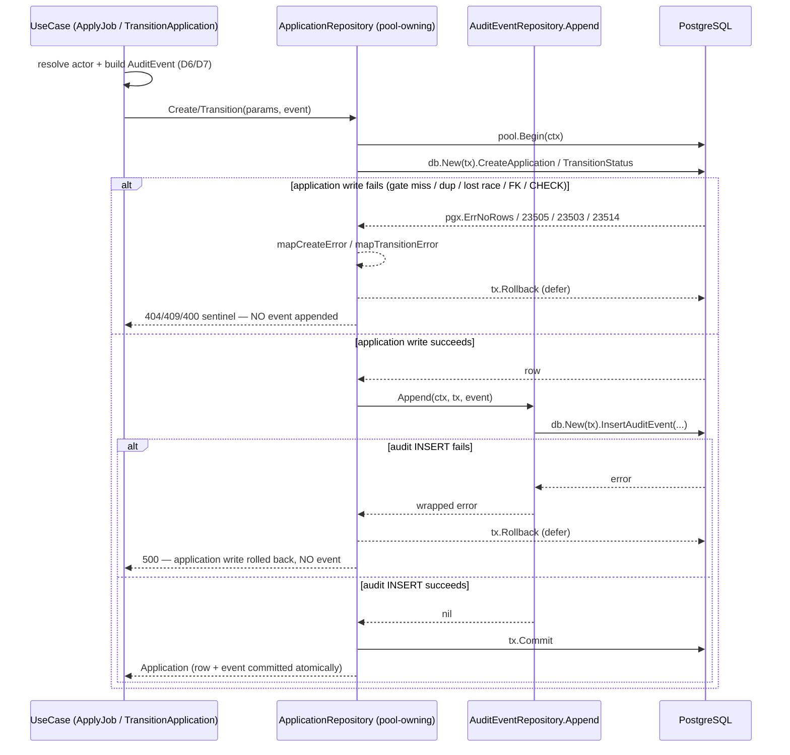

# Design: `audit_events` — Append-Only Audit Log (applications write paths)

Status: design. Grounded by `openspec/changes/audit_events/proposal.md`, the new BC spec `openspec/changes/audit_events/specs/audit_events/spec.md`, and the applications delta `openspec/changes/audit_events/specs/applications/spec.md`. The specs are authoritative for observable behavior; this document turns that behavior into component-level architecture.

Reference slices: `applications` (archived at `openspec/changes/archive/2026-08-25-applications/`) is the same-domain reference — it delivers the two write paths (`Create`/`Transition`) whose seam this change modifies. `jobs-soft-delete` (archived at `openspec/changes/archive/2026-08-25-jobs-soft-delete/`) is the transaction/seam-change reference — it establishes the atomic port-extension + stub-repair discipline, the `map*Error` ordering (`pgx.ErrNoRows` BEFORE `errors.As`), and the file-inventory format this document reuses. The canonical pool-owning transactional adapters are `candidates.ReplaceLanguagesByUserID` and `companies.CompanyBootstrapRepository.CreateWithOwner` (both `pool.Begin` + `db.New(tx)` + `defer tx.Rollback` + `tx.Commit`).

Locked decisions are **not** re-opened here (user confirmed in the proposal round):

- **Fail-closed co-write**: the audit INSERT runs in the same `pgx.Tx` as the application write; both commit or both roll back. No outbox / SNS / SQS / EventBridge.
- **Event types (closed set)**: exactly `ApplicationSubmitted` (from `applyToJob`, `POST /jobs/{jobId}/applications`, `201`) and `ApplicationTransitioned` (from `transitionApplication`, `PATCH /jobs/{jobId}/applications/{id}/transition`, `200`).
- **Actor identity**: `ApplicationSubmitted` → `actor_type='user'`, `actor_id = candidate users.id` (already resolved by `resolveUserID`). `ApplicationTransitioned` → `actor_type='user'`, `actor_id = CompanyContext.UserID` (additive identity change).
- **Metadata PII-free**: Submitted → `{ job_id, source }` (`source` only when non-NULL); Transitioned → `{ job_id, from_status, to_status }`. Never `cover_letter`, never candidate PII.
- **Append-only port**: a single append op. No read/update/delete/backfill.
- **Applications adapter owns the `pgx.Tx`**; no new unit-of-work abstraction.
- **Scope boundary**: jobs/companies/identity write paths emit nothing. Only the additive `CompanyContext.UserID` change in identity is allowed.

---

## 1. Context and scope

The `applications` slice already ships the two write paths whose seam this change modifies: `ApplicationRepository.Create` (atomic eligibility-gated INSERT, `mapCreateError`) and `ApplicationRepository.Transition` (guarded UPDATE, `mapTransitionError`). Each is today a single statement against a narrow `Querier` seam (design D13 of the applications slice), so neither can open a transaction.

This slice adds:

- **Schema**: migration `00011_create_audit_events.sql` materializes `docs/modelo-de-datos-proyecto-04.md` §3.9 verbatim.
- **New bounded context**: `backend/internal/features/audit_events/` (domain entity + `ActorType` VO + event-type constants + append-only tx-scoped port + stateless sqlc adapter).
- **Co-write**: `Create`/`Transition` open a `pgx.Tx`, run the application write, append the audit event through the audit port, and commit — fail-closed on any error.
- **Event intent**: `applyToJob` and `transitionApplication` build the event intent (actor + metadata) and hand it to the repository.
- **Identity additive change**: `CompanyContext.UserID` so the transition path can record the acting recruiter.

**No change** to the jobs port/service/handler, the public `/jobs` mount, the candidates/companies/identity write paths, the applications read surface (`GetByID`/`ListByJob`/`ListByCandidate` semantics unchanged), the apply eligibility gate, the transition matrix, or the `201`/`200`/`404`/`409`/`400` response taxonomy. The audit event is additive.

---

## 2. Decisions at a glance

| # | Decision | Choice |
|---|---|---|
| D1 | Migration `00011` | `audit_events` exactly §3.9 (table + `audit_events_actor_type_check` + `metadata JSONB NOT NULL DEFAULT '{}'` + `audit_events_entity_idx`); `Down` = `DROP TABLE audit_events` (clean — nothing references it). |
| D2 | sqlc query | `InsertAuditEvent :exec` append-only (no SELECT/UPDATE/DELETE); `metadata` JSONB → `[]byte`; `occurred_at` omitted → DB `now()`. |
| D3 | `audit_events` domain | `AuditEvent` entity + `ActorType` VO (`user`/`system`) + exactly two event-type constants + `entity_type='application'` constant; `event_type` deliberately not DB-constrained. |
| D4 | Append-only port | `AuditEventRepository.Append(ctx, tx pgx.Tx, event)` — tx-scoped, port never begins/commits; stateless sqlc adapter via `db.New(tx)`. |
| D5 | Applications adapter seam | Pool-owning (`*pgxpool.Pool` + audit port); `Create`/`Transition` open the tx and co-write; reads use `db.New(pool)`; the narrow `Querier` seam is removed. |
| D6 | Event intent flow | `Create`/`Transition` gain an `AuditEvent` value param; use case builds the intent (single source of truth); adapter only appends. |
| D7 | Actor + metadata | Submitted actor = resolved candidate `users.id`; Transitioned actor = `CompanyContext.UserID`; PII-free metadata builders pinned by unit tests. |
| D8 | `CompanyContext.UserID` | Additive field; middleware populates from `user.ID`; transition use case takes `userID`; `uuid.Nil` → fail-closed 500, no status change, no event. |
| D9 | Wiring | Composition root passes the pool into the applications repo and wires the stateless audit adapter (mirrors candidates/company-bootstrap pool pattern). |
| D10 | Test strategy | RED-first; unit covers pure builders/mappers/dispatchers/metadata shape/actor VO; integration covers co-write atomicity + rollback + no-event-on-non-write + append-only structural; integration suite migrates rollback-fixture → committed-fixture. |

---

## 3. Architectural decisions (ADR)

### D1 — Migration `00011_create_audit_events.sql` (verbatim §3.9)

The migration wraps §3.9 in goose blocks. The DDL is byte-for-byte the design doc's §3.9:

```sql
-- +goose Up
-- +goose StatementBegin
CREATE TABLE audit_events (
    id           UUID PRIMARY KEY,
    occurred_at  TIMESTAMPTZ NOT NULL DEFAULT now(),
    actor_id     UUID,
    actor_type   TEXT NOT NULL
        CONSTRAINT audit_events_actor_type_check
        CHECK (actor_type IN ('user', 'system')),
    event_type   TEXT NOT NULL,
    entity_type  TEXT NOT NULL,
    entity_id    UUID NOT NULL,
    metadata     JSONB NOT NULL DEFAULT '{}'
);

CREATE INDEX audit_events_entity_idx
    ON audit_events (entity_type, entity_id, occurred_at DESC);
-- +goose StatementEnd

-- +goose Down
-- +goose StatementBegin
DROP TABLE audit_events;
-- +goose StatementEnd
```

Column type confirmation:

| Column | Type / constraint | Notes |
|---|---|---|
| `id` | `UUID PRIMARY KEY` | No DB default — the emitting write path generates `uuid.NewV7` (§1.1). |
| `occurred_at` | `TIMESTAMPTZ NOT NULL DEFAULT now()` | Server time; the INSERT omits it so `now()` (transaction time) applies. |
| `actor_id` | `UUID` (NULL) | **No FK by design** — the audit log survives its actors. |
| `actor_type` | `TEXT NOT NULL` + named CHECK `audit_events_actor_type_check` (`'user' \| 'system'`) | Closed vocabulary at the DB boundary. |
| `event_type` | `TEXT NOT NULL` | **No CHECK** (§1.3 exception — event types grow constantly). |
| `entity_type` | `TEXT NOT NULL` | Free text; this slice only writes `'application'`. |
| `entity_id` | `UUID NOT NULL` | No FK (same survival rationale as `actor_id`). |
| `metadata` | `JSONB NOT NULL DEFAULT '{}'` | PII-free by construction (D7). |
| — | no `updated_at`, no `deleted_at` | Append-only, structurally. |
| `audit_events_entity_idx` | B-tree on `(entity_type, entity_id, occurred_at DESC)` | Serves the future read surface (not delivered this slice). |

`Down` drops the table cleanly: the index drops with the table, and **nothing references `audit_events`** (the table has no FK dependents and no FK of its own except none). There is no data migration in either direction (green table).

**sqlc model mapping note.** `metadata JSONB` maps to `[]byte` under `sql_package: "pgx/v5"` (no jsonb override in `sqlc.yaml`, and there is no existing JSONB column in the repo). The audit adapter marshals the metadata map to JSON bytes; a future read surface would unmarshal.

**Alternatives considered.** Adding a CHECK on `event_type` — rejected (locked §1.3 exception). Adding `updated_at`/`deleted_at` — rejected (append-only invariant).

### D2 — `InsertAuditEvent :exec` append-only query

`db/queries/audit_events.sql` contains exactly one statement:

```sql
-- name: InsertAuditEvent :exec
-- Append-only INSERT (the audit_events slice has NO read / update / delete
-- surface). occurred_at is deliberately OMITTED so the DB DEFAULT now()
-- (transaction time) applies; the emitting write path does not supply a
-- client clock. id is the uuid.NewV7 generated by the emitting write path.
-- actor_id is sqlc.narg (nullable): 'user' events carry the actor's
-- users.id; 'system' events (not emitted this slice) carry SQL NULL.
INSERT INTO audit_events (id, actor_id, actor_type, event_type, entity_type, entity_id, metadata)
VALUES (
    sqlc.arg('id')::uuid,
    sqlc.narg('actor_id')::uuid,
    sqlc.arg('actor_type')::text,
    sqlc.arg('event_type')::text,
    sqlc.arg('entity_type')::text,
    sqlc.arg('entity_id')::uuid,
    sqlc.arg('metadata')::jsonb
);
```

Generated shape (pinned by first-textual-appearance arg order `id`, `actor_id`, `actor_type`, `event_type`, `entity_type`, `entity_id`, `metadata`):

```go
type InsertAuditEventParams struct {
    ID         uuid.UUID
    ActorID    pgtype.UUID // nullable column → pgtype.UUID
    ActorType  string
    EventType  string
    EntityType string
    EntityID   uuid.UUID
    Metadata   []byte      // JSONB → []byte
}
```

`InsertAuditEvent :exec` returns `error` only (append-only — no row, no read). `go tool sqlc generate` adds the method to `db.Querier` and the `AuditEvent` model to `models.go` (the model is generated but unused by the adapter, which uses `InsertAuditEventParams`).

### D3 — `audit_events` domain: entity + ActorType VO + closed event vocabulary

`backend/internal/features/audit_events/domain/entities/auditEvent.go`:

```go
// ActorType is the closed actor vocabulary, mirrored by the
// audit_events_actor_type_check CHECK at the DB boundary.
type ActorType string

const (
    ActorTypeUser   ActorType = "user"
    ActorTypeSystem ActorType = "system"
)

func (a ActorType) String() string { return string(a) }

// Event-type constants — the CLOSED SET for this cycle. event_type has no
// DB CHECK (§1.3 exception), so adding a future event type is a code
// change, not a migration.
const (
    EventApplicationSubmitted    = "ApplicationSubmitted"
    EventApplicationTransitioned = "ApplicationTransitioned"
)

// EntityApplication is the only entity_type this slice writes.
const EntityApplication = "application"

// AuditEvent is the append-only audit event the emitting write path builds.
// OccurredAt is NOT a field: the DB now() DEFAULT supplies server time.
type AuditEvent struct {
    ID         uuid.UUID
    ActorType  ActorType
    ActorID    *uuid.UUID        // nil ⇔ actor_type = 'system'
    EventType  string
    EntityType string
    EntityID   uuid.UUID
    Metadata   map[string]string // PII-free; exact keys pinned by D7 tests
}
```

`ActorType` mirrors the CHECK; `ActorTypeSystem` exists for future system-machinery events but is **never emitted this slice** (both events are `'user'`). The closure is enforced by the typed constants + the absence of any other emit call (pinned by a test that greps the codebase for the two event-type string literals — see §7).

### D4 — Append-only tx-scoped port (`Append(ctx, tx, event)`)

`backend/internal/features/audit_events/domain/repositories/auditEventRepository.go`:

```go
package repositories

import (
    "context"

    "github.com/aldrichcode45/peopleflow-vacantes/internal/features/audit_events/domain/entities"
    "github.com/jackc/pgx/v5"
)

// AuditEventRepository is the append-only audit port. It exposes exactly ONE
// operation. The port is tx-scoped by contract: Append runs inside a
// caller-owned pgx.Tx and MUST NOT begin or commit a transaction of its own
// (the co-write atomicity contract — see the applications delta's
// "Fail-Closed Application + Audit Co-Write"). There is deliberately no
// Update / Delete / Read / List / Backfill method: append-only is enforced
// by the absence of surface.
type AuditEventRepository interface {
    Append(ctx context.Context, tx pgx.Tx, event entities.AuditEvent) error
}
```

The `pgx.Tx` in the port signature is a deliberate, documented seam: the co-write contract requires the caller to own the transaction, and `pgx.Tx` is the exact object the caller already owns. Alternatives considered and rejected: (1) a bespoke `TxQuerier`/`DBTX`-shaped interface in the domain — that is a new abstraction the user ruled out, and it would shadow `db.DBTX` without adding value; (2) folding the audit INSERT directly into the applications adapter — that would delete the `audit_events` bounded-context port the proposal requires and duplicate the metadata-marshaling/`actor_id`-nullable logic.

**Stateless adapter** (`backend/internal/features/audit_events/infrastructure/postgres/auditEventRepository.go`):

```go
type AuditEventRepository struct{}

func NewAuditEventRepository() *AuditEventRepository { return &AuditEventRepository{} }

var _ auditrepositories.AuditEventRepository = (*AuditEventRepository)(nil)

func (r *AuditEventRepository) Append(ctx context.Context, tx pgx.Tx, event auditentities.AuditEvent) error {
    meta, err := json.Marshal(event.Metadata)
    if err != nil {
        return fmt.Errorf("marshal audit metadata: %w", err)
    }
    if err := db.New(tx).InsertAuditEvent(ctx, buildInsertAuditEventParams(event, meta)); err != nil {
        return fmt.Errorf("insert audit event: %w", err)
    }
    return nil
}
```

The adapter holds no pool and opens no transaction — the `pgx.Tx` is supplied by the applications adapter, which is exactly the co-write contract ("the port MUST NOT begin or commit a transaction of its own"). `buildInsertAuditEventParams` maps `*uuid.UUID` → `pgtype.UUID` (`Valid: true` for user, `{}` for nil).

### D5 — Applications adapter becomes pool-owning (the seam change)

The applications adapter moves from the narrow `Querier` seam to the canonical pool-owning pattern (`candidates`/`company-bootstrap`):

```go
type ApplicationRepository struct {
    pool  *pgxpool.Pool
    audit auditrepositories.AuditEventRepository
}

func NewApplicationRepository(pool *pgxpool.Pool, audit auditrepositories.AuditEventRepository) *ApplicationRepository {
    return &ApplicationRepository{pool: pool, audit: audit}
}

var _ repositories.ApplicationRepository = (*ApplicationRepository)(nil)
```

- **Reads** (`GetByID`, `ListByJob`, `ListByCandidate`) become `db.New(r.pool).<Query>(...)` — the exact `candidates` adapter idiom. The two-step `ListByJob` scope check + list remains, just through `db.New(r.pool)`.
- **Writes** (`Create`, `Transition`) open a transaction and co-write (the concrete pattern is in §5.3).
- The narrow `Querier` interface and `var _ Querier = (*db.Queries)(nil)` are **removed** — they existed only for the read-path unit seam, which the pool-owning adapter replaces with `db.New(r.pool)`.

**Concrete `pgx.Tx` co-write pattern (the canonical shape this change reuses):**

```go
func (r *ApplicationRepository) Create(ctx context.Context, p repositories.CreateParams, event auditentities.AuditEvent) (*entities.Application, error) {
    tx, err := r.pool.Begin(ctx)
    if err != nil {
        return nil, fmt.Errorf("begin create tx: %w", err)
    }
    defer func() { _ = tx.Rollback(ctx) }() // no-op after Commit

    queries := db.New(tx)
    row, err := queries.CreateApplication(ctx, buildCreateApplicationParams(
        p.ID, p.JobID, p.CandidateID, p.Source, p.CoverLetter,
    ))
    if err != nil {
        return nil, mapCreateError(err) // gate miss / duplicate / FK / CHECK → 404/409/400
    }

    app, err := toApplication(row)
    if err != nil {
        return nil, err // rollback via defer
    }

    // Fail-closed: an audit INSERT failure aborts the whole transaction.
    if err := r.audit.Append(ctx, tx, event); err != nil {
        return nil, fmt.Errorf("co-write audit: %w", err) // → 500, no row, no event
    }

    if err := tx.Commit(ctx); err != nil {
        return nil, fmt.Errorf("commit create tx: %w", err)
    }
    return &app, nil
}
```

`Transition` is identical in shape: `pool.Begin` → `db.New(tx).TransitionStatus` → `mapTransitionError` → map → `r.audit.Append(ctx, tx, event)` → `tx.Commit`.

**Ordering matters.** The audit append happens strictly **after** a successful application write and strictly **before** `tx.Commit`. Therefore: (a) a `pgx.ErrNoRows` / `23505` / `23503` / `23514` on the application write returns the mapped sentinel before any append and rolls back (no event); (b) an append failure aborts before commit (no application write + no event). Both guarantees are structural, not best-effort.

### D6 — Event intent flows through the applications port

The application repository port (domain) and the use-case port gain an `AuditEvent` **value** parameter (not a pointer — presence is compile-enforced; there is no "no event" path on a write):

```go
// repositories.ApplicationRepository (domain port)
Create(ctx context.Context, params CreateParams, event auditentities.AuditEvent) (*entities.Application, error)
Transition(ctx context.Context, id, jobID, companyID uuid.UUID, from, to valueobjects.ApplicationStatus, event auditentities.AuditEvent) (*entities.Application, error)
```

The use case is the **single source of truth for the event intent**; the adapter only appends (it never re-derives actor/metadata). This avoids duplicating the append/event-building logic across two use cases and keeps the adapter dumb: it maps the already-built event to sqlc params.

### D7 — Actor + metadata resolution (no append-logic duplication)

`applyToJob.go` (after `resolveUserID` + validation):

```go
appID, err := uuid.NewV7()   // the application row id
// ...
eventID, err := uuid.NewV7() // the audit event id
// ...
event := newSubmittedEvent(eventID, appID, candidateID, jobID, source)
return s.repo.Create(ctx, repositories.CreateParams{...}, event)
```

`transitionApplication.go` (after `GetByID` + matrix):

```go
if userID == uuid.Nil {
    return nil, ErrMissingActorIdentity // fail-closed 500, no status change, no event
}
eventID, _ := uuid.NewV7()
event := newTransitionedEvent(eventID, applicationID, userID, jobID, from, to)
return s.repo.Transition(ctx, applicationID, jobID, companyID, from, to, event)
```

Event builders (in `application/usecases/eventIntent.go`) are the **only** place the metadata keys are assembled, so the PII-free shape is pinned in one place:

```go
func buildSubmittedMetadata(jobID uuid.UUID, source *valueobjects.ApplicationSource) map[string]string {
    m := map[string]string{"job_id": jobID.String()}
    if source != nil {
        m["source"] = source.String()
    }
    return m
}

func buildTransitionedMetadata(jobID uuid.UUID, from, to valueobjects.ApplicationStatus) map[string]string {
    return map[string]string{
        "job_id":      jobID.String(),
        "from_status": from.String(),
        "to_status":   to.String(),
    }
}
```

`cover_letter` and `candidateID` are never passed into these builders — the PII-free invariant is enforced by what the builders accept (and pinned by a unit test asserting the exact key set `{job_id, source, from_status, to_status}`).

### D8 — `CompanyContext.UserID` (additive identity change)

`backend/internal/features/identity/domain/security/companyContext.go` gains one field:

```go
type CompanyContext struct {
    CompanyID uuid.UUID
    UserID    uuid.UUID // NEW: the caller's users.id (transition actor)
    Role      valueobjects.MemberRole
}
```

`RequireCompanyRole` already resolves `user` (`sub → users.id`) before the membership lookup; it now carries that `user.ID` into the context:

```go
ctx := security.ContextWithCompanyContext(r.Context(), security.CompanyContext{
    CompanyID: member.CompanyID,
    UserID:    user.ID,
    Role:      member.Role,
})
```

The change is purely additive (no field removed/re-typed/re-sourced). The transition handler passes it through:

```go
app, err := h.service.TransitionApplication(r.Context(), cc.CompanyID, cc.UserID, jobID, appID, in)
```

The transition use case gains a `userID uuid.UUID` parameter and guards `userID == uuid.Nil` → `ErrMissingActorIdentity` (a new use-case sentinel classified as `500 internal server error`). This is defense-in-depth: the middleware always resolves a real `users.id`, so `uuid.Nil` is unreachable via the designed flow; the guard satisfies the spec's "missing `CompanyContext.UserID` fails closed" scenario. The handler never accepts an `actor_id` from the body/path (the `TransitionRequestDto` has no such field, so `encoding/json` ignores it).

### D9 — Wiring (composition root)

`cmd/api/main.go`:

```go
// New: stateless audit adapter (append runs in the caller-owned tx).
auditRepo := auditpostgres.NewAuditEventRepository()

// Applications repo becomes pool-owning so Create/Transition can open the
// co-write transaction (mirrors candidates / company-bootstrap pool pattern).
applicationRepo := applicationspostgres.NewApplicationRepository(pool, auditRepo)
applicationService := applicationsusecases.NewApplicationService(applicationRepo, identityUserRepo)
```

No new env var, service, or docker-compose surface. `queries := db.New(pool)` remains for the other read/write adapters; only the applications repo changes constructor.

### D10 — Test strategy (RED-first, strict TDD)

Strict TDD applies (`strict_tdd: true`). Coverage is split deliberately:

- **Unit (no Postgres)**: pure builders (`buildSubmittedMetadata`/`buildTransitionedMetadata` exact keys), event builders (actor/entity/event-type/entity-type), `ActorType` VO, `buildInsertAuditEventParams` (`*uuid.UUID` → `pgtype.UUID`), the existing `map*Error`/builder/mapper helpers (unchanged), and the use-case/handler actor + metadata + fail-closed branches.
- **Integration (`-tags=integration`, live Postgres)**: everything only Postgres can prove — co-write atomicity, rollback on audit failure, exactly-one-event-per-commit, no-event-on-non-write, and the `00011` schema invariants (CHECK, index, metadata default, no `updated_at`/`deleted_at`, no FK, `event_type` not CHECK-constrained).

**Integration fixture migration (a consequence of D5).** The existing applications integration suite binds the adapter to the fixture's rolled-back transaction (`NewApplicationRepository(db.New(tx))`). A pool-owning adapter opens **its own** transaction on `pool.Begin`, which cannot see the fixture tx's uncommitted seed. The suite must therefore migrate from the rollback-fixture pattern to the **committed-fixture pattern** (`companyBootstrapRepository_integration_test.go` precedent): seed through `pool` with `ON CONFLICT DO NOTHING` + unique suffixes, and clean up with targeted `DELETE`s in `t.Cleanup`. This is a test-only migration with no production-code impact; it is enumerated in the seam-change inventory (§6).

---

## 4. Sequence diagram — fail-closed co-write



---

## 5. Exact code-level shapes

### 5.1 Migration (NEW)

`backend/db/migrations/00011_create_audit_events.sql` — §3 D1.

### 5.2 sqlc query (NEW)

`backend/db/queries/audit_events.sql` — §3 D2. Regen produces `backend/internal/db/audit_events.sql.go` (+ `models.go` `AuditEvent`, + `querier.go` entry).

### 5.3 Applications adapter (MOD)

`backend/internal/features/applications/infrastructure/postgres/applicationRepository.go`:

- Remove `Querier` interface + `var _ Querier = (*db.Queries)(nil)`.
- `ApplicationRepository{pool *pgxpool.Pool; audit auditrepositories.AuditEventRepository}`.
- `NewApplicationRepository(pool *pgxpool.Pool, audit auditrepositories.AuditEventRepository)`.
- `Create`/`Transition` use the §3 D5 co-write pattern; reads use `db.New(r.pool)`.
- `buildCreateApplicationParams`, `buildTransitionParams`, all `to*` mappers, `mapCreateError`/`mapTransitionError`/`mapGetError`, and the sentinel aliases are unchanged.

### 5.4 Applications port (MOD)

`backend/internal/features/applications/domain/repositories/applicationRepository.go`: `Create`/`Transition` gain `event auditentities.AuditEvent` (D6). `CreateParams`, reads, sentinels unchanged.

### 5.5 Use-case port + service (MOD)

`backend/internal/features/applications/application/usecases/applicationService.go`: `ApplicationRepoPort` mirrors the domain port change; add `ErrMissingActorIdentity = errors.New("missing actor identity")`.

### 5.6 Use cases (MOD)

- `applyToJob.go` — build the `ApplicationSubmitted` event intent (D7).
- `transitionApplication.go` — `userID` param + `uuid.Nil` guard + build the `ApplicationTransitioned` event intent (D7/D8).
- `eventIntent.go` (NEW) — `buildSubmittedMetadata`, `buildTransitionedMetadata`, `newSubmittedEvent`, `newTransitionedEvent`.

### 5.7 Handler (MOD)

`backend/internal/features/applications/infrastructure/http/applicationHandler.go`: `transitionApplication` passes `cc.UserID`; `classifyApplicationError` gains a `ErrMissingActorIdentity → 500` branch.

### 5.8 Identity (MOD)

- `backend/internal/features/identity/domain/security/companyContext.go` — add `UserID`.
- `backend/internal/features/identity/infrastructure/http/requireCompanyRole.go` — set `UserID: user.ID`.

### 5.9 Composition root (MOD)

`backend/cmd/api/main.go` — §3 D9.

---

## 6. Seam-change impact inventory (atomic, single commit)

The compile break is the RED (mirrors jobs-soft-delete D6/D9). Every type that satisfies the changed port breaks in lockstep.

| # | Type / file | What breaks | Repair |
|---|---|---|---|
| 1 | `postgres.ApplicationRepository` (`applicationRepository.go`) | `Querier` seam removed; struct/constructor change; `var _ repositories.ApplicationRepository` now requires event params | Rewrite per §5.3; remove `Querier` + its assert |
| 2 | `repositories.ApplicationRepository` (domain port) | `Create`/`Transition` gain `event` param | Update interface (D6) |
| 3 | `usecases.ApplicationRepoPort` (`applicationService.go`) | Mirrors port change | Update interface (D6) |
| 4 | `stubApplicationRepo` (`stubs_test.go`) | `var _ ApplicationRepoPort` fails; `Create`/`Transition` signatures | Add event param + `lastCreateEvent`/`lastTransitionEvent` capture |
| 5 | `stubQuerier` + three `TestListByJob_*` (`applicationRepository_test.go`) | `NewApplicationRepository(q)` call sites no longer type-check; `stubQuerier` becomes dead | Delete `stubQuerier` + the 3 ListByJob tests (move coverage to integration); keep all pure-helper tests (`map*Error`, builders, mappers) |
| 6 | `setupApplicationFixture` (`applicationRepository_integration_test.go`) | `NewApplicationRepository(db.New(tx))` no longer type-checks; rollback-fixture can't see the adapter's own tx | Migrate to committed-fixture pattern (D10); `NewApplicationRepository(pool, NewAuditEventRepository())`; raw asserts read via `pool` |
| 7 | `cmd/api/main.go` | `NewApplicationRepository(queries)` | `NewApplicationRepository(pool, auditRepo)` + wire `auditRepo` |
| 8 | `security.CompanyContext` (`companyContext.go`) | Additive — no compile break | Add `UserID` |
| 9 | `RequireCompanyRole` (`requireCompanyRole.go`) | No break; behavior gap | Set `UserID: user.ID` |
| 10 | `requireCompanyRole_test.go` / `requireCompanyRoleRoutes_test.go` | No compile break (named-field access, no non-zero deep-equal) | Add `UserID` assertions to pin the new field |
| 11 | `security/companyContext_test.go` | No break (round-trips `CompanyContext{}`/zero-value `UserID`) | Optionally extend round-trip with a `UserID` case |
| 12 | `applicationHandler_test.go` (transition tests) | `CompanyContext{CompanyID: uuid.New()}` now has `UserID = uuid.Nil` → fail-closed 500 instead of 200 | Add `UserID: <recruiterID>` to transition-path `CompanyContext` literals; add missing-UserID 500 + body-`actor_id`-ignored tests |
| 13 | `applyToJob_test.go` / `transitionApplication_test.go` (usecase) | `stubApplicationRepo` signature change (compile); no event assertions yet | Add event-intent assertions (actor/metadata); transition tests pass a non-nil `userID` |

The applications **read** path (`GetByID`/`ListByJob`/`ListByCandidate`) is behaviorally unchanged; only its unit seam (`stubQuerier`) is removed, which is why rows 5's coverage moves to integration.

---

## 7. Test inventory (RED-first)

### Phase A — `audit_events` domain unit (`audit_events/domain/...`)

1. **RED** `TestActorTypeVocabulary` — `ActorTypeUser.String()=="user"`, `ActorTypeSystem.String()=="system"`; no other value accepted by the VO.
2. **RED** `TestEventVocabularyIsClosed` — the domain exposes exactly the two constants; (a grep/`go/ast` guard asserts no other `event_type` string literal is emitted anywhere in `backend/internal/features/**`).

### Phase B — applications use-case unit (`applyToJob_test.go`, `transitionApplication_test.go`, `eventIntent_test.go`)

3. **RED** `TestBuildSubmittedMetadata_WithSource` — `{job_id, source}` exact keys.
4. **RED** `TestBuildSubmittedMetadata_NilSource` — `{job_id}` only (no `source` key).
5. **RED** `TestBuildSubmittedMetadata_NeverCoverLetterOrCandidateID` — key set ⊆ `{job_id, source, from_status, to_status}`.
6. **RED** `TestBuildTransitionedMetadata_ExactKeys` — `{job_id, from_status, to_status}`.
7. **RED** `TestApplyJob_PassesSubmittedEvent` — stub captures `lastCreateEvent` with `ActorType=user`, `ActorID=candidateID`, `EventType=ApplicationSubmitted`, `EntityType=application`, `EntityID=appID`, metadata `{job_id}`/`{job_id,source}`.
8. **RED** `TestTransitionApplication_PassesTransitionedEvent` — `ActorID=userID`, `EventType=ApplicationTransitioned`, `EntityID=applicationID`, metadata `{job_id,from_status,to_status}`.
9. **RED** `TestTransitionApplication_MissingUserIDFailsClosed` — `userID=uuid.Nil` → `ErrMissingActorIdentity`, `repo.Transition` NOT called (no write, no event).

### Phase C — applications adapter unit (`applicationRepository_test.go`)

10. **RED (compile)** — author `audit_events.sql` + regen; the adapter's changed signatures fail (D6 inventory).
11. **RED** `TestBuildInsertAuditEventParams` — `*uuid.UUID` (non-nil) → `pgtype.UUID{Valid:true}`; nil → `pgtype.UUID{}`; `Metadata` marshaled to `[]byte`; all scalar fields pinned.

### Phase D — co-write integration (NEW, `//go:build integration`)

12. **RED/GREEN** `TestCreate_CoWritesApplicationAndAuditEvent` — after `Create`, exactly one `audit_events` row with `event_type='ApplicationSubmitted'`, `entity_type='application'`, `entity_id=<appID>`, `actor_type='user'`, `actor_id=<candidateID>`, metadata `{job_id}` (and `{job_id,source}` when sourced).
13. **RED/GREEN** `TestCreate_AuditFailureRollsBackApplication` — force the audit INSERT to fail (e.g. drop `audit_events` in-test or a metadata value that violates a constraint) → `Create` returns error; no `applications` row AND no event.
14. **RED/GREEN** `TestCreate_NonWriteOutcomeNoEvent` — gate miss / duplicate → mapped sentinel AND `audit_events` row count is 0 for that `entity_id`.
15. **RED/GREEN** `TestTransition_CoWritesTransitionedEvent` — metadata `{job_id,from_status,to_status}`, actor `userID`.
16. **RED/GREEN** `TestTransition_LostRaceNoEvent` — lost race → `ErrApplicationNotFound`, no `audit_events` row.
17. **RED/GREEN** `TestTransition_AuditFailureRollsBackStatus` — audit failure → status unchanged, no event.

### Phase E — migration `00011` integration (NEW, `//go:build integration`)

18. **RED/GREEN** `TestMigration00011_UpCreatesNamedObjects` — table + `audit_events_actor_type_check` + `audit_events_entity_idx` exist.
19. **RED/GREEN** `TestMigration00011_DownDropsTableAndIndex` — `DROP TABLE audit_events` then re-create via inline DDL (leaves schema usable).
20. **RED/GREEN** `TestAuditEvents_RequiredFieldsRejectNull` — `actor_type`/`event_type`/`entity_type`/`entity_id` NULL → 23502.
21. **RED/GREEN** `TestAuditEvents_MetadataDefaultsEmptyObject` — INSERT omitting `metadata` → `'{}'`.
22. **RED/GREEN** `TestAuditEvents_EventTypeNotCheckConstrained` — `event_type='SomeFutureEventType'` accepted.
23. **RED/GREEN** `TestAuditEvents_ActorTypeCheckRejectsOutOfVocabulary` — `'service'` → 23514.
24. **RED/GREEN** `TestAuditEvents_StructurallyAppendOnly` — no `updated_at`/`deleted_at` columns; no FK on `actor_id` (information_schema/`pg_constraint`).

### Phase F — handler + middleware (`applicationHandler_test.go`, `requireCompanyRole_test.go`)

25. **RED** `TestTransitionApplication_MissingUserIDReturns500` — `CompanyContext{CompanyID, Role}` with zero `UserID` → 500, no status change.
26. **RED** `TestTransitionApplication_BodyActorIDIgnored` — request body `{"actor_id": "..."}` → actor is `cc.UserID`, not the body value.
27. **RED** `TestRequireCompanyRole_InjectsUserID` — middleware produces `CompanyContext.UserID == user.ID`.

---

## 8. Spec-scenario → test checklist

| Scenario (spec) | Test(s) | Layer |
|---|---|---|
| 00011 up creates named objects | `TestMigration00011_UpCreatesNamedObjects` | I |
| 00011 down drops table + index | `TestMigration00011_DownDropsTableAndIndex` | I |
| required fields reject NULL | `TestAuditEvents_RequiredFieldsRejectNull` | I |
| metadata defaults `'{}'` | `TestAuditEvents_MetadataDefaultsEmptyObject` | I |
| event_type not CHECK-constrained | `TestAuditEvents_EventTypeNotCheckConstrained` | I |
| table structurally append-only | `TestAuditEvents_StructurallyAppendOnly` | I |
| actor_type closed to user/system | `TestAuditEvents_ActorTypeCheckRejectsOutOfVocabulary` / `TestActorTypeVocabulary` | I + U |
| exactly two event-type constants | `TestEventVocabularyIsClosed` | U |
| port exposes append only | (surface: `AuditEventRepository` interface has exactly `Append`; sqlc file has only INSERT) | U (compile/surface) |
| append runs inside caller's tx | `TestCreate_CoWritesApplicationAndAuditEvent` | I |
| append failure rolls back the write | `TestCreate_AuditFailureRollsBackApplication` / `TestTransition_AuditFailureRollsBackStatus` | I |
| Submitted metadata `{job_id,source}` / `{job_id}` | `TestBuildSubmittedMetadata_*` + `TestCreate_CoWritesApplicationAndAuditEvent` | U + I |
| Transitioned metadata `{job_id,from_status,to_status}` | `TestBuildTransitionedMetadata_ExactKeys` + `TestTransition_CoWritesTransitionedEvent` | U + I |
| cover_letter/PII never in metadata | `TestBuildSubmittedMetadata_NeverCoverLetterOrCandidateID` | U |
| successful apply appends exactly one Submitted event | `TestCreate_CoWritesApplicationAndAuditEvent` | I |
| successful transition appends exactly one Transitioned event | `TestTransition_CoWritesTransitionedEvent` | I |
| lost-race 404 appends no event | `TestTransition_LostRaceNoEvent` | I |
| recruiter users.id recorded as actor | `TestTransitionApplication_PassesTransitionedEvent` | U |
| body actor_id ignored | `TestTransitionApplication_BodyActorIDIgnored` | H |
| missing CompanyContext.UserID fails closed | `TestTransitionApplication_MissingUserIDReturns500` / `TestTransitionApplication_MissingUserIDFailsClosed` | H + U |
| non-write outcomes append no event | `TestCreate_NonWriteOutcomeNoEvent` | I |

---

## 9. Out of scope (explicit)

No audit read endpoint/query surface; no UPDATE/DELETE/backfill/replay; no outbox / SNS / SQS / EventBridge; no event emission from jobs/companies/identity write paths; no retention/TTL/DynamoDB archival; no catalog of other event types; no new unit-of-work abstraction; no `event_type` DB CHECK. The jobs port/service/handler, the public `/jobs` mount, and all non-application write paths are untouched.

---

## 10. Risks and rollout

- **Availability coupling (fail-closed)** — an unavailable/corrupt `audit_events` table blocks application writes by design (R2). This is the compliance-correct default; the failure surfaces as `500 internal server error` with `slog.Error` and a rollback, never a silent gap. Pinned by `TestCreate_AuditFailureRollsBackApplication`.
- **Integration fixture migration** — the rollback-fixture suite cannot see a pool-owning adapter's own tx; the suite migrates to committed fixtures (company-bootstrap precedent). This is the largest mechanical change in the slice and is done in the same commit as the seam change so `go test -tags=integration` stays green.
- **`pgx.Tx` in the audit domain port** — accepted and documented (D4); a future refactor should keep the caller-owned tx invariant, not replace it with a port that opens its own transaction (which would silently break the co-write atomicity contract).
- **sqlc return/param drift** — `InsertAuditEventParams.Metadata []byte` and `.ActorID pgtype.UUID` are pinned by the SQL shapes; a sqlc drift fails the adapter compile.
- **`metadata` JSONB marshal** — `map[string]string` has deterministic key order in Go ≥ 1.12; the exact-key unit test guards against a future PII key sneaking in.
- **Rollback** — revert the merge commit. `00011 Down` drops the table cleanly (nothing references it); deleting `backend/internal/features/audit_events/`, `db/queries/audit_events.sql`, and reverting the applications adapter/port/use-case/handler/wiring restores the prior single-statement write surface. No data migration in either direction.

---

## 11. Success criteria

`goose up` creates `audit_events` with `audit_events_actor_type_check`, `metadata JSONB NOT NULL DEFAULT '{}'`, and `audit_events_entity_idx`; `goose down` drops them cleanly. A successful apply commits exactly one `ApplicationSubmitted` row (actor = candidate `users.id`, metadata `{job_id[, source]}`); a successful transition commits exactly one `ApplicationTransitioned` row (actor = `CompanyContext.UserID`, metadata `{job_id, from_status, to_status}`) — atomically with the application write. An audit INSERT failure rolls back the application write (no row, no event, `500`). A `400`/`401`/`403`/`404`/`409` outcome inserts no event. `cd backend && go test ./...` green, `go vet ./...` clean, `go build ./...` clean, `go tool sqlc generate` idempotent, `make db-migrate` + `make db-migrate-rollback` round-trips.
