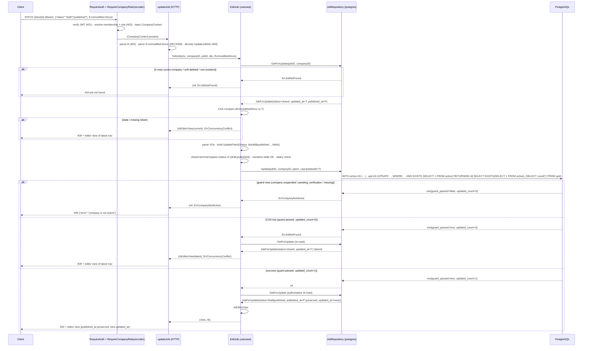

# Design: `jobs-reopen`

Status: design. Grounded by `openspec/changes/jobs-reopen/proposal.md` and the delta spec `openspec/changes/jobs-reopen/specs/jobs/spec.md`. The delta spec is authoritative for observable behavior; this document turns that behavior into component-level architecture.

Reference slice: `jobs-create` (archived at `openspec/changes/archive/2026-08-25-jobs-create/`), which delivered the atomic active-company SQL-guard CTE, `ErrCompanyNotActive → 409`, `mapCreateError`, and the `classifyError` branch this change reuses. `jobs-write-side` (archived at `openspec/changes/archive/2026-08-24-jobs-write-side/`) delivered the PATCH precedent (transition table, CAS, same-company invariant, editor view, error taxonomy) this change relaxes.

Locked decisions are **not** re-opened here:

- Re-open target: **both** `closed → draft` and `closed → published` via the existing `PATCH /jobs/{id}` body `status`. No new endpoint/handler/route/port method/migration.
- `published_at` on `closed → published`: **preserve original** (policy (a), audit history). Zero SQL change for the timestamp.
- Field-only edits on a closed row: still `400 invalid status transition`.
- Active-company gate: **required for ALL PATCHes** via an atomic SQL CTE guard mirroring `CreateJob`; `409 company is not active`.
- `closed → closed` stays `400`. Soft-deleted closed job stays `404`. No `closed_at` column.

---

## 1. Context and scope

`jobs-write-side` made `status='closed'` terminal: the `isTransitionAllowed` switch rejects every transition out of `Closed`, and `EditJob` has an unconditional early-return that rejects **any** body against a closed row. This change lifts exactly two transitions (`closed → draft`, `closed → published`) and, in the same movement, adds the active-company gate that `POST /jobs` already has to the `PATCH /jobs/{id}` write path.

The slice is deliberately minimal:

- **Application**: relax `isTransitionAllowed` for `Closed → {Draft, Published}`; bypass the closed-terminal early-return only when the patch explicitly sets `status` to `draft` or `published`.
- **Persistence**: add the active-company CTE guard to `UpdateJob`, but **not** as a naive `AND EXISTS` on the existing `:execrows` statement — the statement shape changes (see D1, the central design decision).
- **Infrastructure**: `mapUpdateError` gains a `pgx.ErrNoRows → ErrCompanyNotActive` branch (defense-in-depth); the adapter's `Update` method inspects the new guard outcome.

**No migration.** `00007_jobs.sql` already carries every column the re-open write needs. `published_at` requires **no** SQL change (the existing `COALESCE(published_at, now())` branch already preserves it — see D6). The public read side, DTOs, handler, port, domain sentinels, and composition root are all untouched.

---

## 2. Decisions at a glance

| # | Decision | Choice |
|---|---|---|
| D1 | `UpdateJob` SQL guard shape | Change `:execrows` → `:one`; atomic CTE + scalar SELECT returning `{guard_passed, updated_count}`. |
| D2 | Guard-miss signal | Adapter inspects `GuardPassed=false` → `ErrCompanyNotActive`. `mapUpdateError` gains `pgx.ErrNoRows → ErrCompanyNotActive` as defense-in-depth. |
| D3 | CAS/same-company/deleted_at | Predicates unchanged; `updated_count=0` with `guard_passed=true` → `ErrJobNotFound` (→ use case re-read → `ErrConcurrencyConflict`). |
| D4 | `isTransitionAllowed` relaxation | Add an explicit `case valueobjects.Closed` returning `to == Draft || to == Published`; **keep `default: return false`**. |
| D5 | Closed-terminal early-return bypass | Bypass only when `newStatus != nil && (*newStatus == Draft || *newStatus == Published)`. |
| D6 | `published_at` on re-open | Zero SQL change; the existing `COALESCE(published_at, now())` branch already preserves the original. |
| D7 | sqlc regen | `UpdateJob` return type changes; regen touches `jobs.sql.go` **and** `querier.go` (both generated). |
| D8 | File inventory | 4 authored files + 2 generated. Handler/DTO/port/entities/main unchanged. |

---

## 3. Architectural decisions (ADR)

### D1 — `UpdateJob` guard shape: `:one` scalar SELECT `{guard_passed, updated_count}`

**Context.** The locked decision is an atomic active-company guard "mirroring `CreateJob`". `CreateJob` is a `:one` query whose `active` CTE yields zero rows when the company is non-active, and `mapCreateError` maps the resulting `pgx.ErrNoRows` to `ErrCompanyNotActive`. The natural first attempt is to copy that onto the existing `UpdateJob`:

```sql
-- REJECTED: naive guard on the current :execrows statement
WITH active AS (SELECT id FROM companies WHERE id = sqlc.arg('company_id')::uuid AND status = 'active')
UPDATE jobs SET ... WHERE id = ... AND company_id = ... AND deleted_at IS NULL
  AND updated_at = sqlc.arg('cas_token')::timestamptz
  AND EXISTS (SELECT 1 FROM active);
```

**Problem.** `UpdateJob` is currently `:execrows` (`q.db.Exec` → `RowsAffected()`), **not** `:one`. A guard-miss on an `UPDATE` does **not** produce `pgx.ErrNoRows` — it produces `RowsAffected() == 0`. The adapter's existing `if rows == 0 { return entities.ErrJobNotFound }` would fire, and the use case would then re-read via `GetForUpdate` (which deliberately does **not** filter on company activity — see `TestGetForUpdate_NonActiveCompanyRowVisible`), find the row, and return `ErrConcurrencyConflict` with the latest editor view. That is the **wrong** response: the spec pins `409 {"error":"company is not active"}` with the row untouched.

**Decision.** Change `UpdateJob` to `:one` and make the guard outcome **observable and distinguishable** from a CAS miss inside the same statement:

```sql
-- name: UpdateJob :one
WITH active AS (
    SELECT id
    FROM companies
    WHERE id = sqlc.arg('company_id')::uuid
      AND status = 'active'
),
upd AS (
    UPDATE jobs
    SET
        title           = COALESCE(sqlc.narg('title')::text,           title),
        description     = COALESCE(sqlc.narg('description')::text,     description),
        work_mode       = COALESCE(sqlc.narg('work_mode')::text,       work_mode),
        employment_type = COALESCE(sqlc.narg('employment_type')::text, employment_type),
        seniority       = COALESCE(sqlc.narg('seniority')::text,       seniority),
        salary_currency = COALESCE(sqlc.narg('salary_currency')::text, salary_currency),
        location        = CASE WHEN sqlc.arg('set_location')::boolean
                                THEN sqlc.narg('location')::text
                                ELSE location END,
        salary_min      = CASE WHEN sqlc.arg('set_salary_min')::boolean
                                THEN sqlc.narg('salary_min')::int
                                ELSE salary_min END,
        salary_max      = CASE WHEN sqlc.arg('set_salary_max')::boolean
                                THEN sqlc.narg('salary_max')::int
                                ELSE salary_max END,
        status          = COALESCE(sqlc.narg('status')::text, status),
        published_at    = CASE WHEN sqlc.narg('status')::text = 'published'
                                THEN COALESCE(published_at, now())
                                ELSE published_at END,
        updated_at      = now()
    WHERE id         = sqlc.arg('id')::uuid
      AND company_id = sqlc.arg('company_id')::uuid
      AND deleted_at IS NULL
      AND updated_at = sqlc.arg('cas_token')::timestamptz
      AND EXISTS (SELECT 1 FROM active)
    RETURNING id
)
SELECT
    EXISTS (SELECT 1 FROM active) AS guard_passed,
    (SELECT count(*) FROM upd)    AS updated_count;
```

How it composes with the existing predicates:

- The `active` CTE is evaluated once and referenced twice: in the UPDATE `WHERE` (`EXISTS (SELECT 1 FROM active)` — the atomicity guard) and in the final `SELECT` (`EXISTS (SELECT 1 FROM active)` — the observability flag). Because a CTE is a single snapshot in a single statement, the guard and the write are the same statement → no TOCTOU window (spec scenario "the active check is atomic with the UPDATE").
- The existing CAS / same-company / soft-delete WHERE predicates (`id`, `company_id`, `deleted_at IS NULL`, `updated_at = cas_token`) are **unchanged** and remain the row-narrowing conditions.
- `updated_count = (SELECT count(*) FROM upd)` is `1` when the UPDATE matched a row and `0` otherwise. `id` is the PK and `company_id` + `deleted_at IS NULL` + `updated_at` narrow to at most one row, so the count is `0|1`.
- The final `SELECT` is scalar (no `FROM`, no `WHERE`), so it **always** returns exactly one row. `pgx.ErrNoRows` is therefore unreachable on the designed path.

Result matrix (all in one statement):

| Guard (`active` non-empty) | Row predicates matched | `guard_passed` | `updated_count` | Adapter result |
|---|---|---|---|---|
| no (suspended/pending/missing) | — | `false` | `0` | `ErrCompanyNotActive` → 409 "company is not active" |
| yes | yes | `true` | `1` | `nil` (success) |
| yes | no (CAS lost / cross-company / soft-deleted race) | `true` | `0` | `ErrJobNotFound` → use case re-read |

**Alternatives considered.**

1. **Naive `AND EXISTS` on the existing `:execrows`** — rejected: guard-miss collapses to `RowsAffected()==0` → `ErrJobNotFound` → (after re-read) `ErrConcurrencyConflict`, the wrong body and the wrong semantics. This is the trap the proposal's "mirror `mapCreateError`'s `pgx.ErrNoRows`" phrasing would fall into, because `:execrows` never returns `pgx.ErrNoRows`.
2. **A scalar-subquery / `WHERE EXISTS` guard plus a second pre-check** — rejected: a separate `SELECT companies.status` ahead of the UPDATE reintroduces a read-then-write TOCTOU window, which the spec explicitly forbids ("no read-then-write TOCTOU window").
3. **Raise a distinct SQLSTATE on guard-miss (division-by-zero / `RAISE`)** — rejected: relies on hidden SQL side effects and stored-procedure behavior, which the `golang-database` skill forbids ("avoid hidden SQL features… triggers, views, materialized views, stored procedures"). Fragile and un-idiomatic.
4. **`RETURNING` the full editor view** (like `CreateJob`) and dropping the use case's step-8 re-read — rejected as a larger change: the port `Update(...) error` and the use case's existing re-read/`toEditorView` flow are already correct; returning the row would be a parallel projection for no benefit.

### D2 — Guard-miss → `ErrCompanyNotActive` at the adapter; `mapUpdateError` branch is defense-in-depth

**Decision.** The adapter's `Update` inspects `GuardPassed` directly (the designed path). `mapUpdateError` still gains `pgx.ErrNoRows → entities.ErrCompanyNotActive` (satisfying the locked decision and mirroring `mapCreateError`), but it is documented as **defense-in-depth** — unreachable because the `:one` scalar SELECT always returns one row.

Ordering vs the existing `23514` branch: `pgx.ErrNoRows` is checked **before** `errors.As(err, &pgErr)`, exactly like `mapCreateError`. `pgx.ErrNoRows` and `pgconn.PgError` are mutually exclusive (`pgx.ErrNoRows` is not a `*pgconn.PgError`), so there is no precedence conflict — the two checks coexist and `23514 → ErrInvalidStatusTransition` is preserved unchanged.

### D3 — CAS / same-company / soft-delete invariants unchanged

The CAS `updated_at = sqlc.arg('cas_token')`, `company_id = sqlc.arg('company_id')`, and `deleted_at IS NULL` predicates stay verbatim. A CAS miss with an **active** company yields `guard_passed=true, updated_count=0`, which the adapter maps to `ErrJobNotFound`; the use case's existing re-read logic then returns `ErrConcurrencyConflict` + latest editor view (or `ErrJobNotFound` if the row is gone). This preserves the exact 409-with-view body shape and the IDOR/soft-delete defenses (spec `Re-Open Inherits CAS and Same-Company Invariants`). The active-company gate is additive: it only fires when the company is non-active, never when CAS simply lost a race.

### D4 — `isTransitionAllowed`: explicit `Closed` case, not a `default` relaxation

**Decision.** Add a named case:

```go
func isTransitionAllowed(from, to valueobjects.JobStatus) bool {
	switch from {
	case valueobjects.Draft:
		return to == valueobjects.Draft || to == valueobjects.Published
	case valueobjects.Published:
		return to == valueobjects.Published || to == valueobjects.Closed
	case valueobjects.Closed:
		return to == valueobjects.Draft || to == valueobjects.Published
	default:
		return false
	}
}
```

**Why not change the `default` branch** (the proposal's wording "default branch returns true for `to == Draft || to == Published`)? The current `default: return false` also catches unknown from-statuses (e.g. `JobStatus(99)`), and the existing `TestIsTransitionAllowed_UnknownStatusDefaultsFor` pins that `JobStatus(99) → Published` is `false`. Relaxing `default` would silently allow an unknown status to transition, breaking that defense-in-depth. An explicit `case valueobjects.Closed` is the minimal, non-leaky change; `default` stays `false`.

### D5 — Closed-terminal early-return bypass

The current unconditional `if current.JobStatus == valueobjects.Closed { return nil, ErrInvalidStatusTransition }` is replaced by a guarded bypass:

```go
// 4. Transition check — closed-terminal rule first, but a closed row may
// re-open when the patch explicitly sets status to draft or published.
if current.JobStatus == valueobjects.Closed {
	reopens := newStatus != nil &&
		(*newStatus == valueobjects.Draft || *newStatus == valueobjects.Published)
	if !reopens {
		return nil, entities.ErrInvalidStatusTransition
	}
}
if newStatus != nil && !isTransitionAllowed(current.JobStatus, *newStatus) {
	return nil, entities.ErrInvalidStatusTransition
}
```

Behavior table after the change:

| Current | Body `status` | Result |
|---|---|---|
| closed | `"draft"` | bypass → `isTransitionAllowed(Closed, Draft)` true → proceeds → `200` |
| closed | `"published"` | bypass → `isTransitionAllowed(Closed, Published)` true → proceeds → `200` |
| closed | `"closed"` | `reopens` false → `400 invalid status transition` |
| closed | absent (field-only) | `newStatus == nil` → `reopens` false → `400 invalid status transition` |
| draft / published | any | early-return skipped; existing transition table applies unchanged |

The salary-range validation, patch build, `repo.Update` call, re-read, and `toEditorView` projection run unchanged for the re-open path (the transition + field edits apply in the same single UPDATE).

**`ErrCompanyNotActive` propagation needs no use-case change.** The use case's Update-error branch special-cases only `ErrJobNotFound` (re-read); every other error already falls through `return nil, err`. `ErrCompanyNotActive` therefore propagates untouched to the handler, whose existing `classifyError` maps it to `409 "company is not active"`.

### D6 — `published_at` on re-open: zero SQL change

Policy (a) is locked: preserve the original `published_at`. The existing CASE already does this and needs **no edit**:

- `closed → published`: `sqlc.narg('status') = 'published'` → `COALESCE(published_at, now())`. The row was previously published, so `published_at` is non-NULL and is preserved.
- `closed → draft`: `sqlc.narg('status') = 'draft'` → the `ELSE published_at` branch leaves it untouched.

The integrity check `CHECK (status <> 'published' OR published_at IS NOT NULL)` continues to hold because every `published` row carries a non-NULL `published_at`. No `CASE` change, no `closed_at`, no `reopened_at`.

### D7 — sqlc regen is mechanical but touches two generated files

Changing `UpdateJob` from `:execrows` to `:one` changes the generated method signature, so `go tool sqlc generate` rewrites **two** files, both generated and never hand-edited:

1. `backend/internal/db/jobs.sql.go` — the `updateJob` SQL constant, a new `UpdateJobRow` type, and the `UpdateJob` method (`(UpdateJobRow, error)` instead of `(int64, error)`). `UpdateJobParams` is **unchanged** (the guard reuses the existing `company_id` arg; no new `sqlc.arg`/`sqlc.narg`).
2. `backend/internal/db/querier.go` — the `Querier` interface's `UpdateJob` method signature changes to `(UpdateJobRow, error)`.

The only consumer of `db.Queries.UpdateJob` is `jobRepository.go:143`; no hand-rolled `Querier` stub or test double for the jobs adapter exists, so the compile break is localized to the adapter's `Update` method (which is updated in the same GREEN step). `CreateJob`, `SearchJobs`, `GetJobByID`, `GetJobForUpdate` are regenerated verbatim and unchanged.

### D8 — File inventory (authoritative)

**MOD (authored):**

- `backend/internal/features/jobs/application/usecases/updateJob.go` — D4 + D5.
- `backend/db/queries/jobs.sql` — D1 (`UpdateJob :one` guard shape).
- `backend/internal/features/jobs/infrastructure/postgres/jobRepository.go` — D2 (`Update` method + `mapUpdateError`).
- `backend/internal/features/jobs/application/usecases/updateJob_test.go` — D4/D5 use-case tests (extend existing).
- `backend/internal/features/jobs/infrastructure/postgres/jobRepository_write_integration_test.go` — SQL-level re-open + gate tests.

**MOD (generated, never hand-edited):**

- `backend/internal/db/jobs.sql.go` — regen.
- `backend/internal/db/querier.go` — regen.

**UNCHANGED:** `cmd/api/main.go`, `application/dtos/updateJobDto.go`, `application/dtos/jobEditorViewDto.go`, `application/usecases/jobService.go`, `domain/entities/job.go` (sentinels reused), `domain/entities/jobForUpdate.go`, `domain/valueobjects/jobStatus.go`, `domain/repositories/jobRepository.go` (port signature unchanged — the guard is internal to the adapter), `infrastructure/http/jobHandler.go` (`classifyError` already has `ErrCompanyNotActive → 409`), `application/usecases/createJob.go`, read-side queries, all migrations.

**Cosmetic note (comment-only, flagged for the tasks phase, not a behavior change):** the doc comment on `isTransitionAllowed` ("closed is terminal") and on `entities.ErrInvalidStatusTransition` ("the closed-terminal rule… rejects ANY body") become stale. The `isTransitionAllowed` comment is in a MOD file and SHOULD be refreshed in the same commit. The `entities/job.go` sentinel comment is in a file the locked inventory marks UNCHANGED; refreshing it is optional and, if done, is a separate comment-only touch that does not alter the compiled surface.

---

## 4. Sequence diagrams

### 4.1 Re-open flow (closed → draft / published) — happy path + 409 gate



The `409-with-view CAS path` (spec `Re-Open Inherits CAS…` / `Error Taxonomy` `409 carries the latest editor view`) is the `CAS lost` branch above — identical to the existing PATCH flow, re-read then render the editor view. The handler special-case (`ErrConcurrencyConflict` writes the view before `classifyError`) is unchanged.

---

## 5. Exact code-level diffs/shapes

### 5.1 `application/usecases/updateJob.go`

**`isTransitionAllowed`** (D4):

```go
func isTransitionAllowed(from, to valueobjects.JobStatus) bool {
	switch from {
	case valueobjects.Draft:
		return to == valueobjects.Draft || to == valueobjects.Published
	case valueobjects.Published:
		return to == valueobjects.Published || to == valueobjects.Closed
	case valueobjects.Closed:
		return to == valueobjects.Draft || to == valueobjects.Published
	default:
		return false
	}
}
```

**Closed-terminal early-return** (D5):

```go
	// 4. Transition check — closed-terminal rule first, but a closed row
	// may re-open when the patch explicitly sets status to draft or
	// published (re-open slice). Everything else on a closed row stays
	// rejected.
	if current.JobStatus == valueobjects.Closed {
		reopens := newStatus != nil &&
			(*newStatus == valueobjects.Draft || *newStatus == valueobjects.Published)
		if !reopens {
			return nil, entities.ErrInvalidStatusTransition
		}
	}
	if newStatus != nil && !isTransitionAllowed(current.JobStatus, *newStatus) {
		return nil, entities.ErrInvalidStatusTransition
	}
```

Everything else in `EditJob` (CAS, VO parse, salary validation, patch build, `repo.Update`, re-read, `toEditorView`) is unchanged.

### 5.2 `db/queries/jobs.sql` — `UpdateJob :one`

The full SQL fragment is in D1. Summary of the edit: (a) rename `UpdateJob :execrows` → `UpdateJob :one`; (b) wrap the existing `UPDATE` in a `upd` CTE with `RETURNING id`; (c) prepend the `active` CTE; (d) append `AND EXISTS (SELECT 1 FROM active)` to the UPDATE WHERE; (e) replace the statement terminator with the scalar `SELECT EXISTS(SELECT 1 FROM active) AS guard_passed, (SELECT count(*) FROM upd) AS updated_count`. The `SET` column list and the `published_at` CASE are byte-for-byte unchanged.

### 5.3 `infrastructure/postgres/jobRepository.go` — `Update` + `mapUpdateError`

```go
func (r *JobRepository) Update(ctx context.Context, id, companyID uuid.UUID, patch repositories.UpdatePatch, casUpdatedAt time.Time) error {
	row, err := r.queries.UpdateJob(ctx, buildUpdateJobParams(id, companyID, patch, casUpdatedAt))
	if err != nil {
		return mapUpdateError(err)
	}
	if !row.GuardPassed {
		return entities.ErrCompanyNotActive
	}
	if row.UpdatedCount == 0 {
		return entities.ErrJobNotFound
	}
	return nil
}
```

```go
func mapUpdateError(err error) error {
	if err == nil {
		return nil
	}
	// Defense-in-depth: the :one scalar SELECT always returns one row, so
	// pgx.ErrNoRows is unreachable via the designed flow. Kept to mirror
	// mapCreateError and to satisfy the locked "pgx.ErrNoRows →
	// ErrCompanyNotActive" contract if the query shape ever drifts.
	if errors.Is(err, pgx.ErrNoRows) {
		return entities.ErrCompanyNotActive
	}
	var pgErr *pgconn.PgError
	if errors.As(err, &pgErr) {
		switch pgErr.Code {
		case "23514":
			return entities.ErrInvalidStatusTransition
		}
	}
	return err
}
```

`buildUpdateJobParams`, `toJobForUpdateEntity`, and the `var _ repositories.JobRepository = (*JobRepository)(nil)` assertion are unchanged.

---

## 6. Test inventory (RED-first, strict TDD)

Strict TDD applies (`strict_tdd: true`). Each behavior has a RED test that pre-dates its GREEN implementation; the sqlc return-type change is itself a RED compile break for the adapter.

### Phase A — use-case transition logic (`updateJob_test.go`)

1. **RED — transition matrix**: extend `TestIsTransitionAllowed_FullTable` to the new expectations (the three `Closed` rows flip): `Closed→Draft = true`, `Closed→Published = true`, `Closed→Closed = false`; all six draft/published rows unchanged. Fails against current `default: return false`.
2. **RED — closed re-open happy paths**: `TestEditJob_ClosedToDraftReopens` (assert 200 view `status="draft"`, `Update` called with `patch.Status==Draft`); `TestEditJob_ClosedToPublishedReopens` (200 view `status="published"`).
3. **RED — closed no-op and field-only reject**: `TestEditJob_ClosedToClosedRejects` (`status="closed"` → `ErrInvalidStatusTransition`); `TestEditJob_ClosedFieldOnlyRejects` (no `status` → `ErrInvalidStatusTransition`, `Update` NOT called); `TestEditJob_ClosedStatusAbsentLeavesClosed` (field-only body leaves `status="closed"` — same 400 path, no Update).
4. **RED — atomic field mix**: `TestEditJob_ClosedToDraftWithTitleApplies` (patch carries `Status: Draft` **and** `Title`); `TestEditJob_ClosedToPublishedWithDescriptionApplies` (patch carries `Status: Published` **and** `Description`).
5. **RED — re-open CAS**: `TestEditJob_ClosedReopenStaleCASReturnsConflict` (closed row + `status="draft"` + stale token → `(view, ErrConcurrencyConflict)`, `Update` NOT called).
6. **RED — gate propagation**: `TestEditJob_UpdateErrCompanyNotActivePropagates` (stub `updateErr: ErrCompanyNotActive` → use case returns `ErrCompanyNotActive` and does **not** re-read — `getForUpdateCalls` stays 1).

GREEN: apply D4 + D5 in `updateJob.go`. (`TestEditJob_UnknownStatusDefaultsFor` and all pre-existing draft/published tests must stay green — they are the regression net proving D4/D5 don't relax anything else.)

### Phase B — adapter + sqlc

7. **RED — `mapUpdateError`** (`jobRepository_test.go`): `pgx.ErrNoRows → ErrCompanyNotActive`; wrapped `%w` `pgx.ErrNoRows → ErrCompanyNotActive`; `23514 → ErrInvalidStatusTransition` (existing); unknown `PgError`/non-pg error → pass-through (existing behavior preserved).
8. **RED (compile) — sqlc shape**: author the `UpdateJob :one` CTE in `jobs.sql` and run `go tool sqlc generate` → `UpdateJob` now returns `UpdateJobRow`; the adapter's `rows, err := … ; rows == 0` no longer compiles.
9. **GREEN**: implement `Update` (inspect `GuardPassed`/`UpdatedCount`) + `mapUpdateError` (D2/D3).

### Phase C — SQL-level integration (`jobRepository_write_integration_test.go`, `//go:build integration`)

10. **RED/GREEN — re-open transitions**: `TestUpdate_ClosedToDraftReopens` (fixture `wpClosedID` → `UpdatePatch{Status:&Draft}` → re-read `status="draft"`, `published_at` unchanged `2026-06-15T12:00:00Z`, `updated_at` advanced); `TestUpdate_ClosedToPublishedPreservesPublishedAt` (→ `status="published"`, `published_at` still `2026-06-15T12:00:00Z`).
11. **RED/GREEN — atomic field mix + search_vector**: `TestUpdate_ClosedToDraftWithTitleApplies` (status + title in one statement); `TestUpdate_ClosedToPublishedWithDescriptionRegeneratesSearchVector` (status + description; assert `jobs.search_vector @@ websearch_to_tsquery('spanish', '<new description token>')` is true on re-read).
12. **RED/GREEN — active-company gate**: `TestUpdate_SuspendedCompanyReturnsErrCompanyNotActive` (suspend `seededCompanyIDs[0]` in-transaction, then `Update` → `ErrCompanyNotActive`, row NOT updated); `TestUpdate_PendingVerificationCompanyReturnsErrCompanyNotActive` (set `pending_verification`, same assertion); `TestUpdate_ActiveCompanyPassesGuard` (active company → `nil`).
13. **RED/GREEN — atomicity**: `TestUpdate_GuardIsAtomicWithUpdate` (the guard lives in the same statement as the write; assert a company suspended in-transaction after a prior `GetForUpdate` still yields `ErrCompanyNotActive` — the UPDATE's `EXISTS` wins, no TOCTOU).

**Regression guards already present and still valid** (no change): `TestUpdate_CASMismatchReturnsErrJobNotFound` (active company + stale token → `guard_passed=true, updated_count=0` → `ErrJobNotFound`), `TestUpdate_CrossCompanyUpdateAffectsZeroRows` (active Globex + wrong company → `ErrJobNotFound`), `TestGetForUpdate_CrossCompanyReturnsErrJobNotFound` / `TestGetForUpdate_SoftDeletedReturnsErrJobNotFound` (the 404 boundary for S15/S16 is enforced by the existing `GetForUpdate` SQL, unchanged).

---

## 7. Spec-scenario → test checklist

Every delta scenario maps to at least one test (unit `U`, adapter `A`, SQL integration `I`, existing regression `R`):

| # | Scenario (delta spec) | Test | Layer |
|---|---|---|---|
| S1 | closed → draft re-opens the row to draft | `TestEditJob_ClosedToDraftReopens` / `TestUpdate_ClosedToDraftReopens` | U + I |
| S2 | closed → published re-opens and preserves `published_at` | `TestEditJob_ClosedToPublishedReopens` / `TestUpdate_ClosedToPublishedPreservesPublishedAt` | U + I |
| S3 | closed → published preserves `published_at` across cycles | `TestUpdate_ClosedToPublishedPreservesPublishedAt` | I |
| S4 | closed → closed (no-op) returns 400 | `TestIsTransitionAllowed_FullTable` (Closed→Closed false) / `TestEditJob_ClosedToClosedRejects` | U |
| S5 | closed → draft through same gate as PATCH/CREATE | existing `RequireCompanyRole` gate tests (no handler/middleware change); re-open path asserted via `TestEditJob_ClosedToDraftReopens` | U/R |
| S6 | closed → draft + title applies atomically | `TestEditJob_ClosedToDraftWithTitleApplies` / `TestUpdate_ClosedToDraftWithTitleApplies` | U + I |
| S7 | closed → published + description regenerates `search_vector` | `TestEditJob_ClosedToPublishedWithDescriptionApplies` / `TestUpdate_ClosedToPublishedWithDescriptionRegeneratesSearchVector` | U + I |
| S8 | field-only PATCH on closed row → 400 | `TestEditJob_ClosedFieldOnlyRejects` | U |
| S9 | status absent on closed row leaves status unchanged | `TestEditJob_ClosedStatusAbsentLeavesClosed` | U |
| S10 | suspended company PATCH → 409 company is not active | `TestUpdate_SuspendedCompanyReturnsErrCompanyNotActive` | I |
| S11 | pending_verification company PATCH → 409 | `TestUpdate_PendingVerificationCompanyReturnsErrCompanyNotActive` | I |
| S12 | active company PATCH passes the gate | `TestUpdate_ActiveCompanyPassesGuard` (and every passing `TestUpdate_*`) | I |
| S13 | active check is atomic with the UPDATE | `TestUpdate_GuardIsAtomicWithUpdate` | I |
| S14 | re-open stale `If-Unmodified-Since` → 409 + latest editor view | `TestEditJob_ClosedReopenStaleCASReturnsConflict` / `TestUpdate_CASMismatchReturnsErrJobNotFound` | U + I(R) |
| S15 | cross-company re-open → 404 | `TestGetForUpdate_CrossCompanyReturnsErrJobNotFound` (existing) | I(R) |
| S16 | soft-deleted closed job re-open → 404 | `TestGetForUpdate_SoftDeletedReturnsErrJobNotFound` (existing) | I(R) |
| S17 | draft → published sets `published_at` now | `TestUpdate_DraftToPublishedSetsPublishedAt` (existing) | I(R) |
| S18 | published → closed preserves `published_at` | `TestUpdate_PublishedToClosedPreservesPublishedAt` (existing) | I(R) |
| S19 | status + field mix applies atomically | `TestEditJob_StatusOnlyPatchReturns200` (existing) / `TestUpdate_PartialPatchLeavesAbsentFieldsIntact` (existing) | U/I(R) |
| S20 | published field-only edit preserves `published_at` | `TestUpdate_PublishedToPublishedPreservesPublishedAt` (existing) | I(R) |
| S21 | published → draft rejected | `TestIsTransitionAllowed_FullTable` / `TestEditJob_PublishedToDraftRejected` (existing) | U(R) |
| S22 | draft → closed rejected | `TestEditJob_DraftToClosedRejected` (existing) | U(R) |
| S23 | status-only PATCH allowed | `TestEditJob_StatusOnlyPatchReturns200` (existing) | U(R) |
| S24 | closed → draft re-open allowed | `TestIsTransitionAllowed_FullTable` (Closed→Draft true) / `TestEditJob_ClosedToDraftReopens` | U |
| S25 | closed → published re-open allowed | `TestIsTransitionAllowed_FullTable` (Closed→Published true) / `TestEditJob_ClosedToPublishedReopens` | U |
| S26 | invalid job id → 400 | existing `updateJobHandler_test.go` id-parse test | R |
| S27 | 404 identical for cross-company and non-existent | existing handler/`GetForUpdate` tests | R |
| S28 | 409 carries latest editor view | existing `TestEditJob_CASMismatchReturnsConflict` / handler CAS test | U/R |
| S29 | 409 non-active company carries "company is not active" | `TestEditJob_UpdateErrCompanyNotActivePropagates` + existing handler `classifyError` branch (create path already pins the body) | U/R |

---

## 8. Out of scope (explicit)

No new endpoint, no migration, no `closed_at`/`reopened_at` column, no candidate-side behavior, no notifications/events, no public read-side change, no `company_members` ownership, no soft-delete endpoint, no `published_at` reset (policy (b) rejected). The port signature, handler, DTOs, and composition root are all unchanged.

---

## 9. Risks and rollout

- **Guard-miss vs CAS-miss misclassification** — the central risk. Eliminated by D1's `{guard_passed, updated_count}` shape; the naive `:execrows` + `AND EXISTS` would have surfaced a suspended-company PATCH as `ErrConcurrencyConflict` (wrong body). Pinned by `TestUpdate_SuspendedCompanyReturnsErrCompanyNotActive` and `TestUpdate_CASMismatchReturnsErrJobNotFound`.
- **Retroactive gate on ALL PATCHes** — a suspended company's PATCH that was previously `200` (or a `409 conflict`) is now `409 company is not active`. Accepted by the user round; consistent with `POST /jobs`.
- **`closed is terminal` scenario replacement** — the canonical spec scenario is superseded by the four delta cases (S4, S8/S9, S24, S25). The spec phase already rewrote it; an obsolete scenario would pass verification but contradict production.
- **Re-open sorts by original `published_at`** — policy (a) accepted; re-opened jobs rank by their original first-publish time on `published_at DESC` listings. Product trade-off, no technical mitigation.
- **sqlc return-type drift** — `UpdateJob`'s signature change is caught at compile time in the adapter; the generated `UpdateJobRow` field names are pinned by the SQL column aliases (`guard_passed`, `updated_count`) so a sqlc naming drift fails the adapter compile.
- **Rollback** — revert the merge commit. Reverting `updateJob.go` restores closed terminality; reverting `jobs.sql` + `jobRepository.go` restores the pre-gate `UpdateJob :execrows` (the regen of `jobs.sql.go`/`querier.go` is reverted in lockstep). No data migration in either direction.

---

## 10. Success criteria

Mirrors proposal §13, with the gate spelled out: a recruiter of company `A` can re-open a `closed` job via `PATCH /jobs/{id}` `{"status":"draft"}` or `{"status":"published"}` with a matching CAS token → `200` (editor view, `published_at` preserved, new `updated_at`); `{"status":"closed"}` on a closed row → `400`; field-only on a closed row → `400`; stale CAS → `409` + latest editor view; cross-company / soft-deleted → `404`; suspended / `pending_verification` company → `409 {"error":"company is not active"}`; `cd backend && go test ./...` green; `cd backend && go vet ./...` clean; `go tool sqlc generate` idempotent.
