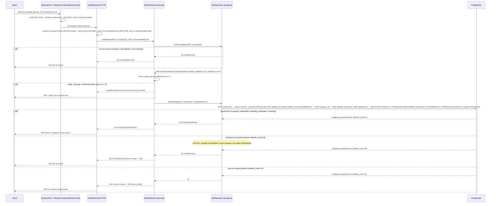

# Design: `jobs-soft-delete`

Status: design. Grounded by `openspec/changes/jobs-soft-delete/proposal.md` and the delta spec `openspec/changes/jobs-soft-delete/specs/jobs/spec.md`. The delta spec is authoritative for observable behavior; this document turns that behavior into component-level architecture.

Reference slice: `jobs-reopen` (archived at `openspec/changes/archive/2026-08-25-jobs-reopen/`), which delivered the atomic active-company SQL-guard CTE (`UpdateJob :one` → `{guard_passed, updated_count}`), the `mapUpdateError` ordering (`pgx.ErrNoRows` BEFORE `errors.As`), and the explicit-case-not-default-relaxation discipline this change mirrors. `jobs-create` (archived at `openspec/changes/archive/2026-08-25-jobs-create/`) delivered the atomic five-stub repair (D10) and the gated-route wiring pattern this change reuses. `jobs-write-side` (archived at `openspec/changes/archive/2026-08-24-jobs-write-side/`) delivered the PATCH CAS / editor-view / same-company precedent this change inherits verbatim.

Locked decisions are **not** re-opened here:

- New gated endpoint `DELETE /jobs/{id}`; sets `deleted_at = now()` tombstone. No hard delete, no migration.
- Gate: `RequireAuth` + `RequireCompanyRole(recruiter)` on the gated subtree; owner passes via `MemberRole` ordinal.
- CAS **required** via `If-Unmodified-Since` (RFC 3339, same as PATCH); stale/missing/malformed → `409` with the latest editor view.
- Response: `204 No Content`. Any status deletable (`draft`/`published`/`closed`). Second DELETE → `404`. Cross-company → `404`. Invalid UUID → `400`. Auth `401` / role `403`.
- Active-company gate **required** (atomic CTE mirroring `UpdateJob`) — suspended/pending → `409 company is not active`.
- Read-side zero change. Re-open on soft-deleted stays `404`. No new columns, no notifications, no restore endpoint.

---

## 1. Context and scope

The jobs write surface today covers `POST /jobs` (create draft), `PATCH /jobs/{id}` (field edits + publish/close/re-open). There is no API path that removes a vacancy: "close it forever" today means leaving `status='closed'` forever or running maintenance SQL that bypasses the gate, CAS, and active-company guard. The `jobs` table already carries `deleted_at TIMESTAMPTZ NULL` (`00007_jobs.sql`), every read-side query (`SearchJobs`, `GetJobByID`, `GetJobForUpdate`) and `UpdateJob` already filter `deleted_at IS NULL`, and the partial index `jobs_public_listing_idx` is already predicated on `deleted_at IS NULL`. Read-side invisibility is already correct. The only missing piece is the single write path that sets the tombstone behind the same gate, CAS, and active-company guard every other write goes through.

The slice is deliberately minimal:

- **Application**: a new `SoftDeleteJob` use case that reuses `GetForUpdate` + CAS compare + a new port method `SoftDelete`. No re-read on success (204 has no body).
- **Persistence**: a new `SoftDeleteJob :one` query mirroring `UpdateJob`'s atomic CTE guard, with a minimal `SET` list (`deleted_at = now()`, `updated_at = now()`).
- **Infrastructure**: a new `SoftDelete` adapter method + `mapSoftDeleteError` (mirrors `mapUpdateError`), a new `softDeleteJob` handler, and one new gated route line.
- **Port**: extend `JobRepository` with `SoftDelete`, which breaks every stub + the `var _` assertion in lockstep (atomic five-stub repair, `jobs-create` D10 precedent).

**No migration.** `00007_jobs.sql` already has `deleted_at`. No new column, no `deleted_by_user_id`, no `deletion_log`, no candidate-side behavior, no notifications. The public read side, DTOs, entities, and all migrations are untouched.

---

## 2. Decisions at a glance

| # | Decision | Choice |
|---|---|---|
| D1 | `SoftDeleteJob` SQL guard shape | `:one`; atomic CTE + scalar SELECT returning `{guard_passed, deleted_count}` (mirrors `UpdateJob`). |
| D2 | Outcome matrix | `guard_passed=false` → `ErrCompanyNotActive`; `guard_passed=true, deleted_count=0` → `ErrJobNotFound` (404, **no re-read**); `deleted_count=1` → success. |
| D3 | `mapSoftDeleteError` | `pgx.ErrNoRows` → `ErrCompanyNotActive` (BEFORE `errors.As`); `23514` → `ErrInvalidStatusTransition` (defense-in-depth); no `23503`. |
| D4 | Use-case signature | `(*dtos.JobEditorViewDto, error)` — refines the proposal's `error`; the 409-with-view CAS body needs the view. |
| D5 | Use-case flow | `GetForUpdate` → CAS compare → `repo.SoftDelete`; no re-read on success. |
| D6 | Port extension + stub repair | `SoftDelete(ctx, id, companyID, casUpdatedAt) error`; 5 stub types + adapter + assertions in one commit. |
| D7 | sqlc regen | `SoftDeleteJobParams` + `SoftDeleteJobRow` + `Querier` entry; `UpdateJobParams` unchanged; two generated files. |
| D8 | Handler + wiring | `softDeleteJob` + `JobHandlers.SoftDeleteJob` + `r.With(requireAuth, requireRecruiter).Delete(...)`; `classifyError` unchanged. |
| D9 | File inventory | Authoritative; corrects the proposal §9 stub list (5 stub **types**, not 5 files). |

---

## 3. Architectural decisions (ADR)

### D1 — `SoftDeleteJob` guard shape: `:one` scalar SELECT `{guard_passed, deleted_count}`

**Context.** The locked decision is an active-company gate "atomic CTE mirroring `UpdateJob`". `UpdateJob` (from `jobs-reopen` D1) is a `:one` query whose `active` CTE yields zero rows when the company is non-active, and whose final scalar `SELECT` returns `{guard_passed, updated_count}` so the adapter can distinguish guard-miss from CAS-miss. `SoftDeleteJob` must replicate that shape exactly, but with a minimal SET list and the `deleted_count` alias (not `updated_count`).

**Decision.** Add a new `:one` query:

```sql
-- name: SoftDeleteJob :one
-- Atomic soft-delete + CAS + active-company guard for DELETE /jobs/{id}
-- (design D1/D2/D3, jobs-soft-delete slice).
--
-- Minimal SET list: ONLY deleted_at = now() and updated_at = now().
-- published_at / title / description / status / work_mode /
-- employment_type / seniority / location / salary_min / salary_max /
-- salary_currency are PRESERVED as audit history. search_vector (STORED
-- generated) is naturally unchanged because its inputs (title,
-- description) are not touched; the partial index jobs_public_listing_idx
-- (predicated on deleted_at IS NULL) drops the row automatically.
--
-- Active-company guard (mirrors UpdateJob D1):
--   - the `active` CTE selects the owning company ONLY when
--     companies.status = 'active'. suspended / pending_verification /
--     missing company yields zero rows in `active`, so the UPDATE inside
--     `upd` matches zero rows AND the final SELECT reports
--     guard_passed = false.
--   - the UPDATE's WHERE adds `AND EXISTS (SELECT 1 FROM active)` so the
--     guard and the write are the same statement — no TOCTOU window.
--
-- Outcome matrix (adapter D2):
--   guard_passed = false, deleted_count = 0
--     → ErrCompanyNotActive (suspended/pending/missing company)
--   guard_passed = true,  deleted_count = 0
--     → ErrJobNotFound (CAS lost / already-soft-deleted / cross-company
--       race with an active company; the use case already CAS-compared,
--       so this is a residual tight race — mapped to 404, no re-read)
--   guard_passed = true,  deleted_count = 1
--     → success (1 row tombstoned)
--
-- CAS in the UPDATE WHERE: `updated_at = sqlc.arg('cas_token')` — the
-- atomic race-free guard. The final scalar SELECT (no FROM, no WHERE)
-- ALWAYS returns exactly one row, so pgx.ErrNoRows is unreachable via the
-- designed flow (mapSoftDeleteError keeps it as defense-in-depth).
WITH active AS (
    SELECT id
    FROM companies
    WHERE id = sqlc.arg('company_id')::uuid
      AND status = 'active'
),
upd AS (
    UPDATE jobs
    SET
        deleted_at = now(),
        updated_at = now()
    WHERE id         = sqlc.arg('id')::uuid
      AND company_id = sqlc.arg('company_id')::uuid
      AND deleted_at IS NULL
      AND updated_at = sqlc.arg('cas_token')::timestamptz
      AND EXISTS (SELECT 1 FROM active)
    RETURNING id
)
SELECT
    EXISTS (SELECT 1 FROM active) AS guard_passed,
    (SELECT count(*) FROM upd)    AS deleted_count;
```

- The `active` CTE is evaluated once and referenced twice (UPDATE `WHERE` `EXISTS`, final `SELECT` `EXISTS`) — the guard and the write are the same statement → no TOCTOU window (spec scenario "the active check is atomic with the UPDATE").
- The row-narrowing predicates (`id`, `company_id`, `deleted_at IS NULL`, `updated_at = cas_token`) are identical to `UpdateJob`'s; they are the only per-row conditions.
- The SET list is intentionally minimal: `deleted_at` + `updated_at` only. `published_at`, `title`, `description`, `status`, all closed-set fields, `location`, `salary_min`, `salary_max`, `salary_currency` are untouched (audit-history preservation — spec `deleted_at is the audit timestamp and no other column is touched`).
- `deleted_count = (SELECT count(*) FROM upd)` is `1` when the UPDATE matched a row, `0` otherwise. `id` is the PK and `company_id` + `deleted_at IS NULL` + `updated_at` narrow to at most one row, so the count is `0|1`.
- The final `SELECT` is scalar, so it always returns exactly one row; `pgx.ErrNoRows` is unreachable on the designed path.

**Argument order.** sqlc orders params by first textual appearance. `company_id` first appears in the `active` CTE, `id` next in the UPDATE `WHERE`, `cas_token` last. Generated shape (confirmed at regen time):

```go
type SoftDeleteJobParams struct {
    CompanyID uuid.UUID          `json:"company_id"`
    ID        uuid.UUID          `json:"id"`
    CasToken  pgtype.Timestamptz `json:"cas_token"`
}

type SoftDeleteJobRow struct {
    GuardPassed  bool  `json:"guard_passed"`
    DeletedCount int64 `json:"deleted_count"`
}
```

**Alternatives considered.**

1. **`AND EXISTS` on an `:execrows` statement** — rejected for the same reason as `jobs-reopen` D1: a guard-miss on `UPDATE` yields `RowsAffected()==0`, not `pgx.ErrNoRows`, collapsing the guard-miss into `ErrJobNotFound` → (after re-read) `ErrConcurrencyConflict` — the wrong body and semantics for a suspended company (spec pins `409 company is not active` with the row untouched).
2. **Separate company-status pre-check ahead of the UPDATE** — rejected: reintroduces a read-then-write TOCTOU window, which the spec explicitly forbids.
3. **`RETURNING` the editor view** (like `CreateJob`) — rejected: the success response is `204` with no body; there is nothing to project and the editor view DTO has no `deleted_at` field.
4. **Reuse `UpdateJob` with a `deleted_at` flag param** — rejected: it would pollute `UpdateJob` with a soft-delete concern, complicate `buildUpdateJobParams`, and break the "one query per write operation" convention (`GetJobForUpdate`/`UpdateJob`/`CreateJob` are already distinct). A separate query is cleaner and matches the reference slices.

### D2 — Outcome matrix; `deleted_count=0` → `ErrJobNotFound` with **no** use-case re-read

**Decision.** The adapter inspects the row and returns exactly one of:

| `guard_passed` | `deleted_count` | Adapter result | HTTP |
|---|---|---|---|
| `false` | `0` | `ErrCompanyNotActive` | 409 "company is not active" |
| `true` | `0` | `ErrJobNotFound` | 404 "job not found" |
| `true` | `1` | `nil` (success) | 204 No Content |

The use case does **not** re-read on `ErrJobNotFound` from `SoftDelete`, unlike `EditJob`'s step-7 re-read. This is deliberate and is the one place the soft-delete flow diverges from `UpdateJob`:

- The dominant CAS race is caught **at the use-case layer**: `GetForUpdate` loads `current.UpdatedAt`, the use case compares `ifUnmodifiedSince.Equal(current.UpdatedAt)`, and a stale token returns `(toEditorView(current), ErrConcurrencyConflict)` → `409` + editor view **before** `repo.SoftDelete` is ever called (spec scenarios "stale/missing/malformed `If-Unmodified-Since`" and "two concurrent writers, exactly one wins" — the latter's parenthetical pins the mechanism: the second caller's `GetForUpdate` reads the advanced `updated_at` and the CAS compare fails before the tombstone write).
- `deleted_count=0` at the adapter is therefore a **residual tight race**: the row changed after the use case's `GetForUpdate` but before the UPDATE (e.g. a concurrent PATCH advanced `updated_at`, or a concurrent DELETE already set `deleted_at`). In both cases the row is either (a) already soft-deleted, for which `404` is the spec-pinned, indistinguishable answer, or (b) changed under the deleter, for which `204`-with-no-body has no meaningful editor view to render (the editor view DTO has no `deleted_at` and the success path never re-reads). Mapping this residual race to `404` is a conservative, spec-consistent degradation, not a correctness hole — the client's next read reveals the truth.

**Why not re-read → `ErrConcurrencyConflict` (the `UpdateJob` shape).** The `409`-with-view body exists to let the PATCH client re-issue against a still-visible, still-editable row. Soft-delete's success has no body (`204`) and no post-delete editor view, so a `409` body for a row that may already be gone would be misleading. The proposal §6.3 rationale and the task's pinned `guard true + deleted_count 0 → ErrJobNotFound` both confirm this simplification.

**Alternatives considered.**

1. **Re-read and return `409` on a still-visible row / `404` on a gone row** (full `UpdateJob` parity) — rejected as over-engineering for a no-body write: it adds a second `GetForUpdate` round trip for a residual race that the use-case CAS compare already narrows to near-zero, and the `409` body would project a row whose `deleted_at` is not representable.
2. **Idempotent `204` on second DELETE** — rejected in the proposal §6.4 (leaks existence / requires a non-visibility-narrowed read); `404` is the consistent answer.

### D3 — `mapSoftDeleteError`: `pgx.ErrNoRows` first, `23514` defense-in-depth, no `23503`

**Decision.** A distinct dispatcher mirroring `mapUpdateError` exactly (the soft-delete query is an `UPDATE`, not an `INSERT`, so it inherits `Update`'s error surface, not `Create`'s):

```go
func mapSoftDeleteError(err error) error {
	if err == nil {
		return nil
	}
	if errors.Is(err, pgx.ErrNoRows) {
		return entities.ErrCompanyNotActive // defense-in-depth; unreachable via :one scalar SELECT
	}
	var pgErr *pgconn.PgError
	if errors.As(err, &pgErr) {
		switch pgErr.Code {
		case "23514":
			return entities.ErrInvalidStatusTransition // defense-in-depth; minimal SET list cannot trip a CHECK
		}
	}
	return err
}
```

- **`pgx.ErrNoRows` is checked BEFORE `errors.As(err, &pgErr)`** — the locked ordering from `jobs-reopen` D2. `pgx.ErrNoRows` is not a `*pgconn.PgError`, so there is no precedence conflict; the two checks coexist and `23514` is preserved.
- **`23514 → ErrInvalidStatusTransition`** is defense-in-depth: the minimal SET list (`deleted_at`, `updated_at`) cannot trip the `jobs_published_integrity_check` (`status <> 'published' OR published_at IS NOT NULL`) because it touches neither `status` nor `published_at`. Kept to mirror `mapUpdateError` and satisfy the locked contract if the query shape drifts.
- **No `23503`** — soft-delete does not insert or reassign `company_id`; a FK violation on `company_id` is impossible on this path (unlike `CreateJob`, which maps `23503 → ErrCompanyGone`).

**Alternatives considered.**

1. **Reuse `mapUpdateError` directly** — rejected on convention grounds: the codebase uses one dispatcher per write operation (`mapGetError` / `mapUpdateError` / `mapCreateError`), so a future drift of the soft-delete SQLSTATE surface stays isolated. The bodies are intentionally identical today.
2. **Map `23503 → ErrCompanyGone`** — rejected: not applicable to an UPDATE that does not change `company_id`.

### D4 — Use-case signature: `(*dtos.JobEditorViewDto, error)`

**Decision.** `SoftDeleteJob` returns `(*dtos.JobEditorViewDto, error)`, **not** the bare `error` the proposal §7.2 sketches.

**Rationale.** The spec pins the CAS-mismatch body: `409 Conflict` with the latest editor view. The handler's existing special-case (`errors.Is(err, entities.ErrConcurrencyConflict)` → write the view) needs the view to be **returned alongside** the error — the exact tuple contract `EditJob` already uses. A bare `error` return would force the handler to re-read the job itself (it cannot: `GetForUpdate` is a repo method, not exposed on the service) or drop the view (violating the spec's "same editor view DTO" requirement). The tuple return is the established precedent and keeps the handler thin.

Return contract:

- success → `(nil, nil)` (handler writes `204`, empty body)
- CAS mismatch → `(toEditorView(current), entities.ErrConcurrencyConflict)` (handler writes `409` + view)
- `ErrJobNotFound` (from `GetForUpdate` or `SoftDelete`) → `(nil, entities.ErrJobNotFound)` → `404`
- `ErrCompanyNotActive` → `(nil, entities.ErrCompanyNotActive)` → `409 company is not active`
- any other error → `(nil, err)` → `500`

**Alternatives considered.**

1. **Bare `error` + handler re-read** — rejected: the handler has no access to `GetForUpdate`, and adding a read passthrough on `JobService` just for this would widen the service surface for no benefit.
2. **A custom error type carrying the view** — rejected: the codebase convention is sentinel errors + the `(view, err)` tuple (`EditJob`); introducing a view-carrying error type would be a new pattern with no precedent.

### D5 — Use-case flow: `GetForUpdate` → CAS → `SoftDelete`, no re-read on success

```go
func (s *JobService) SoftDeleteJob(
	ctx context.Context,
	companyID, jobID uuid.UUID,
	ifUnmodifiedSince time.Time,
) (*dtos.JobEditorViewDto, error) {
	// 1. Read for delete — non-visibility-narrowed, company-scoped.
	current, err := s.repo.GetForUpdate(ctx, jobID, companyID)
	if err != nil {
		// 0 rows (non-existent / cross-company / already-soft-deleted)
		// collapse to ErrJobNotFound → handler 404 (indistinguishable).
		return nil, err
	}

	// 2. CAS compare — header vs row.UpdatedAt. A zero token (missing/
	// malformed header) never equals a real timestamp, so this branch
	// surfaces "missing/malformed If-Unmodified-Since returns 409".
	if !ifUnmodifiedSince.Equal(current.UpdatedAt) {
		return toEditorView(current), entities.ErrConcurrencyConflict
	}

	// 3. Soft-delete — atomic UPDATE with the active-company guard.
	// ErrCompanyNotActive / ErrJobNotFound propagate untouched; no re-read.
	if err := s.repo.SoftDelete(ctx, jobID, companyID, current.UpdatedAt); err != nil {
		return nil, err
	}

	// 4. No re-read: 204 has no body and the post-delete row's deleted_at
	// is not representable in the editor view.
	return nil, nil
}
```

`toEditorView` is the package-private projection from `updateJob.go`, reused verbatim for the `409` body — no parallel projection. `JobForUpdate` is unchanged (no `DeletedAt` field; locked decision #12). `ErrCompanyNotActive` propagates untouched; the existing `classifyError` maps it to `409 company is not active` (no use-case special-casing, same as `jobs-reopen` D5's propagation note).

### D6 — Port extension + atomic five-stub repair

**Decision.** Extend `repositories.JobRepository` with:

```go
// SoftDelete tombstones the row (deleted_at = now()) atomically, guarded
// by the active-company CTE (D1/D2), the row predicates (id, company_id,
// deleted_at IS NULL), and CAS `updated_at = casUpdatedAt`. The SQL is
// `:one` and emits {guard_passed, deleted_count}; the adapter inspects it
// to distinguish the three outcomes (guard miss → ErrCompanyNotActive;
// CAS/already-deleted/cross-company → ErrJobNotFound; 1 row → nil).
SoftDelete(ctx context.Context, id, companyID uuid.UUID, casUpdatedAt time.Time) error
```

Signature mirrors `Update` minus the `patch` (there are no fields to set — the SET list is fixed). Error contract: `ErrCompanyNotActive` / `ErrJobNotFound` / `ErrInvalidStatusTransition` (defense-in-depth) / other → pass-through.

Extending the port breaks **every** type that satisfies it. The inventory (D9) is **five stub types + the postgres adapter**, all repaired in a **single commit** with the port extension (`jobs-create` D10 precedent — the compile break is the RED). See §8 for the exact table.

### D7 — sqlc regen is mechanical but touches two generated files

`go tool sqlc generate` rewrites two files, both generated and never hand-edited:

1. `backend/internal/db/jobs.sql.go` — the `softDeleteJob` SQL constant, `SoftDeleteJobParams`, `SoftDeleteJobRow`, and `SoftDeleteJob(ctx, arg) (SoftDeleteJobRow, error)`.
2. `backend/internal/db/querier.go` — `Querier.SoftDeleteJob` interface entry.

`UpdateJobParams` is **unchanged** (soft-delete is a separate query, not a flag on `UpdateJob`); `UpdateJobRow`, `UpdateJob`, `CreateJob`, `SearchJobs`, `GetJobByID`, `GetJobForUpdate` regenerate verbatim. The only consumer of `db.Queries.SoftDeleteJob` is the adapter's `SoftDelete` method (added in the same GREEN step). Field names `GuardPassed`/`DeletedCount` are pinned by the SQL aliases, so a sqlc naming drift fails the adapter compile.

### D8 — Handler + route wiring; `classifyError` unchanged

The handler mirrors `updateJob` with no body decode and no re-read:

```go
func (h *JobHandler) softDeleteJob(w http.ResponseWriter, r *http.Request) {
	cc, ok := requireCompanyContext(w, r) // fail-closed 500 if absent
	if !ok {
		return
	}

	id, err := uuid.Parse(chi.URLParam(r, "id"))
	if err != nil {
		httpjson.WriteError(w, http.StatusBadRequest, "invalid job id")
		return
	}

	ifUnmodifiedSince := parseIfUnmodifiedSince(r.Header.Get("If-Unmodified-Since"))

	view, err := h.service.SoftDeleteJob(r.Context(), cc.CompanyID, id, ifUnmodifiedSince)
	if err != nil {
		if errors.Is(err, entities.ErrConcurrencyConflict) {
			httpjson.WriteJSON(w, http.StatusConflict, view)
			return
		}
		h.classifyAndWriteError(w, r, err)
		return
	}

	w.WriteHeader(http.StatusNoContent)
}
```

`JobHandlers` gains `SoftDeleteJob http.HandlerFunc`; the accessor adds `SoftDeleteJob: http.HandlerFunc(h.softDeleteJob)`. `classifyError` is **unchanged** — `ErrCompanyNotActive`, `ErrJobNotFound`, `ErrConcurrencyConflict` are already classified. The `409`-with-view special-case is the exact same `errors.Is(err, entities.ErrConcurrencyConflict)` branch `updateJob` already has.

Composition root (`cmd/api/main.go`) gains one line on the existing gated subtree:

```go
r.With(requireAuth, requireRecruiter).Delete("/jobs/{id}", jobHandlers.SoftDeleteJob)
```

`requireAuth` and `requireRecruiter` are already hoisted at `run()` scope. The public `r.Mount("/jobs", jobHandler.Routes())` MUST NOT gain the DELETE — the same routing-split defense as PATCH/POST (a DELETE to the public mount is not matched → chi `404`).

### D9 — Authoritative file inventory (corrects proposal §9)

The proposal §9 lists "5 stub files" but names only three stub types (`stubJobRepository`, `writeStubRepo`, `writeStubHandlerRepo`) and omits two read-side stubs that ALSO satisfy the port. The actual surface is **five stub types** (the `jobs-create` D10 inventory is authoritative), asserted in six package-level `var _` sites plus one in-test assignment, plus the postgres adapter. Full table in §8.

---

## 4. Sequence diagrams

### 4.1 `DELETE /jobs/{id}` — full flow (happy path + CAS 409 + company-not-active 409 + 404)



The `409-with-view CAS path` is the `stale / missing / malformed token` branch — identical to the PATCH flow's CAS compare, returning `(toEditorView(current), ErrConcurrencyConflict)`. The handler special-case (`ErrConcurrencyConflict` writes the view before `classifyError`) is unchanged. The `409 company-not-active` path is the `guard miss` branch, produced entirely by the SQL CTE (no TOCTOU window between middleware and write).

---

## 5. Exact code-level diffs/shapes

### 5.1 `application/usecases/softDeleteJob.go` (NEW) — D4/D5

Full body in §3 D5. Package doc mirrors `updateJob.go`'s header: a 4-step flow (`GetForUpdate` → CAS → `SoftDelete` → no re-read), return contract `(view, nil)` on success / `(view, ErrConcurrencyConflict)` on CAS / `(nil, err)` otherwise.

### 5.2 `application/usecases/jobService.go` (MOD)

`NewJobService` signature unchanged (repo port is the only constructor arg). Add the method and seam next to `EditJob` / `CreateJobUseCase`:

```go
var _ SoftDeleteJobUseCase = (*JobService)(nil)

type SoftDeleteJobUseCase interface {
	SoftDeleteJob(
		ctx context.Context,
		companyID, jobID uuid.UUID,
		ifUnmodifiedSince time.Time,
	) (*dtos.JobEditorViewDto, error)
}
```

### 5.3 `domain/repositories/jobRepository.go` (MOD — port)

Add `SoftDelete` (full signature + doc contract in §3 D6). `Search`, `GetByID`, `GetForUpdate`, `Update`, `Create`, `CreateJobParams`, `UpdatePatch`, `SearchParams`, `Cursor` unchanged.

### 5.4 `db/queries/jobs.sql` (MOD) — `SoftDeleteJob :one`

Full SQL fragment in §3 D1. Summary: (a) new `SoftDeleteJob :one` comment block; (b) `active` CTE; (c) `upd` CTE wrapping the UPDATE with `SET deleted_at = now(), updated_at = now()` and `RETURNING id`; (d) `WHERE id / company_id / deleted_at IS NULL / updated_at = cas_token / EXISTS (SELECT 1 FROM active)`; (e) scalar `SELECT EXISTS(SELECT 1 FROM active) AS guard_passed, (SELECT count(*) FROM upd) AS deleted_count`. `SearchJobs`, `GetJobByID`, `GetJobForUpdate`, `UpdateJob`, `CreateJob` are byte-for-byte unchanged.

### 5.5 `infrastructure/postgres/jobRepository.go` (MOD) — `SoftDelete` + helpers

```go
func (r *JobRepository) SoftDelete(ctx context.Context, id, companyID uuid.UUID, casUpdatedAt time.Time) error {
	row, err := r.queries.SoftDeleteJob(ctx, buildSoftDeleteJobParams(id, companyID, casUpdatedAt))
	if err != nil {
		return mapSoftDeleteError(err)
	}
	if !row.GuardPassed {
		return entities.ErrCompanyNotActive
	}
	if row.DeletedCount == 0 {
		return entities.ErrJobNotFound
	}
	return nil
}

func buildSoftDeleteJobParams(id, companyID uuid.UUID, casUpdatedAt time.Time) db.SoftDeleteJobParams {
	return db.SoftDeleteJobParams{
		CompanyID: companyID,
		ID:        id,
		CasToken:  pgtype.Timestamptz{Time: casUpdatedAt, Valid: true},
	}
}
```

`mapSoftDeleteError` is in §3 D3. `var _ repositories.JobRepository = (*JobRepository)(nil)` stays; the port extension forces the adapter to add `SoftDelete` in the same commit.

### 5.6 `infrastructure/http/jobHandler.go` (MOD)

`softDeleteJob` body in §3 D8. `JobHandlers` gains `SoftDeleteJob http.HandlerFunc`; the accessor adds `SoftDeleteJob: http.HandlerFunc(h.softDeleteJob)`. `classifyError` / `requireCompanyContext` / `parseIfUnmodifiedSince` unchanged.

### 5.7 `cmd/api/main.go` (MOD)

One line below the existing PATCH/POST:

```go
r.With(requireAuth, requireRecruiter).Delete("/jobs/{id}", jobHandlers.SoftDeleteJob)
```

### 5.8 `cmd/api/main_test.go` (MOD) — AST route guard

Add `TestJobsSoftDeleteRoute_MountedBehindGates` (mirrors the PATCH/POST guards) + a `deletePathLiteral` helper. The walk finds `r.With(requireAuth, requireRecruiter).Delete("/jobs/{id}", …)` and asserts the inner `With(...)` references BOTH `requireAuth` and `requireRecruiter`. This is the structural gate that survives composition-root refactors.

---

## 6. Stub-repair inventory (atomic, single commit)

Extending the port with `SoftDelete` breaks every implementer in lockstep. The compile break is the RED. Six types gain a method; five stubs get a default `nil` (or programmable) body, the adapter gets the real implementation.

| # | Type | Definition file | Assertion(s) | `SoftDelete` shape |
|---|---|---|---|---|
| 1 | `stubJobRepo` | `domain/repositories/jobRepository_test.go` | `var repo JobRepository = &stubJobRepo{}` (in `TestJobRepository_StubSatisfiesPort`) | `return nil` (keeps read tests green) |
| 2 | `stubJobRepository` | `application/usecases/searchJobs_test.go` | `var _ repositories.JobRepository = (*stubJobRepository)(nil)` (line 97) | `return nil` |
| 3 | `stubRepo` | `infrastructure/http/handler_test.go` | `var _ repositories.JobRepository = (*stubRepo)(nil)` (line 102) | `return nil` |
| 4 | `writeStubRepo` | `application/usecases/updateJob_test.go` (shared by `createJob_test.go`) | `var _ …` (updateJob_test.go:151 **and** createJob_test.go:565) | programmable `softDeleteErr` + capture `softDeleteCalls`, `lastSoftDeleteID`, `lastSoftDeleteCompany`, `lastSoftDeleteCas` |
| 5 | `writeStubHandlerRepo` | `infrastructure/http/updateJobHandler_test.go` (used by `createJobHandler_test.go`) | `var _ …` (updateJobHandler_test.go:151) | programmable `softDeleteErr` + capture `softDeleteCalls`, `lastSoftDeleteID`, `lastSoftDeleteCompany`, `lastSoftDeleteCas` |
| — | `postgres.JobRepository` | `infrastructure/postgres/jobRepository.go` | `var _ repositories.JobRepository = (*JobRepository)(nil)` (line 41) | real implementation (D1/D2/D3) |

**Correction to proposal §9.** The proposal lists `searchJobs_test.go`, `updateJob_test.go`, `createJob_test.go`, `updateJobHandler_test.go`, `createJobHandler_test.go` as the five MOD stub files, but omits `domain/repositories/jobRepository_test.go` (`stubJobRepo`) and `infrastructure/http/handler_test.go` (`stubRepo`) — two read-side stubs that satisfy the port and would break on the extension. Conversely, `createJob_test.go` and `createJobHandler_test.go` need **no** edit: they use the shared `writeStubRepo` / `writeStubHandlerRepo` types (defined in `updateJob_test.go` / `updateJobHandler_test.go`) and their `var _` assertions compile once those types gain the method. The authoritative repair set is **five files** (rows 1–5 above), all in one commit.

---

## 7. Test inventory (RED-first, strict TDD)

Strict TDD applies (`strict_tdd: true`). Each behavior has a RED test pre-dating its GREEN implementation; the port-extension compile break is itself the RED for the stubs.

### Phase A — use case (`softDeleteJob_test.go`, NEW)

1. **RED** `TestSoftDeleteJob_SuccessCallsSoftDeleteWithCAS` — `GetForUpdate` returns a row; assert `repo.SoftDelete` called with `(id, companyID, current.UpdatedAt)` and use case returns `(nil, nil)`.
2. **RED** `TestSoftDeleteJob_StatusAgnostic` (table-driven over draft/published/closed) — the use case never branches on `current.JobStatus`; each status flows `GetForUpdate → SoftDelete` and returns `(nil, nil)`.
3. **RED** `TestSoftDeleteJob_CASMismatchReturnsConflictWithView` — stale `ifUnmodifiedSince` → `(toEditorView(current), ErrConcurrencyConflict)`, `SoftDelete` NOT called.
4. **RED** `TestSoftDeleteJob_ZeroTokenReturnsConflict` — `time.Time{}` token → mismatch → `ErrConcurrencyConflict` (covers missing/malformed header at the use-case layer).
5. **RED** `TestSoftDeleteJob_GetForUpdateNotFoundPropagates` — `GetForUpdate` → `ErrJobNotFound` → `(nil, ErrJobNotFound)`, `SoftDelete` NOT called.
6. **RED** `TestSoftDeleteJob_SoftDeleteErrCompanyNotActivePropagates` — stub `softDeleteErr = ErrCompanyNotActive` → `(nil, ErrCompanyNotActive)`, no re-read (`getForUpdateCalls == 1`).
7. **RED** `TestSoftDeleteJob_SoftDeleteErrJobNotFoundPropagatesNoReread` — stub `softDeleteErr = ErrJobNotFound` → `(nil, ErrJobNotFound)`, `getForUpdateCalls == 1` (pins D2's no-re-read).

GREEN: author `softDeleteJob.go` + `jobService.go` seam. (`writeStubRepo` gains `SoftDelete` in the same RED step as the port extension.)

### Phase B — adapter unit + sqlc (compile)

8. **RED (compile)** — author `SoftDeleteJob :one` in `jobs.sql` and run `go tool sqlc generate`; the adapter has no `SoftDelete`, so the port assertion and stub assertions break.
9. **RED** `TestMapSoftDeleteError` (`jobRepository_softDelete_test.go`): `pgx.ErrNoRows → ErrCompanyNotActive`; wrapped `%w pgx.ErrNoRows → ErrCompanyNotActive`; `pgconn.PgError{Code:"23514"} → ErrInvalidStatusTransition`; unknown PgError / non-pg error → pass-through. (Assert there is NO `23503` branch.)
10. **RED** `TestBuildSoftDeleteJobParams` — `(id, companyID, casUpdatedAt)` → `SoftDeleteJobParams{CompanyID, ID, CasToken}` with `CasToken.Valid=true`.

GREEN: implement `SoftDelete` + `buildSoftDeleteJobParams` + `mapSoftDeleteError` (D1/D2/D3). The `SoftDelete` row-inspection (`GuardPassed`/`DeletedCount`) is exercised by the SQL integration tests (Phase C), matching the `Update` precedent (no `*db.Queries` fake exists; the inspection lives behind the concrete `*db.Queries` handle).

### Phase C — SQL integration (`jobRepository_softDelete_integration_test.go`, NEW, `//go:build integration`)

Reuses the write-path fixtures `wpDraftID`/`wpPublishedID`/`wpClosedID`/`wpDeletedID`/`wpCrossCoID`, `setupWritePath`, and `seededCompanyIDs` (package-level, same `postgres` package — mirroring `jobRepository_create_integration_test.go`'s new-file precedent; the proposal's "MOD write integration file" is the alternative but the file is already ~700 lines).

11. **RED/GREEN** `TestSoftDelete_DraftRowDeletes` — `SoftDelete(wpDraftID)` → `nil`; raw SQL asserts `deleted_at IS NOT NULL`; `repo.GetByID` → `ErrJobNotFound` (read invisibility).
12. **RED/GREEN** `TestSoftDelete_PublishedRowDeletes` — `wpPublishedID` → `nil`; `published_at` preserved; `deleted_at` set.
13. **RED/GREEN** `TestSoftDelete_ClosedRowDeletes` — `wpClosedID` → `nil`; `published_at` preserved; `deleted_at` set.
14. **RED/GREEN** `TestSoftDelete_SetsDeletedAtAndAdvancesUpdatedAt` — raw SQL asserts `deleted_at IS NOT NULL` and `updated_at > before.UpdatedAt` (exactly once).
15. **RED/GREEN** `TestSoftDelete_PreservesImmutables` — maximal snapshot before; after SoftDelete, `title`/`description`/`status`/`work_mode`/`employment_type`/`seniority`/`location`/`salary_min`/`salary_max`/`salary_currency`/`published_at`/`id`/`company_id`/`created_at` unchanged; only `deleted_at` + `updated_at` moved.
16. **RED/GREEN** `TestSoftDelete_SearchVectorUnchangedAndExcludedFromListing` — raw SQL asserts `search_vector` still matches the old `title`+`description` tokens; `repo.Search` (active company, published predicate) excludes the row.
17. **RED/GREEN** `TestSoftDelete_SecondDeleteReturnsErrJobNotFound` — `SoftDelete(wpDeletedID)` → `ErrJobNotFound` (already-soft-deleted); also `SoftDelete` a fresh row twice → second is `ErrJobNotFound`.
18. **RED/GREEN** `TestSoftDelete_CrossCompanyReturnsErrJobNotFound` — `SoftDelete(wpCrossCoID, seededCompanyIDs[0])` → `ErrJobNotFound`.
19. **RED/GREEN** `TestSoftDelete_CASMismatchReturnsErrJobNotFound` — `SoftDelete` with a stale `casUpdatedAt` → `ErrJobNotFound`, row NOT deleted (adapter-level; the use case catches the common case earlier as 409).
20. **RED/GREEN** `TestSoftDelete_SuspendedCompanyReturnsErrCompanyNotActive` — suspend `seededCompanyIDs[0]` in-transaction → `SoftDelete` → `ErrCompanyNotActive`, row NOT deleted.
21. **RED/GREEN** `TestSoftDelete_PendingVerificationCompanyReturnsErrCompanyNotActive` — set `pending_verification` → same assertion.
22. **RED/GREEN** `TestSoftDelete_ActiveCompanyPassesGuard` — active company → `nil`.
23. **RED/GREEN** `TestSoftDelete_GuardIsAtomicWithUpdate` — `GetForUpdate` while active, then suspend in-transaction, then `SoftDelete` → `ErrCompanyNotActive` (the UPDATE's `EXISTS` wins; no TOCTOU).

### Phase D — handler (`softDeleteJobHandler_test.go`, NEW)

24. **RED** `TestSoftDeleteJob_MissingCompanyContextReturns500` — no `CompanyContext` → 500, `SoftDelete` NOT called.
25. **RED** `TestSoftDeleteJob_InvalidUUIDReturns400` — `/jobs/not-a-uuid` → 400.
26. **RED** `TestSoftDeleteJob_StaleCASReturns409WithView` — stale `If-Unmodified-Since` → 409 + editor view body (decode as `JobEditorViewDto`).
27. **RED** `TestSoftDeleteJob_MissingCASReturns409WithView` — no header → 409 + editor view.
28. **RED** `TestSoftDeleteJob_MalformedCASReturns409WithView` — `not-a-timestamp` → 409 + editor view.
29. **RED** `TestSoftDeleteJob_NotFoundReturns404` — `GetForUpdate` → `ErrJobNotFound` → 404 (cross-company/non-existent/soft-deleted indistinguishable).
30. **RED** `TestSoftDeleteJob_CompanyNotActiveReturns409` — `SoftDelete` → `ErrCompanyNotActive` → 409 `{"error":"company is not active"}`.
31. **RED** `TestSoftDeleteJob_SuccessReturns204EmptyBody` — success → 204, empty body.
32. **RED** `TestSoftDeleteJob_MissingAuthReturns401` — mount `RequireAuth(denyAllVerifier)` ahead of the handler; no `Authorization` → 401.
33. **RED** `TestSoftDeleteJob_DeleteNotServedByPublicMount` — DELETE through public `h.Routes()` under `/jobs` → chi 404 (not matched).

GREEN: author `softDeleteJob` handler + `JobHandlers.SoftDeleteJob` accessor + `writeStubHandlerRepo.SoftDelete`.

### Phase E — composition root AST guard (`main_test.go`, MOD)

34. **RED** `TestJobsSoftDeleteRoute_MountedBehindGates` — before the route line exists, the AST walk finds zero gated `Delete("/jobs/{id}")` mutations. GREEN: add the route line + `deletePathLiteral` helper.

**Regression guards already present and still valid** (no change): `TestGetForUpdate_CrossCompanyReturnsErrJobNotFound` / `TestGetForUpdate_SoftDeletedReturnsErrJobNotFound` / `TestGetForUpdate_NonExistentReturnsErrJobNotFound` (the 404 boundary), `TestUpdate_ImmutablesNeverTouched` (pins `deleted_at` is never touched by PATCH — soft-delete is the ONLY setter), `TestJobsMount_PublicReadRoutes` (public mount stays GET-only).

---

## 8. Spec-scenario → test checklist

Every delta scenario maps to at least one test (unit `U`, handler `H`, SQL integration `I`, adapter `A`, existing regression `R`).

| # | Scenario | Test(s) | Layer |
|---|---|---|---|
| S1 | recruiter can soft-delete a vacancy of their company | `TestSoftDeleteJob_SuccessCallsSoftDeleteWithCAS` / `TestSoftDelete_DraftRowDeletes` | U + I |
| S2 | owner passes the recruiter gate | existing `RequireCompanyRole` ordinal tests + `TestJobsSoftDeleteRoute_MountedBehindGates` (route uses `requireRecruiter`) | R + AST |
| S3 | no Authorization header → 401 | `TestSoftDeleteJob_MissingAuthReturns401` | H |
| S4 | authenticated non-member → 403 | existing `RequireCompanyRole` tests (middleware short-circuit) | R |
| S5 | role too low → 403 | existing `RequireCompanyRole` tests | R |
| S6 | invalid job id → 400 | `TestSoftDeleteJob_InvalidUUIDReturns400` | H |
| S7 | 204 No Content with empty body on success | `TestSoftDeleteJob_SuccessReturns204EmptyBody` / `TestSoftDeleteJob_SuccessCallsSoftDeleteWithCAS` | H + U |
| S8 | missing CompanyContext fails closed → 500 | `TestSoftDeleteJob_MissingCompanyContextReturns500` | H |
| S9 | DELETE not reachable through the public mount | `TestSoftDeleteJob_DeleteNotServedByPublicMount` / `TestJobsMount_PublicReadRoutes` | H + R |
| S10 | matching `updated_at` allows the soft-delete | `TestSoftDeleteJob_SuccessCallsSoftDeleteWithCAS` / `TestSoftDelete_DraftRowDeletes` | U + I |
| S11 | stale `updated_at` → 409 with latest editor view | `TestSoftDeleteJob_CASMismatchReturnsConflictWithView` / `TestSoftDeleteJob_StaleCASReturns409WithView` | U + H |
| S12 | missing `If-Unmodified-Since` → 409 with editor view | `TestSoftDeleteJob_ZeroTokenReturnsConflict` / `TestSoftDeleteJob_MissingCASReturns409WithView` | U + H |
| S13 | malformed `If-Unmodified-Since` → 409 with editor view | `TestSoftDeleteJob_MalformedCASReturns409WithView` (parse → zero token) | H |
| S14 | CAS conflict independent of company visibility | `TestSoftDeleteJob_CASMismatchReturnsConflictWithView` (CAS compare runs before the cross-company filter) | U |
| S15 | two concurrent writers, exactly one wins | `TestSoftDeleteJob_CASMismatchReturnsConflictWithView` + `TestSoftDelete_CASMismatchReturnsErrJobNotFound` (second read sees advanced `updated_at`) | U + I |
| S16 | soft-delete advances `updated_at` exactly once | `TestSoftDelete_SetsDeletedAtAndAdvancesUpdatedAt` | I |
| S17 | suspended company DELETE → 409 company is not active | `TestSoftDelete_SuspendedCompanyReturnsErrCompanyNotActive` / `TestSoftDeleteJob_CompanyNotActiveReturns409` | I + H |
| S18 | pending_verification company DELETE → 409 | `TestSoftDelete_PendingVerificationCompanyReturnsErrCompanyNotActive` | I |
| S19 | active company DELETE passes the gate | `TestSoftDelete_ActiveCompanyPassesGuard` | I |
| S20 | active check is atomic with the UPDATE | `TestSoftDelete_GuardIsAtomicWithUpdate` | I |
| S21 | draft row is soft-deletable in one step | `TestSoftDelete_DraftRowDeletes` | I |
| S22 | published row is soft-deletable in one step | `TestSoftDelete_PublishedRowDeletes` | I |
| S23 | closed row is soft-deletable in one step | `TestSoftDelete_ClosedRowDeletes` | I |
| S24 | `deleted_at` is the audit timestamp; no other column touched | `TestSoftDelete_PreservesImmutables` | I |
| S25 | `search_vector` and partial index naturally consistent | `TestSoftDelete_SearchVectorUnchangedAndExcludedFromListing` | I |
| S26 | second DELETE on already-soft-deleted → 404 | `TestSoftDelete_SecondDeleteReturnsErrJobNotFound` / `TestSoftDeleteJob_GetForUpdateNotFoundPropagates` | I + U |
| S27 | cross-company DELETE → 404 | `TestSoftDelete_CrossCompanyReturnsErrJobNotFound` / `TestGetForUpdate_CrossCompanyReturnsErrJobNotFound` | I + R |
| S28 | non-existent id DELETE → 404 | `TestSoftDeleteJob_GetForUpdateNotFoundPropagates` / `TestGetForUpdate_NonExistentReturnsErrJobNotFound` | U + R |
| S29 | PATCH re-open on soft-deleted → 404 (cross-reference) | `TestGetForUpdate_SoftDeletedReturnsErrJobNotFound` (existing) | R |
| S30 | soft-deleted hidden from `GET /jobs/{id}` (cross-reference) | `TestSoftDelete_DraftRowDeletes` (re-read `GetByID` → `ErrJobNotFound`) / existing `GetByID` visibility test | I + R |
| S31 | soft-deleted excluded from `GET /jobs` (cross-reference) | `TestSoftDelete_SearchVectorUnchangedAndExcludedFromListing` / existing `Search` visibility test | I + R |

---

## 9. Out of scope (explicit)

No hard delete / purge, no restore / undelete endpoint, no `deleted_by_user_id` / `deleted_reason` / `deletion_log`, no candidate-side behavior, no notifications / events, no public read-side change, no `closed_at` / `reopened_at` column, no bulk DELETE, no feature-flag-gated rollout, no migration, no new package / env var / docker-compose service. DTOs, `domain/entities`, all `valueobjects`, read-side SQL (`SearchJobs`/`GetJobByID`), `GetJobForUpdate`, `UpdateJob`, and all migrations are unchanged. `JobForUpdate` does not gain a `DeletedAt` field (the `204` success path never re-reads).

---

## 10. Risks and rollout

- **Guard-miss vs CAS-miss misclassification** — the central risk, eliminated by D1's `{guard_passed, deleted_count}` shape. A naive `:execrows` + `AND EXISTS` would surface a suspended-company DELETE as `ErrConcurrencyConflict` (wrong body). Pinned by `TestSoftDelete_SuspendedCompanyReturnsErrCompanyNotActive` and `TestSoftDelete_CASMismatchReturnsErrJobNotFound`.
- **Residual tight race → `404` instead of `409`** — when a concurrent writer changes the row between the use case's `GetForUpdate` and the `SoftDelete` UPDATE, the response is `404` (D2), not `409`-with-view. This is a deliberate, documented simplification: the dominant CAS race is caught at the use-case layer (`409`), and the residual race has no meaningful editor view (204/no-body). Accepted; flagged so future work does not silently "fix" it into a re-read that reintroduces the no-body ambiguity.
- **Routing split** — the DELETE shares `/jobs/{id}` with the public GET. Mitigated by the per-method `JobHandlers()` accessor + the explicit gated `Delete(...)` line + `TestJobsSoftDeleteRoute_MountedBehindGates` + `TestSoftDeleteJob_DeleteNotServedByPublicMount` (public mount never serves DELETE).
- **Cross-company / non-existent / soft-deleted 404 indistinguishability** — by design (same-company invariant); no leak of existence. Pinned by the existing `GetForUpdate` 404 tests.
- **`deleted_at` immutability on PATCH** — `UpdateJob`'s SET list never touches `deleted_at` (existing `TestUpdate_ImmutablesNeverTouched`); soft-delete is the only setter.
- **sqlc return-type drift** — `SoftDeleteJob`'s `SoftDeleteJobRow` field names are pinned by the SQL aliases (`guard_passed`, `deleted_count`); a sqlc naming drift fails the adapter compile.
- **Rollback** — revert the merge commit. No migration, no schema change, no new package. Reverting `main.go` removes the route; reverting `jobs.sql` + `jobRepository.go` + `jobService.go` + `softDeleteJob.go` + `jobHandler.go` restores the prior write surface; the regen of `jobs.sql.go`/`querier.go` is reverted in lockstep. No data migration in either direction.

---

## 11. Success criteria

A recruiter of an active company `A` can `DELETE /jobs/{id}` with a matching `If-Unmodified-Since` → `204 No Content` (empty body); the row's `deleted_at` is set within the request window and `updated_at` advances exactly once. Immediately after, `GET /jobs/{id}` returns `404` and `GET /jobs` excludes the row. Any status (`draft`/`published`/`closed`) soft-deletes in one step with `published_at` preserved. Stale/missing/malformed CAS → `409` + latest editor view. Suspended / `pending_verification` company → `409 {"error":"company is not active"}` (row NOT tombstoned). Cross-company / non-existent / already-soft-deleted → `404`. Invalid UUID → `400`; no `Authorization` → `401`; role too low → `403`; public-mount DELETE → chi `404`. `cd backend && go test ./...` green; `cd backend && go vet ./...` clean; `go tool sqlc generate` idempotent (second run → empty `git diff`).
