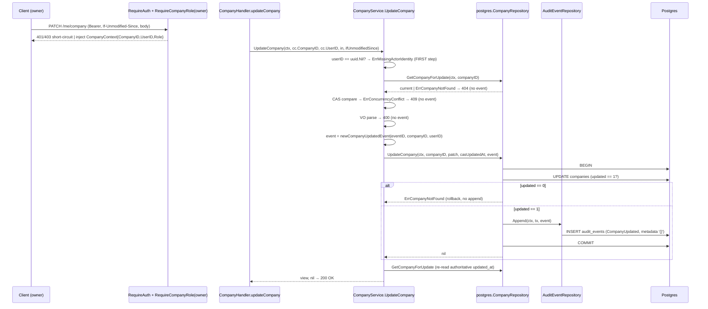
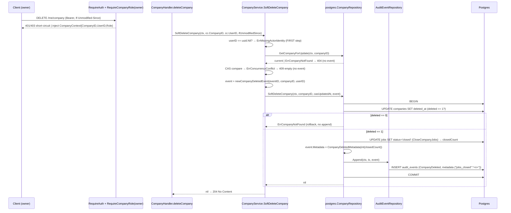

# Design: `companies-audit` — emit `CompanyUpdated` / `CompanyDeleted` from companies write paths

Status: design (architecture phase)
Change: `openspec/changes/companies-audit`
Artifact store: openspec

## Executive summary

This is a **seam change, not a migration**: no new goose migration, no new sqlc query. The `audit_events` INSERT (`InsertAuditEvent :exec`) already exists, `event_type` is deliberately NOT DB-CHECK-constrained, and the companies postgres adapter already owns its own `pgx.Tx` for `UpdateCompany` and `SoftDeleteCompany` (soft-delete + inline `CloseCompanyJobs` run in ONE tx). The change mirrors the applications co-write precedent exactly: thread an `AuditEvent` value param through the companies port + use cases, add the stateless audit adapter to the companies postgres adapter, build the event in the use case (actor = `CompanyContext.UserID`), and `Append` inside the existing tx after the domain write and before `tx.Commit`.

The one genuinely non-trivial decision is the **`jobs_closed` metadata plumbing** (proposal §13 item 1): the value is only observable *inside* the adapter after `CloseCompanyJobs` returns, but the use case must build the event and the append must happen inside the same tx. This design resolves that tension by finalizing the `jobs_closed` scalar in the adapter via a pure **audit_events domain** builder (so no infra→application layer inversion occurs), while the use case remains the single source of truth for *which* event is emitted and for the metadata *contract* (key set pinned by a unit test).

---

## 1. Resolved open items (proposal §13 → design decisions)

| Proposal §13 | Resolution | Decision |
| --- | --- | --- |
| 1. `closedCount` plumbing | Adapter finalizes `jobs_closed` via `auditentities.CompanyDeletedMetadata`; port does NOT return the count | D1 |
| 2. Use-case `UserID` signatures | `userID uuid.UUID` immediately after `companyID` | D2 |
| 3. Port method signatures | `event auditentities.AuditEvent` value param, last position, `error` return unchanged | D3 |
| 4. Constructor + call-site repair | `NewCompanyRepository(pool, audit)`; 8 call sites (1 main + 7 integration), plus hoist `auditRepo` | D4 |
| 5. Event builder location | `companies/application/usecases/eventIntent.go` (structure builders); DELETE metadata builder in audit domain | D5 |
| 6. `uuid.Nil` guard | `ErrMissingActorIdentity` sentinel; FIRST step, before any query; classifier → 500 | D6 |
| 7. `AuditEvent` shape | `entities.AuditEvent`; use case builds structure; DELETE metadata finalized by adapter | D7 |
| 8. Testability | Unit (eventIntent_test, use-case mock port) + integration (real co-write); flip "row count unchanged" | D8 |
| 9. Adapter operation order | Append after `updated==1`/`deleted==1` (+inline close) and before `tx.Commit` | D9 |
| §13.6. Spec archive staging | Both spec deltas land in the same single-PR archive cycle as code | D10 |
| §13.7. Future-only constants | `EventCompanyCreated` / `CompanyRestored` / `CompanySoftDeleted` deferred; only 2 new constants | D11 |

---

## 2. Decisions (ADRs)

### D1 — `jobs_closed` plumbing: the adapter finalizes the post-write scalar via a domain-owned pure builder

**Context.** `CompanyDeleted` metadata is `{"jobs_closed": "<n>"}` where `<n>` is the rowcount of the inline `CloseCompanyJobs` UPDATE. Today that rowcount is captured and discarded (`_ = closedCount` in `companyRepository.go::SoftDeleteCompany`). The proposal §6.4/§13 item 1 offered three seams: (a) adapter returns `(int, error)` and the use case passes the count into the event; (b) adapter builds the event; (c) split the inline close into a use-case-composed method.

**Decision.** The `jobs_closed` value is finalized in the adapter, because the adapter is the only layer that observes `CloseCompanyJobs`'s `cmdtag.RowsAffected()`. Concretely:

- The use case builds the `CompanyDeleted` event **structure** via `newCompanyDeletedEvent(eventID, companyID, userID)` with `Metadata: nil`.
- The adapter, after `deleted == 1` and a successful inline `CloseCompanyJobs`, sets `event.Metadata = auditentities.CompanyDeletedMetadata(int(closedCount))` and then calls `r.audit.Append(ctx, tx, event)`.
- `auditentities.CompanyDeletedMetadata(closedCount int) map[string]string` is a pure package function in `audit_events/domain/entities/auditEvent.go` returning exactly `{"jobs_closed": strconv.Itoa(closedCount)}` (key always present, even `"0"`).
- The port `SoftDeleteCompany` return stays `error` (proposal §6.3 already fixed the port return to `error`); no `closedCount` is returned to the use case.

**Rationale.** This is the only resolution that satisfies all four invariants simultaneously:

1. **Co-write atomicity** — the append must run inside the adapter's `pgx.Tx` before `Commit`.
2. **Use case = single source of truth for the event** — the use case owns event type, actor, entity, and the metadata *contract* (the closed key set is pinned by `eventIntent_test.go`). The handler never builds the event.
3. **Hexagonal layering** — the adapter cannot import the companies *application* layer, so the metadata builder must live somewhere reachable from both. The `audit_events` **domain** is the correct home: that bounded context already owns the "Metadata Shape (PII-Free)" invariant and the closed-key vocabulary.
4. **Adapter-owned tx** — the pool-owning adapter contract (companies-write WU3/D15) is preserved.

Returning `closedCount` to the use case (literal option (a)) is **impossible to reconcile with co-write atomicity**: the use case would need the count *before* it calls `SoftDeleteCompany` (to build the event it passes in), but the count only exists *after* the inline close inside that same call. The "thread it back to the use case" phrasing in proposal §4.5 is therefore refined: the count is surfaced to the **audit row** (its observability purpose), not to the use-case return value.

**Alternatives considered.**

- **(b) Adapter builds the whole event.** Rejected — the adapter does not have the actor (`CompanyContext.UserID`) and would have to decide event type/entity type, which belongs to the application layer (proposal D7 single-source-of-truth).
- **(c) Split `CloseCompanyJobs(ctx, companyID) (int, error)` and let the use case compose.** Rejected — this breaks the single-tx atomicity of `soft-delete + inline close` (two separate commits) unless the use case also takes over tx ownership, which contradicts the pool-owning adapter design and is a materially larger seam than this slice warrants.
- **Return `(int, error)` from the port and have the use case pass the count to `newCompanyDeletedEvent`.** Rejected as circular (see Rationale); this is the proposal §6.2 signature `newCompanyDeletedEvent(eventID, companyID, userID, jobsClosed int)` which is **unreachable at build time**. This design corrects that signature to `newCompanyDeletedEvent(eventID, companyID, userID)`.

---

### D2 — Use-case signatures gain `userID uuid.UUID` immediately after `companyID`

**Decision.**

```go
// companies/application/usecases/updateCompany.go
func (s *CompanyService) UpdateCompany(
    ctx context.Context,
    companyID, userID uuid.UUID,
    in dtos.UpdateCompanyDto,
    ifUnmodifiedSince time.Time,
) (*dtos.CompanyEditorViewDto, error)

// companies/application/usecases/deleteCompany.go
func (s *CompanyService) SoftDeleteCompany(
    ctx context.Context,
    companyID, userID uuid.UUID,
    ifUnmodifiedSince time.Time,
) error
```

`userID` sits immediately after `companyID` (the "identity pair" stays together), mirroring `applications/application/usecases/transitionApplication.go::TransitionApplication(ctx, companyID, userID, jobID, applicationID, in)`.

**Rationale.** The actor is the second identity in every gated owner/recruiter write path; grouping `companyID, userID` keeps the two UUIDs adjacent and matches the only existing `userID`-threading precedent in the codebase.

**Alternatives considered.** A trailing `userID` (diverges from the applications precedent and splits the identity pair); a context struct (`CompanyContext` or a new params struct — no precedent in this slice, which threads `uuid.UUID` positionally; would add a type with no callers). Both rejected.

---

### D3 — Port signatures: `event auditentities.AuditEvent` value param, last position

**Decision.**

```go
// companies/domain/repositories/companyRepository.go
type CompanyRepository interface {
    Create(ctx context.Context, company *entities.Company) error
    GetByID(ctx context.Context, id uuid.UUID) (*entities.Company, error)
    GetCompanyForUpdate(ctx context.Context, companyID uuid.UUID) (*entities.Company, error)

    UpdateCompany(
        ctx context.Context,
        companyID uuid.UUID,
        patch UpdateCompanyPatch,
        casUpdatedAt time.Time,
        event auditentities.AuditEvent,
    ) error

    SoftDeleteCompany(
        ctx context.Context,
        companyID uuid.UUID,
        casUpdatedAt time.Time,
        event auditentities.AuditEvent,
    ) error
}
```

The `event` param is a **value, not a pointer**, in **last position** — exact mirror of `applications/domain/repositories/applicationRepository.go` (`Create(ctx, params, event)` line 68; `Transition(..., event)` line 97). The companies port gains the import `auditentities "…/features/audit_events/domain/entities"` (domain→domain, same as the applications port). Presence is compile-enforced: there is no "no event" write path.

**Rationale.** Value-not-pointer mirrors the applications precedent (the `AuditEvent` is small and immutable once built); last-position keeps the existing positional args stable and minimizes diff noise across the 12 stub types (D8). The adapter receives the event and appends it — the port does **not** return it (the use case already owns it).

**Alternatives considered.** A separate `AppendAuditEvent` port method (rejected — breaks the single-tx co-write, since the append must share the write's tx); passing the event as `*AuditEvent` (rejected — diverges from applications and invites nil-handling).

---

### D4 — Constructor `NewCompanyRepository(pool, audit)` and the 8-call-site atomic seam

**Decision.**

```go
// companies/infrastructure/postgres/companyRepository.go
type CompanyRepository struct {
    pool  *pgxpool.Pool
    audit auditrepositories.AuditEventRepository
}

func NewCompanyRepository(
    pool *pgxpool.Pool,
    audit auditrepositories.AuditEventRepository,
) *CompanyRepository {
    return &CompanyRepository{pool: pool, audit: audit}
}
```

Pool first, audit second — exact mirror of `applicationRepository.go::NewApplicationRepository(pool, audit)`.

**Call-site repair (verified against the code, correcting the proposal's "9"):** there are **8 constructor call sites**, not 9:

| File | Site | New form |
| --- | --- | --- |
| `cmd/api/main.go:99` | `companyRepo := postgres.NewCompanyRepository(pool)` | `companyRepo := postgres.NewCompanyRepository(pool, auditRepo)` |
| `companyRepository_write_integration_test.go:268` | `repo := NewCompanyRepository(pool)` | `repo := NewCompanyRepository(pool, auditRepo)` |
| `…:389` | `repo := NewCompanyRepository(pool)` | same |
| `…:498` | `repo := NewCompanyRepository(pool)` | same |
| `…:697` | `repo := NewCompanyRepository(pool)` | same |
| `…:738` | `repo := NewCompanyRepository(pool)` | same |
| `…:815` | `repo := NewCompanyRepository(pool)` | same |
| `…:907` | `companyRepo := NewCompanyRepository(pool)` | same |

**Required main.go reordering.** The existing `auditRepo := auditpostgres.NewAuditEventRepository()` singleton lives at `main.go:139`, *after* `companyRepo` at `main.go:99`. The apply phase MUST hoist the `auditRepo` declaration **above** the `companyRepo` construction (it is stateless and safe to construct early; the applications wiring block continues to reference the same variable). Without this hoist the composition root will not compile.

**Atomicity.** The constructor seam and the port-signature seam (D3) are one atomic compile-break repair: `go build ./...` fails closed until every call site and every stub is migrated. This mirrors companies-write D16 and the applications slice.

**Integration-test helper.** The 7 integration sites share one stateless audit adapter. The apply phase introduces a package-local test helper (e.g. `func newTestCompanyRepository(pool *pgxpool.Pool) *CompanyRepository { return NewCompanyRepository(pool, auditpostgres.NewAuditEventRepository()) }`) or constructs `auditpostgres.NewAuditEventRepository()` inline at each site — the design pins the **helper** form to avoid 7 duplicated imports of the audit postgres package in the test file.

---

### D5 — Event builder location: `companies/application/usecases/eventIntent.go`

**Decision.** New file `companies/application/usecases/eventIntent.go` (same package as the use cases, mirror of `applications/application/usecases/eventIntent.go`):

```go
func newCompanyUpdatedEvent(eventID, companyID, userID uuid.UUID) auditentities.AuditEvent {
    actorID := userID
    return auditentities.AuditEvent{
        ID:         eventID,
        ActorType:  auditentities.ActorTypeUser,
        ActorID:    &actorID,
        EventType:  auditentities.EventCompanyUpdated,
        EntityType: auditentities.EntityCompany,
        EntityID:   companyID,
        Metadata:   map[string]string{}, // empty non-nil → JSONB '{}'
    }
}

func newCompanyDeletedEvent(eventID, companyID, userID uuid.UUID) auditentities.AuditEvent {
    actorID := userID
    return auditentities.AuditEvent{
        ID:         eventID,
        ActorType:  auditentities.ActorTypeUser,
        ActorID:    &actorID,
        EventType:  auditentities.EventCompanyDeleted,
        EntityType: auditentities.EntityCompany,
        EntityID:   companyID,
        Metadata:   nil, // finalized by the adapter with CompanyDeletedMetadata(closedCount)
    }
}
```

The DELETE metadata builder `buildCompanyDeletedMetadata(closedCount int) map[string]string` named in proposal §6.2 is **relocated to the audit_events domain** as `auditentities.CompanyDeletedMetadata(closedCount int) map[string]string`, so the adapter can call it without an infra→application import. The application `eventIntent.go` therefore has no `buildCompanyDeletedMetadata` production function; the closed-key contract is pinned in `eventIntent_test.go` by importing and asserting `auditentities.CompanyDeletedMetadata` (see D8).

**No `append_audit` helper exists.** The proposal asked to confirm "cómo reutiliza el helper `append_audit` si existe" — there is no such helper. The adapter calls `r.audit.Append(ctx, tx, event)` inline (exact mirror of `applicationRepository.go::Create`/`::Transition`). No abstraction is introduced.

**Rationale.** Keeping the structure builders in the application layer (1) makes "which event is emitted + actor + entity" a use-case concern (single source of truth), (2) keeps the empty-metadata PATCH event (`{}`) fully assembled in the application layer, and (3) mirrors `buildSubmittedMetadata`/`newSubmittedEvent` exactly. The one post-write scalar that cannot be known at build time is pushed to the domain-owned pure function, preserving layering.

**Alternatives considered.** Inline builders in `updateCompany.go`/`deleteCompany.go` (rejected — scatters the event shape across two files and forces a duplicated PII-free test); a builder in the adapter (rejected — violates use-case single-source-of-truth and cannot hold the actor).

---

### D6 — `uuid.Nil` actor guard: `ErrMissingActorIdentity` → 500, FIRST step

**Decision.**

- Sentinel in `companies/application/usecases/companyService.go` (sibling to `NewCompanyService`):

```go
// ErrMissingActorIdentity is returned when a company owner-only write use case
// receives uuid.Nil as the actor (CompanyContext.UserID). Fail-closed 500 ...
var ErrMissingActorIdentity = errors.New("missing actor identity")
```

- Guard is the **FIRST step** of both use cases, **before `GetCompanyForUpdate` and before the CAS compare**:

```go
// UpdateCompany
if userID == uuid.Nil {
    return nil, ErrMissingActorIdentity
}

// SoftDeleteCompany
if userID == uuid.Nil {
    return ErrMissingActorIdentity
}
```

- Classifiers gain an explicit branch (before the `default`):

```go
// classifyUpdateCompanyError + classifyDeleteCompanyError
case errors.Is(err, usecases.ErrMissingActorIdentity):
    return http.StatusInternalServerError, "internal server error"
```

**Rationale.** The spec delta (`companies/spec.md` ADDED requirement) pins the guard as the FIRST step, before any query — a zero-actor request must never cost a DB read and must never attempt an append. (This intentionally differs from `applications.TransitionApplication`, whose guard sits after request-shape validation; companies PATCH/DELETE have no request-shape validation that must precede the guard, so first-step is both spec-compliant and safe.) The explicit classifier branch documents intent and guarantees the generic 500 message with no existence leak (mirror `applications/infrastructure/http/applicationHandler.go:324-327`).

**Alternatives considered.** Guard after `GetCompanyForUpdate` (rejected — contradicts the spec's "FIRST step" and costs a query for a mis-wired request); guard after the CAS compare (rejected — same); returning 401/400 (rejected — a missing actor is an internal mis-wiring, not a client error).

---

### D7 — `AuditEvent` shape and construction

The event is the existing `audit_events/domain/entities/auditEvent.go::AuditEvent`:

```go
type AuditEvent struct {
    ID         uuid.UUID
    ActorType  ActorType        // "user"
    ActorID    *uuid.UUID       // &userID
    EventType  string           // "CompanyUpdated" | "CompanyDeleted"
    EntityType string           // "company"
    EntityID   uuid.UUID        // companyID
    Metadata   map[string]string // {} (PATCH) | {"jobs_closed":"<n>"} (DELETE, finalized by adapter)
}
```

Construction:

- **`eventID`** — a fresh `uuid.NewV7()` generated in the use case (the DB has no id default, mirror of applications).
- **`ActorType` / `ActorID`** — `ActorTypeUser` / `&userID`, taken from `CompanyContext.UserID` (passed as `userID`).
- **`EventType`** — `auditentities.EventCompanyUpdated` / `EventCompanyDeleted` (new constants).
- **`EntityType`** — `auditentities.EntityCompany = "company"` (singular).
- **`EntityID`** — `companyID` (the use case's `companyID` param, sourced from `CompanyContext.CompanyID` by the handler).
- **`Metadata`** — PATCH: `map[string]string{}` (non-nil, marshals to `{}`); DELETE: `nil` at build time, finalized by the adapter to `auditentities.CompanyDeletedMetadata(int(closedCount))`.

New constants in `audit_events/domain/entities/auditEvent.go`:

```go
const (
    EventApplicationSubmitted    = "ApplicationSubmitted"
    EventApplicationTransitioned = "ApplicationTransitioned"
    EventCompanyUpdated          = "CompanyUpdated"
    EventCompanyDeleted          = "CompanyDeleted"
)

const EntityApplication = "application"
const EntityCompany     = "company"

// CompanyDeletedMetadata assembles the PII-free CompanyDeleted metadata map.
// jobs_closed is ALWAYS present (even "0") so the shape is machine-parseable.
func CompanyDeletedMetadata(closedCount int) map[string]string {
    return map[string]string{"jobs_closed": strconv.Itoa(closedCount)}
}
```

---

### D8 — Testability: unit vs integration, without breaking the flipped invariant

**Unit tests (application layer + HTTP layer):**

- **`companies/application/usecases/eventIntent_test.go` (NEW)** — pins:
  - `newCompanyUpdatedEvent(...).Metadata` is exactly `map[string]string{}` (empty, non-nil → `{}`).
  - `newCompanyUpdatedEvent` / `newCompanyDeletedEvent` structural fields (`EventType`, `EntityType`, `ActorType`, `ActorID=&userID`, `EntityID=companyID`, `Metadata` nil/empty as specified).
  - `auditentities.CompanyDeletedMetadata(2)` == `{"jobs_closed":"2"}` and `CompanyDeletedMetadata(0)` == `{"jobs_closed":"0"}` (always-present key).
  - A closed-vocabulary assertion: for any company event, the allowed key set is `{jobs_closed}` only (mirror of `applications/eventIntent_test.go::TestBuildSubmittedMetadata_NeverCoverLetterOrCandidateID`) — no `description`, `name`, `website`, etc.
- **`companies/application/usecases/updateCompany_test.go` (MOD)** — add `TestUpdateCompany_MissingUserIDFailsClosed` (uuid.Nil → `ErrMissingActorIdentity`, `repo.UpdateCompany` NOT called). Update `stubUpdateRepo.UpdateCompany` to accept + capture the `event` param (`updateEvent auditentities.AuditEvent` field). Existing tests pass a real non-nil `userID`.
- **`companies/application/usecases/deleteCompany_test.go` (MOD)** — add `TestSoftDeleteCompany_MissingUserIDFailsClosed`. Update `stubDeleteRepo.SoftDeleteCompany` to accept + capture `event` (`softDeleteEvent` field). Existing tests pass a real non-nil `userID`.
- **HTTP handler tests (MOD)** — `handler_test.go`, `updateCompanyHandler_test.go`, `deleteCompanyHandler_test.go`:
  - `TestUpdateCompany_MissingUserIDReturns500` / `TestDeleteCompany_MissingUserIDReturns500` (mirror applications `TestTransitionApplication_MissingUserIDReturns500`).
  - `TestUpdateCompany_PassesCompanyUpdatedEvent` / `TestDeleteCompany_PassesCompanyDeletedEvent` asserting the **stub-repo-captured event** has `ActorType=user`, `ActorID=<cc.UserID>`, `EntityType=company`, `EntityID=<companyID>`, `Metadata={}` (PATCH). For DELETE the stub adapter does **not** finalize metadata (that is real-adapter behavior), so the handler-level assertion covers the event structure and `Metadata==nil`; the final `jobs_closed` value is asserted in the domain-builder unit test and the integration test.

**Port-signature atomic stub repair (12 stub types across 8 files):**

| File | Stub type(s) gaining the `event` param |
| --- | --- |
| `infrastructure/http/handler_test.go` | `stubRepo` |
| `infrastructure/http/deleteCompanyHandler_test.go` | `stubDeleteServiceRepo` |
| `infrastructure/http/updateCompanyHandler_test.go` | `stubUpdateServiceRepo`, `sequentialUpdateRepo` |
| `application/usecases/updateCompany_test.go` | `stubUpdateRepo`, `sequentialRepo`, `sequentialSuccessRepo` |
| `application/usecases/deleteCompany_test.go` | `stubDeleteRepo`, `countingGetRepo` |
| `infrastructure/http/memberHandler_test.go` | `stubMemberCompanyRepositoryForHandler` |
| `application/usecases/companyMemberService_test.go` | `stubMemberCompanyRepository` |
| `application/usecases/createCompany_test.go` | `stubCompanyRepository` |

**Integration tests (the real co-write):**

- **`companyRepository_write_integration_test.go` (MOD)** — in `TestSoftDeleteCompany_TombstonesAndClosesJobs`, **flip** invariant (e) from "audit_events row count unchanged" to "audit_events row count is `preAuditCount + 1`", and assert the new row: `event_type='CompanyDeleted'`, `entity_type='company'`, `actor_type='user'`, `actor_id=<seed userID>`, `metadata->>'jobs_closed'='2'` (the draft + published jobs the inline close closes). Invariants (a)–(d) — company tombstone, draft/published → `closed` with fresh `updated_at`, closed job untouched, soft-deleted job untouched, members/roles unchanged, applications unchanged — remain asserted unchanged.
- Add a parallel PATCH integration test: successful `UpdateCompany` produces `+1` row with `event_type='CompanyUpdated'`, `entity_type='company'`, `metadata='{}'`.
- **Cleanup predicate widening** — `cleanupCompanies` line 222–228 changes from `WHERE entity_type = 'companies'` to `WHERE entity_type IN ('companies', 'company')` (the seed row is plural `'companies'`; the new production row is singular `'company'`).
- The fixture must seed an owner `users` row + `company_members` row (or reuse an existing seed user id) so `actor_id` can be asserted as a real `users.id`. The current fixture seeds companies/jobs but no explicit owner user for the write-co tests — the apply phase adds a deterministic `writeOwnerUserID` to the fixture.
- **Rollback-on-audit-failure** — the existing `TestSoftDeleteCompany_RollbackOnCloseFailure_Placeholder` documents a deliberate coverage gap; the audit-append-failure path is covered by the same `defer tx.Rollback` idiom + review (no new live-DB test required, consistent with D17 item 30).

---

### D9 — Adapter operation order (PATCH and DELETE)

**`UpdateCompany` (postgres adapter):**

```
pool.Begin → defer tx.Rollback
  → db.New(tx).UpdateCompany
  → mapUpdateCompanyError(err)
  → if updated == 0 → return ErrCompanyNotFound (NO append)
  → r.audit.Append(ctx, tx, event)              // NEW — after updated==1, before Commit
  → tx.Commit
```

**`SoftDeleteCompany` (postgres adapter):**

```
pool.Begin → defer tx.Rollback
  → db.New(tx).SoftDeleteCompany
  → mapSoftDeleteCompanyError(err)
  → if deleted == 0 → return ErrCompanyNotFound (NO append)
  → closedCount, err := db.New(tx).CloseCompanyJobs      // inline close, same tx
  → mapSoftDeleteCompanyError(err)
  → event.Metadata = auditentities.CompanyDeletedMetadata(int(closedCount))  // NEW
  → r.audit.Append(ctx, tx, event)              // NEW — before Commit
  → tx.Commit
```

Any `Append` error is wrapped (`fmt.Errorf("co-write audit: %w", err)`) and returned **before** `tx.Commit`, so the deferred `tx.Rollback` aborts the domain write (fail-closed co-write). This replaces `_ = closedCount` with a real use of the rowcount.

### Sequence diagram — PATCH `/me/company` (crosses 4 layers)



### Sequence diagram — DELETE `/me/company` (crosses 4 layers)



---

## 3. File change inventory

### Production (under `backend/`)

| Path | Op | Purpose |
| --- | --- | --- |
| `internal/features/audit_events/domain/entities/auditEvent.go` | MOD | Add `EventCompanyUpdated`, `EventCompanyDeleted`, `EntityCompany`, `CompanyDeletedMetadata`. |
| `internal/features/audit_events/domain/entities/auditEvent_test.go` | MOD | Expand `want` map + emit-literal walk to the two new literals + `EntityCompany`. |
| `internal/features/companies/application/usecases/companyService.go` | MOD | Add `ErrMissingActorIdentity` sentinel. |
| `internal/features/companies/application/usecases/updateCompany.go` | MOD | `userID` param; guard; build + pass event. |
| `internal/features/companies/application/usecases/deleteCompany.go` | MOD | `userID` param; guard; build + pass event. |
| `internal/features/companies/application/usecases/eventIntent.go` | NEW | `newCompanyUpdatedEvent`, `newCompanyDeletedEvent`. |
| `internal/features/companies/domain/repositories/companyRepository.go` | MOD | Add `event auditentities.AuditEvent` value param to `UpdateCompany`/`SoftDeleteCompany`; import audit entities. |
| `internal/features/companies/infrastructure/postgres/companyRepository.go` | MOD | `audit` field; `NewCompanyRepository(pool, audit)`; append + finalize metadata before commit. |
| `internal/features/companies/infrastructure/http/handler.go` | MOD | Pass `cc.UserID`; classifiers gain `ErrMissingActorIdentity → 500`. |
| `cmd/api/main.go` | MOD | Hoist `auditRepo` above line 99; `NewCompanyRepository(pool, auditRepo)`. |

### Tests (under `backend/`)

| Path | Op | Purpose |
| --- | --- | --- |
| `…/companies/application/usecases/eventIntent_test.go` | NEW | Closed metadata vocabulary + exact shape. |
| `…/companies/application/usecases/updateCompany_test.go` | MOD | Stub `event` capture; `MissingUserIDFailsClosed`; update existing calls. |
| `…/companies/application/usecases/deleteCompany_test.go` | MOD | Stub `event` capture; `MissingUserIDFailsClosed`; update existing calls. |
| `…/companies/infrastructure/http/handler_test.go` | MOD | `stubRepo` gains `event` param. |
| `…/companies/infrastructure/http/updateCompanyHandler_test.go` | MOD | Stubs gain `event`; `MissingUserIDReturns500`; `PassesCompanyUpdatedEvent`. |
| `…/companies/infrastructure/http/deleteCompanyHandler_test.go` | MOD | Stub gains `event`; `MissingUserIDReturns500`; `PassesCompanyDeletedEvent`. |
| `…/companies/infrastructure/http/memberHandler_test.go` | MOD | Stub gains `event` param. |
| `…/companies/application/usecases/companyMemberService_test.go` | MOD | Stub gains `event` param. |
| `…/companies/application/usecases/createCompany_test.go` | MOD | Stub gains `event` param. |
| `…/companies/infrastructure/postgres/companyRepository_write_integration_test.go` | MOD | Constructor arg; flip audit-count assertion; widen cleanup predicate; add PATCH +1 test; seed owner user. |

### OpenSpec (archive phase, same single-PR cycle)

| Path | Op | Purpose |
| --- | --- | --- |
| `openspec/specs/audit_events/spec.md` | MOD | Closed set → 4; metadata shape adds company rows; closed-key vocabulary adds `jobs_closed`. |
| `openspec/specs/companies/spec.md` | MOD | Replace "No Audit Events for Companies" with "Audit Events for Companies". |

---

## 4. Rollout / atomic seam plan

1. **Domain constants + AST guard first** (single commit-internal step): add `EventCompanyUpdated`/`EventCompanyDeleted`/`EntityCompany`/`CompanyDeletedMetadata` and expand `auditEvent_test.go` in the same step (otherwise `TestEventVocabularyIsClosed` goes RED).
2. **Port + adapter + use cases + handler + composition root** land together: the port-signature change (D3) and the constructor change (D4) are compile-break seams — `go build ./...` fails closed until all 8 constructor sites and all 12 stub types are migrated.
3. **Stub repair is atomic** with the port change (12 stub types across 8 files, enumerated in D8).
4. **Spec deltas** (already written under `openspec/changes/companies-audit/specs/`) are archived in the same single-PR cycle as the code (D10 below); otherwise the spec set is self-contradictory for one cycle.

### D10 — Spec archive staging (proposal §13.6)

Both `audit_events/spec.md` and `companies/spec.md` deltas MUST land in the same archive cycle as the code. `companies-audit` is a single-PR change: the archive phase pastes both deltas into their canonical specs and moves the change folder to `archive/` atomically. No partial spec landing.

### D11 — Future-only event constants (proposal §13.7)

Confirmed deferred: only `EventCompanyUpdated` and `EventCompanyDeleted` are added this cycle. `EventCompanyCreated` (for `POST /companies`), `CompanySoftDeleted`, and `CompanyRestored` stay future-only — adding a constant for a non-existent emitter would violate the closed-vocabulary invariant (`TestEventVocabularyIsClosed`) and the proposal's §7 non-goals.

---

## 5. Risks

1. **Constructor + port double seam** — 8 constructor sites + 12 stub types must migrate atomically. Mitigated by `go build ./...` failing closed; the apply phase fixes them in one pass.
2. **`TestEventVocabularyIsClosed` RED on constants** — mitigated by updating `auditEvent_test.go` in the same step as the constants.
3. **`audit_events` row-count assertion flip** — the integration test flips exactly one invariant (e); the other four (a)–(d) stay asserted. A parallel PATCH +1 test is added.
4. **`jobs_closed` value ownership** — the adapter finalizes metadata (D1). Mitigated by the domain-owned `CompanyDeletedMetadata` (single implementation) and the closed-key unit test.
5. **main.go ordering** — `auditRepo` must be hoisted above `companyRepo`; missing this is a compile error, not a silent gap.
6. **Spec contradiction** — mitigated by same-cycle archive (D10).

---

## 6. Open questions remaining

None blocking. Two implementation-level notes for the apply phase: (1) the integration fixture must gain a deterministic owner `users` row + `company_members` row to assert a real `actor_id`; (2) the DELETE handler-level test can only assert event structure (not the final `jobs_closed`), because metadata finalization is a real-adapter behavior — that value is asserted in the domain-builder unit test and the integration test.
