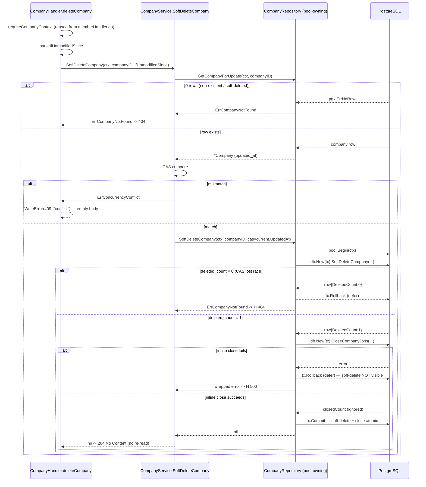

# Design: `companies-write` — Owner-only PATCH/DELETE for the `companies` aggregate

Status: design. Grounded by `openspec/changes/companies-write/proposal.md` and the delta spec `openspec/changes/companies-write/specs/companies/spec.md` (9 requirements / 45 scenarios — the authoritative behavior contract). This document turns that behavior into component-level architecture.

Reference slices: `jobs-soft-delete` and `jobs-reopen` (archived under `openspec/changes/archive/`) establish the atomic `:one` scalar-SELECT guard, the CAS-via-`If-Unmodified-Since` contract, the `map*Error` ordering (`pgx.ErrNoRows` BEFORE `errors.As` into `*pgconn.PgError`), and the atomic port-extension + stub-repair discipline. `audit_events` (archived) establishes the pool-owning transactional adapter pattern (`pool.Begin → db.New(tx) → defer tx.Rollback → tx.Commit`) and the committed-fixture migration for pool-owning adapters. The canonical pool-owning adapters are `companies.CompanyBootstrapRepository.CreateWithOwner`, `applications.ApplicationRepository`, and `candidates.CandidateRepository.ReplaceLanguagesByUserID`.

Locked decisions (§4/§15) are **not** re-opened here: owner-only gate, soft-delete + transactional close of all non-closed jobs, `rfc`/`industry_id` immutable, audit deferred, CAS via `If-Unmodified-Since`, no new migration, memberships/applications untouched.

---

## 1. Context and scope

The `companies` slice today ships exactly two operations: `POST /companies` (create) and `GET /companies/{id}` (read). This change adds the two owner-only write paths that close the MVP loop:

- `PATCH /me/company` — partial update of `name` + 12 profile columns with CAS, returning a redacted editor view on `200`/`409`.
- `DELETE /me/company` — soft-delete (`companies.deleted_at = now()`) + transactional inline close of the company's `draft`/`published` jobs (`status='closed'`) in one `pgx.Tx`, returning `204 No Content` on success.

**No new migration.** `companies.deleted_at` and `companies.updated_at` exist since `00002`; the `jobs.status = 'closed'` terminal value exists since `00007` (verified in `backend/db/migrations/00002_create_companies.sql`, `00003_companies_profile.sql`, `00007_jobs.sql`). The only DB change is **three new sqlc queries added to existing query files** — `UpdateCompany :one` and `SoftDeleteCompany :one` in `backend/db/queries/companies.sql`, plus `CloseCompanyJobs :execrows` in `backend/db/queries/jobs.sql`. They are pure SQL additions (no DDL), so no goose migration precedes them.

---

## 2. Decisions at a glance

| # | Decision | Choice |
|---|---|---|
| D1 | Schema / migration | No new migration; exactly 3 new queries (`UpdateCompany`, `SoftDeleteCompany` in `companies.sql`; `CloseCompanyJobs` in `jobs.sql`). `GetCompanyForUpdate` is a **port method**, not a new query — it reuses `GetCompanyByID`. |
| D2 | `GetCompanyForUpdate` | Port + adapter method wrapping the existing `db.Queries.GetCompanyByID` (`WHERE id=$1 AND deleted_at IS NULL`, no status filter). `pgx.ErrNoRows → ErrCompanyNotFound`. |
| D3 | `UpdateCompany :one` | CTE `upd` + scalar `SELECT (SELECT count(*) FROM upd) AS updated_count`; `name` via `COALESCE`, 12 profile columns via `CASE WHEN set_<field> THEN narg ELSE col END`; CAS in WHERE. Row `{ UpdatedCount int64 }`. |
| D4 | `SoftDeleteCompany :one` | CTE `upd` + scalar `SELECT ... AS deleted_count`; minimal SET (`deleted_at`, `updated_at`); CAS. Row `{ DeletedCount int64 }`. |
| D5 | `CloseCompanyJobs :execrows` | Plain `UPDATE jobs … WHERE company_id=$1 AND deleted_at IS NULL AND status IN ('draft','published')`; no guard; `RowsAffected` surfaced, never branched. |
| D6 | `Optional[T]` lift | Move to `internal/shared/valueobjects/optional.go`; jobs re-exports via generic type alias (Go 1.26 supports it); companies imports shared directly. |
| D7 | DTO / patch field types | `name` = `*string`; **all 12 profile columns** = `Optional[T]` tri-state (spec requires null-vs-absent for text columns too). |
| D8 | Editor view DTO | New `CompanyEditorViewDto` = `id`, `name`, 12 profile fields, `updated_at`; **omits `industry_id`/`rfc`/`status`/`deleted_at`/`created_at`** (differs from `companyPublicResponse`, which exposes `industry_id`). |
| D9 | Sentinel placement | New `companies/domain/entities/sentinels.go` with `ErrConcurrencyConflict` + `ErrInvalidCompanyStatusTransition`; `company.go` unchanged; companies owns its sentinels (no jobs import). |
| D10 | `buildUpdateCompanyParams` order | SET-list args first, then `CompanyID`, then `CasToken` (sqlc first-textual-appearance; no `active` CTE). |
| D11 | Row naming | `UpdateCompanyRow.UpdatedCount int64`; `SoftDeleteCompanyRow.DeletedCount int64`. |
| D12 | Use-case CAS / re-read | PATCH: `(view, ErrConcurrencyConflict)` on mismatch, re-read after success; DELETE: `ErrConcurrencyConflict` (no view), no re-read, `204`. |
| D13 | Error mappers | `mapUpdateCompanyError` (`ErrNoRows→ErrCompanyNotFound`; `23514→ConstraintName` dispatch to `size`/`founded_year` sentinels); `mapSoftDeleteCompanyError` (`ErrNoRows→ErrCompanyNotFound`; `23514→ErrInvalidCompanyStatusTransition`); pass-through unknown. |
| D14 | Handler shape | Reuse existing `requireCompanyContext` (already in `memberHandler.go`, same package); duplicate `parseIfUnmodifiedSince`; two flat classifier dispatchers. |
| D15 | Wiring | `CompanyRepository` becomes pool-owning (`NewCompanyRepository(pool)`); `NewCompanyService(repo)` unchanged (no pool in the service); two routes under `/me` with the existing `requireOwner`. |
| D16 | Stub repair | Atomic single commit; 4 stub files + the adapter `var _` assertion. |
| D17 | Test strategy | RED-first; unit for use case/handler/mappers/builders; SQL integration (committed-fixture) for update/soft-delete/inline-close/preservation invariants. |

---

## 3. Architectural decisions (ADR)

### D1 — No migration; exactly three new sqlc queries

**Confirmed** against the migrations:

- `companies.deleted_at TIMESTAMPTZ` — `00002` column 9 (nullable).
- `companies.updated_at TIMESTAMPTZ NOT NULL DEFAULT now()` — `00002` column 8.
- `jobs.status` CHECK including `'closed'` — `00007` (`jobs_status_check`).
- `jobs.deleted_at TIMESTAMPTZ` — `00007`.
- `companies.deleted_at`/`updated_at` are already present; the `jobs` closed terminal is already legal.

The **three** new queries are:

1. `UpdateCompany :one` — `backend/db/queries/companies.sql`.
2. `SoftDeleteCompany :one` — `backend/db/queries/companies.sql`.
3. `CloseCompanyJobs :execrows` — `backend/db/queries/jobs.sql`.

`GetCompanyForUpdate` is **not** a new query (D2). `go tool sqlc generate` regenerates `companies.sql.go`, `jobs.sql.go`, and `querier.go`; existing queries are regenerated verbatim and unchanged.

**Alternatives considered.** Adding a `GetCompanyForUpdate :one` query — rejected: it would be byte-for-byte identical to `GetCompanyByID` (`SELECT * FROM companies WHERE id=$1 AND deleted_at IS NULL`), because — unlike jobs — the companies public read already has no `status` filter. A duplicate query would add a generated row type + interface method with zero semantic value.

### D2 — `GetCompanyForUpdate` reuses `GetCompanyByID` SQL

The write-path read MUST see active, suspended, and pending_verification companies but MUST NOT see tombstoned ones. `GetCompanyByID` already does exactly this: `SELECT * FROM companies WHERE id = $1 AND deleted_at IS NULL` (no `status` predicate, `deleted_at IS NULL` filter, `SELECT *` includes `updated_at`).

The port gains a dedicated `GetCompanyForUpdate(ctx, companyID)` method (named by the spec) implemented as a thin wrapper:

```go
func (r *CompanyRepository) GetCompanyForUpdate(ctx context.Context, companyID uuid.UUID) (*entities.Company, error) {
    row, err := db.New(r.pool).GetCompanyByID(ctx, companyID)
    if err != nil {
        if errors.Is(err, pgx.ErrNoRows) {
            return nil, entities.ErrCompanyNotFound
        }
        return nil, err
    }
    return toEntity(row)
}
```

Rationale: the spec names `GetCompanyForUpdate` as the read-for-update/read-for-delete seam; a dedicated port method gives a future drift point (e.g., `FOR UPDATE` locking, distinct columns) without overloading the public `GetByID`. Today it is semantically identical to `GetByID`; the thin wrapper keeps the write path's intent explicit.

**Alternatives considered.** (a) Drop `GetCompanyForUpdate` and call `GetByID` from the use case — rejected: the spec references `GetCompanyForUpdate` by name in multiple scenarios. (b) New `GetCompanyForUpdate :one` query — rejected (D1).

### D3 — `UpdateCompany :one` SQL (CTE + scalar count, no active-company guard)

```sql
-- name: UpdateCompany :one
WITH upd AS (
    UPDATE companies
    SET
        name            = COALESCE(sqlc.narg('name')::text, name),
        website         = CASE WHEN sqlc.arg('set_website')::boolean
                                THEN sqlc.narg('website')::text ELSE website END,
        logo_url        = CASE WHEN sqlc.arg('set_logo_url')::boolean
                                THEN sqlc.narg('logo_url')::text ELSE logo_url END,
        description     = CASE WHEN sqlc.arg('set_description')::boolean
                                THEN sqlc.narg('description')::text ELSE description END,
        size            = CASE WHEN sqlc.arg('set_size')::boolean
                                THEN sqlc.narg('size')::text ELSE size END,
        founded_year    = CASE WHEN sqlc.arg('set_founded_year')::boolean
                                THEN sqlc.narg('founded_year')::int2 ELSE founded_year END,
        city            = CASE WHEN sqlc.arg('set_city')::boolean
                                THEN sqlc.narg('city')::text ELSE city END,
        country         = CASE WHEN sqlc.arg('set_country')::boolean
                                THEN sqlc.narg('country')::text ELSE country END,
        linkedin_url    = CASE WHEN sqlc.arg('set_linkedin_url')::boolean
                                THEN sqlc.narg('linkedin_url')::text ELSE linkedin_url END,
        instagram_url   = CASE WHEN sqlc.arg('set_instagram_url')::boolean
                                THEN sqlc.narg('instagram_url')::text ELSE instagram_url END,
        facebook_url    = CASE WHEN sqlc.arg('set_facebook_url')::boolean
                                THEN sqlc.narg('facebook_url')::text ELSE facebook_url END,
        twitter_url     = CASE WHEN sqlc.arg('set_twitter_url')::boolean
                                THEN sqlc.narg('twitter_url')::text ELSE twitter_url END,
        cover_image_url = CASE WHEN sqlc.arg('set_cover_image_url')::boolean
                                THEN sqlc.narg('cover_image_url')::text ELSE cover_image_url END,
        updated_at      = clock_timestamp()
    WHERE id         = sqlc.arg('company_id')::uuid
      AND deleted_at IS NULL
      AND updated_at = sqlc.arg('cas_token')::timestamptz
    RETURNING id
)
SELECT (SELECT count(*) FROM upd) AS updated_count;
```

Notes:

- Mirrors `UpdateJob :one` **minus** the `active` CTE (locked §6.9/§6.10: no active-company guard on PATCH/DELETE — a suspended company may edit its profile; `status` is not patchable).
- `name` uses `COALESCE` (non-nullable, no clear-to-NULL); the 12 profile columns use `CASE WHEN set_<field> THEN narg ELSE col END` (tri-state — D7).
- `founded_year` is `SMALLINT` → `sqlc.narg('founded_year')::int2` (matches `buildCreateParams`'s `pgtype.Int2`).
- CAS is the atomic race-free guard: `updated_at = cas_token` in the WHERE, so two writers holding the same token produce exactly one `updated_count = 1`.
- The scalar `SELECT (SELECT count(*) FROM upd)` has no `FROM`, so it **always returns exactly one row** — `pgx.ErrNoRows` is unreachable via the designed flow (D13 keeps it as defense-in-depth).
- Never touched: `rfc`, `industry_id`, `status`, `created_at`, `id`, `deleted_at`.

Generated row (pinned by the alias): `type UpdateCompanyRow struct { UpdatedCount int64 }`.

### D4 — `SoftDeleteCompany :one` SQL

```sql
-- name: SoftDeleteCompany :one
WITH upd AS (
    UPDATE companies
    SET
        deleted_at = now(),
        updated_at = clock_timestamp()
    WHERE id         = sqlc.arg('company_id')::uuid
      AND deleted_at IS NULL
      AND updated_at = sqlc.arg('cas_token')::timestamptz
    RETURNING id
)
SELECT (SELECT count(*) FROM upd) AS deleted_count;
```

Notes:

- Minimal SET list: only `deleted_at` + `updated_at`. All other columns preserved as audit history.
- No `active` CTE (locked §6.10). The WHERE scopes by `id`, `deleted_at IS NULL`, and CAS `updated_at`.
- Alias `deleted_count` mirrors `SoftDeleteJob`'s `deleted_count` (and its row type `DeletedCount int64`); the proposal's literal `updated_count` wording for this query is overridden for semantic accuracy and parity with `SoftDeleteJobRow.DeletedCount`.
- Always returns exactly one row (no `FROM`), so `pgx.ErrNoRows` is unreachable (D13 keeps it as defense-in-depth).

Generated row: `type SoftDeleteCompanyRow struct { DeletedCount int64 }`.

### D5 — `CloseCompanyJobs :execrows` SQL

```sql
-- name: CloseCompanyJobs :execrows
UPDATE jobs
SET
    status     = 'closed',
    updated_at = clock_timestamp()
WHERE company_id = sqlc.arg('company_id')::uuid
  AND deleted_at IS NULL
  AND status IN ('draft', 'published');
```

Notes:

- Plain `UPDATE`, no guard, no CTE. The soft-delete is in the same `pgx.Tx`; the soft-delete WHERE already scopes by `company_id`, so no second guard is needed (§14.3 confirmed).
- `status IN ('draft','published')` excludes `closed` (closing a closed row is a no-op) and `deleted_at IS NULL` excludes already-tombstoned jobs (a soft-deleted job's tombstone stands).
- `:execrows` (not `:exec`) is chosen deliberately: sqlc `:exec` returns only `error`, so the adapter could not "surface RowsAffected" as the proposal requires. `:execrows` returns `(int64, error)`. The adapter captures the count and explicitly ignores it (`_ = closedCount`) — the use case **does not** branch on it; `0 rows closed` is a legitimate success ("no non-closed jobs at delete time").

### D6 — `Optional[T]` lift to `internal/shared/valueobjects` (re-export via generic type alias)

`Optional[T]` is a generic presence codec, not a jobs-specific concept. Both `jobs` (salary_min/salary_max/location) and `companies` (12 profile columns) need it.

**Refactor (exact):**

1. **NEW** `backend/internal/shared/valueobjects/optional.go` — move the `Optional[T]` struct + `UnmarshalJSON` verbatim; change the doc comment to "shared tri-state presence type".
2. **MOD** `backend/internal/features/jobs/domain/valueobjects/optional.go` — reduce to a re-export:

   ```go
   package valueobjects

   import sharedvalueobjects "github.com/aldrichcode45/peopleflow-vacantes/internal/shared/valueobjects"

   // Optional is the tri-state presence type for PATCH fields, lifted to
   // internal/shared/valueobjects (design D6). Kept here as a generic type
   // alias so existing jobs call sites (UpdateJobDto, UpdatePatch, the
   // postgres adapter helpers, tests) continue to compile unchanged.
   type Optional[T any] = sharedvalueobjects.Optional[T]
   ```

3. **UNCHANGED** `backend/internal/features/jobs/domain/valueobjects/optional_test.go` — it stays in place and exercises the shared type through the alias.
4. **UNCHANGED** every jobs call site — `valueobjects.Optional[string]`/`Optional[int]` resolve through the alias, so no import churn.
5. **Companies** imports `internal/shared/valueobjects` directly (aliased `sharedvalueobjects` to avoid a `valueobjects` package-name collision with `companies/domain/valueobjects`).

**Go version check.** `backend/go.mod` declares `go 1.26.1`. Generic type aliases (`type A[T any] = B[T]`) are fully supported (stabilized in Go 1.24), and aliases carry the identical method set (`UnmarshalJSON` remains callable through the alias). No fallback wrapper type is needed.

**Alternatives considered.** (a) Duplicate `Optional[T]` into the companies slice with a "intentionally duplicated" comment — rejected: two definitions of a generic presence codec invite drift. (b) Move + rewrite all jobs imports to shared — rejected: unnecessary churn; the alias keeps jobs untouched. (c) A wrapper type — rejected: Go 1.26 supports aliases, so a wrapper adds indirection with no benefit.

### D7 — DTO/patch field types: `name` `*string`; all 12 profile columns `Optional[T]`

The spec is authoritative and its requirement text is explicit:

> "For text columns (`website`, `logo_url`, `city`, `country`, `linkedin_url`, `instagram_url`, `facebook_url`, `twitter_url`, `cover_image_url`), the server **MUST distinguish `null` … from absent** … For the nullable profile columns (`description`, `size`, `founded_year`), the tri-state semantics MUST apply."

A plain `*string` cannot distinguish JSON `null` from an absent key (both decode to `nil`). Therefore **all 12 profile columns use `Optional[T]`**, overriding the proposal §6.2's "plain `*string`, no tri-state for text columns" (which also mis-described `jobs.location` — that field is `Optional[string]`, not plain `*string`).

Field inventory (13 mutable columns):

| Column | DTO/patch type | SQL shape | VO validation when present |
|---|---|---|---|
| `name` | `*string` | `COALESCE(narg('name'), name)` | `NewCompanyName` (≥ 4 chars) |
| `website` | `Optional[string]` | `CASE set_website` | — |
| `logo_url` | `Optional[string]` | `CASE set_logo_url` | — |
| `description` | `Optional[string]` | `CASE set_description` | `NewCompanyDescription` (≤ 3000) |
| `size` | `Optional[string]` | `CASE set_size` | `ParseCompanySize` (closed set) |
| `founded_year` | `Optional[int]` | `CASE set_founded_year` | `NewFoundedYear` ([1800, year+1]) |
| `city` | `Optional[string]` | `CASE set_city` | — |
| `country` | `Optional[string]` | `CASE set_country` | — |
| `linkedin_url` | `Optional[string]` | `CASE set_linkedin_url` | — |
| `instagram_url` | `Optional[string]` | `CASE set_instagram_url` | — |
| `facebook_url` | `Optional[string]` | `CASE set_facebook_url` | — |
| `twitter_url` | `Optional[string]` | `CASE set_twitter_url` | — |
| `cover_image_url` | `Optional[string]` | `CASE set_cover_image_url` | — |

Tri-state decode (same as jobs): `Set=false` → column untouched; `Set=true, Valid=false` → JSON `null` → clear to SQL NULL; `Set=true, Valid=true` → value set.

The use case canonicalizes before building the patch: `size` stores `parsedSize.String()` (lowercase — the DB CHECK `companies_size_check` requires lowercase); `founded_year` stores the int; `description`/`name` store trimmed raw values.

### D8 — `CompanyEditorViewDto` (distinct from `companyPublicResponse`)

The spec requires the PATCH `200`/`409` body to include `id`, `name`, the 12 profile fields, and `updated_at`, and to **exclude** `rfc`, `industry_id`, `status`, `deleted_at`, and `created_at`.

**Discovery (reconciled here).** The existing `companyPublicResponse` (`backend/internal/features/companies/infrastructure/http/handler.go`) **does** expose `industry_id` (`IndustryID string json:"industry_id"`), contradicting the spec's parenthetical "the existing `companyPublicResponse` does not expose it". The spec's normative `MUST NOT include industry_id` is authoritative and unambiguous. Therefore the PATCH body is a **new sibling DTO**, not a literal reuse of `companyPublicResponse`:

```go
type CompanyEditorViewDto struct {
    ID            string     `json:"id"`
    Name          string     `json:"name"`
    Website       *string    `json:"website,omitempty"`
    LogoURL       *string    `json:"logo_url,omitempty"`
    Description   *string    `json:"description,omitempty"`
    Size          *string    `json:"size,omitempty"`
    FoundedYear   *int       `json:"founded_year,omitempty"`
    City          *string    `json:"city,omitempty"`
    Country       *string    `json:"country,omitempty"`
    LinkedInURL   *string    `json:"linkedin_url,omitempty"`
    InstagramURL  *string    `json:"instagram_url,omitempty"`
    FacebookURL   *string    `json:"facebook_url,omitempty"`
    TwitterURL    *string    `json:"twitter_url,omitempty"`
    CoverImageURL *string    `json:"cover_image_url,omitempty"`
    UpdatedAt     time.Time  `json:"updated_at"`
}
```

`updated_at` has no `omitempty` (always echoed as the next CAS token); no `industry_id`, no `rfc`, no `status`, no `deleted_at`, no `created_at`. The existing `toCompanyPublicResponse` projection and its helpers (`descriptionToStringPtr`, `sizeToStringPtr`, `foundedYearToIntPtr`) are reused by the new `toCompanyEditorView` projection.

**Alternatives considered.** Reusing `companyPublicResponse` verbatim — rejected: it leaks `industry_id` into the PATCH body, violating the spec's `MUST NOT`.

### D9 — Sentinel placement: new `companies/domain/entities/sentinels.go`

The proposal §4/§7.2 pins `company.go` as **NO CHANGE**, but two new sentinels must live somewhere:

- `ErrConcurrencyConflict` (PATCH 409-with-view + DELETE 409-empty-body)
- `ErrInvalidCompanyStatusTransition` (defense-in-depth for SQLSTATE 23514 on the inline close)

**Decision:** NEW `backend/internal/features/companies/domain/entities/sentinels.go`:

```go
package entities

import "errors"

var (
    ErrConcurrencyConflict          = errors.New("concurrency conflict")
    ErrInvalidCompanyStatusTransition = errors.New("invalid company status transition")
)
```

Rationale:

- `company.go` stays byte-for-byte unchanged (honoring the proposal's "NO CHANGE" literally — a new file is additive).
- Companies defines its **own** `ErrConcurrencyConflict` rather than importing `jobs/domain/entities.ErrConcurrencyConflict`. Cross-feature sentinel reuse couples the slices: the companies HTTP classifier would have to import the jobs entities package, inverting the hexagonal boundary and dragging the jobs vocabulary into companies. Jobs already owns its own `ErrConcurrencyConflict` (verified in `jobs/domain/entities/job.go`); each feature owning its sentinels is the established convention.

`ErrCompanyNotFound`, `ErrDuplicateCompany`, `ErrIndustryNotFound`, `ErrEmptyIndustry` remain in `company.go` (unchanged).

### D10 — `buildUpdateCompanyParams` signature and arg order

```go
func buildUpdateCompanyParams(companyID uuid.UUID, patch repositories.UpdateCompanyPatch, casUpdatedAt time.Time) db.UpdateCompanyParams
```

**Arg order (sqlc first-textual-appearance).** For a no-`active`-CTE UPDATE, the SET list textually precedes the WHERE, so the SET-list args come **first**, and the WHERE args (`company_id`, `cas_token`) come **last** — the opposite of the proposal §14.5's "company_id, cas_token first" claim, which held only for jobs because `company_id` first appeared in its `active` CTE. Expected generated order:

```
Name             pgtype.Text          // COALESCE
SetWebsite       bool;  Website       pgtype.Text
SetLogoUrl       bool;  LogoUrl       pgtype.Text
SetDescription   bool;  Description   pgtype.Text
SetSize          bool;  Size          pgtype.Text
SetFoundedYear   bool;  FoundedYear   pgtype.Int2   // SMALLINT
SetCity          bool;  City          pgtype.Text
SetCountry       bool;  Country       pgtype.Text
SetLinkedinUrl   bool;  LinkedinUrl   pgtype.Text
SetInstagramUrl  bool;  InstagramUrl  pgtype.Text
SetFacebookUrl   bool;  FacebookUrl   pgtype.Text
SetTwitterUrl    bool;  TwitterUrl    pgtype.Text
SetCoverImageUrl bool;  CoverImageUrl pgtype.Text
CompanyID        uuid.UUID           // WHERE
CasToken         pgtype.Timestamptz  // WHERE
```

The generated struct is the source of truth: any order mismatch fails compilation (the RED), so the exact naming (`LogoUrl`, `LinkedinUrl`, etc. — matching `buildCreateParams`) is verified at `go tool sqlc generate` + `go build`.

For `SoftDeleteCompany`, the arg order is trivial (no SET-list args): `SoftDeleteCompanyParams{ CompanyID uuid.UUID; CasToken pgtype.Timestamptz }` — `company_id` first (WHERE), `cas_token` second (WHERE).

### D11 — Row field naming

- `UpdateCompanyRow { UpdatedCount int64 }` (alias `updated_count`).
- `SoftDeleteCompanyRow { DeletedCount int64 }` (alias `deleted_count`; parity with `SoftDeleteJobRow.DeletedCount`).

The adapter inspects `row.UpdatedCount`/`row.DeletedCount`:
- `1` → success.
- `0` → `ErrCompanyNotFound` (CAS lost / already-soft-deleted / cross-company / non-existent — indistinguishable by design).

### D12 — Use-case CAS compare + re-read semantics

`parseIfUnmodifiedSince` (RFC 3339, whole-second parse) yields a zero `time.Time{}` on absent/malformed headers; a zero token never equals a real `updated_at`, so missing/malformed → guaranteed mismatch → `409` (matches `EditJob`/`SoftDeleteJob`).

**PATCH (`UpdateCompany`):**

1. `GetCompanyForUpdate` → `ErrCompanyNotFound` propagates → handler 404.
2. `if !ifUnmodifiedSince.Equal(current.UpdatedAt) { return toCompanyEditorView(current), entities.ErrConcurrencyConflict }`.
3. VO parse (`name`, `description`, `size`, `founded_year`) when present → 400 sentinels.
4. Build patch → `repo.UpdateCompany(ctx, companyID, patch, current.UpdatedAt)`.
5. `repo.UpdateCompany` returns `ErrCompanyNotFound` on 0 rows → re-read via `GetCompanyForUpdate`; if re-read also `ErrCompanyNotFound` → `ErrCompanyNotFound` (404); else → `(toCompanyEditorView(latest), ErrConcurrencyConflict)` (409 with latest view).
6. Success → **re-read** via `GetCompanyForUpdate` for the authoritative post-write `updated_at` (the `clock_timestamp()` value), project → `200`.

**DELETE (`SoftDeleteCompany`):**

1. `GetCompanyForUpdate` → `ErrCompanyNotFound` → 404.
2. `if !ifUnmodifiedSince.Equal(current.UpdatedAt) { return entities.ErrConcurrencyConflict }` (no view).
3. `repo.SoftDeleteCompany(ctx, companyID, current.UpdatedAt)` — the adapter owns the tx (soft-delete + inline close).
4. Success → return `nil` → handler `204 No Content`, **no re-read** (no view to project). `0 rows` on the soft-delete → `ErrCompanyNotFound` → 404.

### D13 — Error mappers (defense-in-depth)

Both mappers check `pgx.ErrNoRows` BEFORE `errors.As(err, &pgErr)` (same ordering as jobs `mapUpdateError`/`mapSoftDeleteError`; `pgx.ErrNoRows` is not a `*pgconn.PgError`, so there is no precedence conflict).

**`mapUpdateCompanyError`:**

| Input | Output |
|---|---|
| `nil` | `nil` |
| `pgx.ErrNoRows` | `entities.ErrCompanyNotFound` (defense-in-depth; scalar SELECT always returns one row) |
| `23514` + `ConstraintName == "companies_size_check"` | `valueobjects.ErrInvalidCompanySize` |
| `23514` + `ConstraintName == "companies_founded_year_check"` | `valueobjects.ErrFoundedYearOutOfRange` |
| any other error | pass-through (HTTP 500) |

**Verified:** migrations `00002`/`00003` define `companies_status_check`, `companies_size_check`, `companies_founded_year_check`. There is **no** `companies_name_check` and **no** `companies_description_check` — `name` length (≥ 4) and `description` length (≤ 3000) are VO-only. Therefore `mapUpdateCompanyError` does **not** map `ErrCompanyNameTooShort` or `ErrCompanyDescriptionTooLong` (those are VO-level, surfaced from the use case, never from SQL). `23503` is not mapped (PATCH does not insert or reassign FKs). `companies_status_check` is unreachable (PATCH never sets `status`) and passes through as unknown.

**`mapSoftDeleteCompanyError`:**

| Input | Output |
|---|---|
| `nil` | `nil` |
| `pgx.ErrNoRows` | `entities.ErrCompanyNotFound` (defense-in-depth) |
| `23514` | `entities.ErrInvalidCompanyStatusTransition` (defense-in-depth; the only plausible CHECK is `jobs_status_check`, and `'closed'` satisfies it) |
| any other error | pass-through (HTTP 500) |

The companies soft-delete SET list (`deleted_at`, `updated_at`) touches no CHECK column; the inline close sets `status='closed'` which `jobs_status_check` accepts and `jobs_published_integrity_check` accepts (`'closed'` ≠ `'published'`). So the `23514` branch is unreachable via the designed flow. `23503` is not mapped (no FK reassignment).

### D14 — Handler shape (reuse `requireCompanyContext`, duplicate `parseIfUnmodifiedSince`)

- **`requireCompanyContext` is already present** in `backend/internal/features/companies/infrastructure/http/memberHandler.go` (same `package http`). The new `updateCompany`/`deleteCompany` handlers reuse it directly — **no duplication** (the proposal §5.2's "duplicate verbatim" is unnecessary within the same package).
- **`parseIfUnmodifiedSince`** exists only in `jobs/.../jobHandler.go`. It is **duplicated** into `companies/.../handler.go` (≈ 10 lines, RFC 3339 whole-second parse, zero on absent/malformed), with a comment "intentionally duplicated from jobs handler; the companies handler must not import the jobs handler".

The two new handlers (`updateCompany`, `deleteCompany`) + `CompanyHandlers.UpdateCompany`/`DeleteCompany` fields + `classifyUpdateCompanyError`/`classifyDeleteCompanyError`:

```
ErrConcurrencyConflict → 409 "conflict"      (PATCH/DELETE handlers special-case the 409 body BEFORE the classifier)
ErrCompanyNameTooShort / ErrInvalidCompanySize / ErrFoundedYearOutOfRange / ErrCompanyDescriptionTooLong → 400
ErrInvalidCompanyStatusTransition → 400       (defense-in-depth)
ErrCompanyNotFound → 404
default → 500
```

The PATCH handler writes `httpjson.WriteJSON(w, 409, view)` on `ErrConcurrencyConflict` (view already projected by the use case); the DELETE handler writes `httpjson.WriteError(w, 409, "conflict")` (empty body) on the same sentinel.

### D15 — Wiring (composition root + adapter)

- **Adapter** becomes pool-owning: `NewCompanyRepository(pool *pgxpool.Pool)` replaces `NewCompanyRepository(queries *db.Queries)`. The `queries *db.Queries` field is dropped; reads use `db.New(r.pool).<Query>(...)`; `UpdateCompany`/`SoftDeleteCompany` open `r.pool.Begin(ctx)` + `defer tx.Rollback(ctx)` + `tx.Commit(ctx)`.
- **Service** constructor stays `NewCompanyService(repository repositories.CompanyRepository)` — **no pool parameter** (the proposal §7.2's `NewCompanyService(repo, pool)` is unnecessary: the service depends only on the port, and the adapter owns the transaction). The service gains `UpdateCompany` + `SoftDeleteCompany` methods. `NewCompanyServiceWithBootstrap` is unchanged.
- **main.go** (one-line): `companyRepo := postgres.NewCompanyRepository(queries)` → `postgres.NewCompanyRepository(pool)`.
- **Routes** (inside the `/me` block, which already has `r.Use(requireAuth)`; `requireOwner` is already hoisted there):

  ```go
  companyWriteHandlers := companyHandler.CompanyHandlers()
  r.With(requireOwner).Patch("/company", companyWriteHandlers.UpdateCompany)
  r.With(requireOwner).Delete("/company", companyWriteHandlers.DeleteCompany)
  ```

  These sit next to the existing `r.Get("/company", handlers.GetMyMembership)`. Using `r.With(requireOwner)` (not `r.With(requireAuth, requireOwner)`) is consistent with the sibling membership routes and avoids a redundant second `RequireAuth` (already applied by the `/me` subtree). `requireOwner` is verified wired in `cmd/api/main.go`.

### D16 — Stub repair (atomic, single commit)

Extending `repositories.CompanyRepository` with `GetCompanyForUpdate`/`UpdateCompany`/`SoftDeleteCompany` breaks every implementer + the `var _` assertion in lockstep. The repair ships in **one commit** (mirroring jobs-create D10 / jobs-soft-delete D9).

| # | File | Type | Repair |
|---|---|---|---|
| 1 | `application/usecases/companyMemberService_test.go` | `stubMemberCompanyRepository` | add 3 methods (default `ErrCompanyNotFound` / `nil`) |
| 2 | `application/usecases/createCompany_test.go` | `stubCompanyRepository` (reused by `createCompanyWithOwner_test.go` and `addMemberUserType_test.go`) | add 3 methods |
| 3 | `infrastructure/http/handler_test.go` | `stubRepo` | add 3 methods |
| 4 | `infrastructure/http/memberHandler_test.go` | `stubMemberCompanyRepositoryForHandler` | add 3 methods |
| 5 | `infrastructure/postgres/companyRepository.go` | `*CompanyRepository` (adapter) + `var _ repositories.CompanyRepository` | add 3 methods + helpers |

`companyRepository_test.go` is **unaffected** (it tests the pure helpers `toEntity`/`buildCreateParams`/`mapCompanyCreateError`, not the interface).

**Stub shape (captured fields + programmable errors):**

```go
type stubCompanyRepository struct {
    // … existing saved/saveErr/getByID/getErr …
    getForUpdateID    uuid.UUID
    getForUpdate      *entities.Company
    getForUpdateErr   error

    updateID        uuid.UUID
    updatePatch     repositories.UpdateCompanyPatch
    updateCas       time.Time
    updateErr       error

    softDeleteID    uuid.UUID
    softDeleteCas   time.Time
    softDeleteErr   error
}
```

- `GetCompanyForUpdate` returns `getForUpdateErr` (if set) else `getForUpdate` (copy) else `entities.ErrCompanyNotFound`.
- `UpdateCompany` returns `updateErr` (default `nil`) and captures `(id, patch, cas)`.
- `SoftDeleteCompany` returns `softDeleteErr` (default `nil`) and captures `(id, cas)`.

Defaults keep all existing tests green (the new methods are never exercised by the legacy use cases).

### D17 — Test strategy (RED-first, strict TDD)

- **Unit (no Postgres):** `UpdateCompany`/`SoftDeleteCompany` use-case tests (CAS mismatch 409-with-view / 409-no-view, VO failures → 400, cross-company/soft-deleted → 404, success → 200+view / nil), handler tests (missing CompanyContext → 500, invalid JSON → 400, missing/malformed CAS → 409, immutable-field silently dropped, success → 200/204), adapter helper tests (`buildUpdateCompanyParams`, `buildSoftDeleteCompanyParams`, `mapUpdateCompanyError`, `mapSoftDeleteCompanyError`, `Optional→pgtype` helpers).
- **Integration (`-tags=integration`, live Postgres):** new `companyRepository_write_integration_test.go` (committed-fixture pattern) proving the SQL invariants only Postgres can: atomic partial update + CAS, soft-delete + inline close atomicity, rollback on close failure, preservation of `company_members`/`applications`/`audit_events`.

**Fixture migration (a consequence of D15).** The pool-owning `CompanyRepository` opens its **own** `pool.Begin`, which cannot see an uncommitted fixture `tx`'s seed. There is no existing integration test that binds the real `CompanyRepository` adapter (the member/bootstrap integration suites use `NewCompanyMemberRepository(db.New(tx))` / `NewCompanyBootstrapRepository(pool)` respectively), so **no existing integration test breaks**. The new suite uses the committed-fixture pattern (`companyBootstrapRepository_integration_test.go` precedent): seed through `pool.Exec` with `ON CONFLICT DO NOTHING` + unique suffixes, assert via `pool.Query`, and clean up with targeted `DELETE`s in `t.Cleanup`.

**Fixtures** (`companyRepository_write_integration_test.go`): an `industries` row (FK prerequisite); an active company A; a tombstoned company T; a foreign company B; company A's four jobs (1 draft + 1 published + 1 closed + 1 deleted); `company_members` rows for A (owner + recruiter) and `applications` rows referencing A's jobs (for the preservation asserts). The "owner/recruiter/foreign owner" 403/404 semantics are **use-case and handler unit-test** concerns (stubbed), not SQL integration — the middleware never runs at the adapter level.

**Inline-close integration assertion (§14.12)** — one test pins all five invariants: (a) before DELETE, company A has 1 draft + 1 published + 1 closed + 1 deleted job; (b) after DELETE, the draft and published jobs are `closed` with a fresh `updated_at`, the already-closed job's `status`/`updated_at` are unchanged (NOT bumped), the deleted job is untouched; (c) `company_members` row count/roles unchanged; (d) `applications` row count/statuses unchanged; (e) `audit_events` row count unchanged.

---

## 4. Sequence diagram — PATCH `/me/company`

```mermaid
sequenceDiagram
    participant H as CompanyHandler.updateCompany
    participant UC as CompanyService.UpdateCompany
    participant R as CompanyRepository (pool-owning)
    participant DB as PostgreSQL

    H->>H: requireCompanyContext (reused from memberHandler.go)
    H->>H: decode UpdateCompanyDto; parseIfUnmodifiedSince
    H->>UC: UpdateCompany(ctx, companyID, dto, ifUnmodifiedSince)
    UC->>R: GetCompanyForUpdate(ctx, companyID)
    R->>DB: db.New(pool).GetCompanyByID(...)
    alt 0 rows (non-existent / soft-deleted)
        DB-->>R: pgx.ErrNoRows
        R-->>UC: ErrCompanyNotFound
        UC-->>H: ErrCompanyNotFound
        H-->>H: classifyUpdateCompanyError -> 404
    else row exists
        DB-->>R: company row
        R-->>UC: *Company (updated_at)
        UC->>UC: CAS compare (ifUnmodifiedSince vs current.UpdatedAt)
        alt mismatch (stale / missing / malformed)
            UC-->>H: (toEditorView(current), ErrConcurrencyConflict)
            H-->>H: WriteJSON(409, view)
        else match
            UC->>UC: VO parse name/description/size/founded_year
            alt VO failure
                UC-->>H: 400 sentinel
            else valid
                UC->>R: UpdateCompany(ctx, companyID, patch, cas=current.UpdatedAt)
                R->>DB: pool.Begin -> db.New(tx).UpdateCompany(...)
                alt updated_count = 0 (CAS lost race)
                    DB-->>R: row{UpdatedCount:0}
                    R-->>UC: ErrCompanyNotFound
                    UC->>R: GetCompanyForUpdate re-read
                    alt re-read 0 rows
                        R-->>UC: ErrCompanyNotFound -> H 404
                    else re-read row
                        UC-->>H: (toEditorView(latest), ErrConcurrencyConflict) -> 409
                    end
                else updated_count = 1
                    DB-->>R: row{UpdatedCount:1}
                    R-->>DB: tx.Commit
                    R-->>UC: nil
                    UC->>R: GetCompanyForUpdate (authoritative updated_at)
                    R-->>UC: fresh *Company
                    UC-->>H: (toEditorView(fresh), nil) -> 200
                end
            end
        end
    end
```

## 5. Sequence diagram — DELETE `/me/company`



---

## 6. Exact code-level shapes

### 6.1 sqlc queries (NEW / MOD)

- `backend/db/queries/companies.sql` — add `UpdateCompany :one` (D3), `SoftDeleteCompany :one` (D4). `GetCompanyByID`/`CreateCompany` unchanged.
- `backend/db/queries/jobs.sql` — add `CloseCompanyJobs :execrows` (D5).
- Regen: `backend/internal/db/companies.sql.go` (+`UpdateCompanyParams/Row`, `SoftDeleteCompanyParams/Row`), `backend/internal/db/jobs.sql.go` (+`CloseCompanyJobsParams`), `backend/internal/db/querier.go` (+3 interface methods).

### 6.2 Domain port (MOD)

`backend/internal/features/companies/domain/repositories/companyRepository.go`:

```go
type UpdateCompanyPatch struct {
    Name          *string
    Website       sharedvalueobjects.Optional[string]
    LogoURL       sharedvalueobjects.Optional[string]
    Description   sharedvalueobjects.Optional[string]
    Size          sharedvalueobjects.Optional[string]
    FoundedYear   sharedvalueobjects.Optional[int]
    City          sharedvalueobjects.Optional[string]
    Country       sharedvalueobjects.Optional[string]
    LinkedInURL   sharedvalueobjects.Optional[string]
    InstagramURL  sharedvalueobjects.Optional[string]
    FacebookURL   sharedvalueobjects.Optional[string]
    TwitterURL    sharedvalueobjects.Optional[string]
    CoverImageURL sharedvalueobjects.Optional[string]
}

type CompanyRepository interface {
    Create(ctx context.Context, company *entities.Company) error
    GetByID(ctx context.Context, id uuid.UUID) (*entities.Company, error)
    GetCompanyForUpdate(ctx context.Context, companyID uuid.UUID) (*entities.Company, error)
    UpdateCompany(ctx context.Context, companyID uuid.UUID, patch UpdateCompanyPatch, casUpdatedAt time.Time) error
    SoftDeleteCompany(ctx context.Context, companyID uuid.UUID, casUpdatedAt time.Time) error
}
```

### 6.3 Domain sentinels (NEW)

`backend/internal/features/companies/domain/entities/sentinels.go` — D9.

### 6.4 DTOs (NEW)

- `application/dtos/updateCompanyDto.go` — `UpdateCompanyDto` (D7), importing `sharedvalueobjects`.
- `application/dtos/companyEditorViewDto.go` — `CompanyEditorViewDto` (D8).

### 6.5 Use cases (NEW) + service (MOD)

- `application/usecases/updateCompany.go` — `UpdateCompany` (D12 PATCH flow).
- `application/usecases/deleteCompany.go` — `SoftDeleteCompany` (D12 DELETE flow).
- `application/usecases/companyService.go` — add the two methods; constructors unchanged.

### 6.6 Adapter (MOD)

`backend/internal/features/companies/infrastructure/postgres/companyRepository.go`:

- `CompanyRepository{ pool *pgxpool.Pool }`; `NewCompanyRepository(pool *pgxpool.Pool)`; drop `queries` field.
- `GetByID`/`Create` switch to `db.New(r.pool)`; `GetCompanyForUpdate` (D2); `UpdateCompany` (D3 + `mapUpdateCompanyError`); `SoftDeleteCompany` (D4 + `CloseCompanyJobs` + `mapSoftDeleteCompanyError`).
- `buildUpdateCompanyParams` (D10), `buildSoftDeleteCompanyParams` (`{CompanyID, CasToken}`), `optionalStringToText`, `optionalIntToInt2` (mirroring jobs helpers), reuse `textPtrToPgText` for `Name`.

### 6.7 Handler (MOD)

`backend/internal/features/companies/infrastructure/http/handler.go`: `CompanyHandlers.UpdateCompany`/`DeleteCompany`, `updateCompany`, `deleteCompany`, `classifyUpdateCompanyError`, `classifyDeleteCompanyError`, `parseIfUnmodifiedSince` (duplicated), `toCompanyEditorView` projection. Reuses `requireCompanyContext` from `memberHandler.go`.

### 6.8 Composition root (MOD)

`backend/cmd/api/main.go` — D15.

---

## 7. Seam-change impact inventory (atomic, single commit)

The compile break is the RED. See D16 for the stub table; the adapter/port/service/handler/wiring changes are enumerated in §6. The `Optional[T]` lift (D6) is a separate mechanical refactor that must land with (or before) the slice and keeps jobs tests green (alias re-export, `optional_test.go` untouched).

---

## 8. Test inventory (RED-first)

### Phase A — domain

1. **RED** `TestCompanyWriteSentinels` — `entities.ErrConcurrencyConflict` + `entities.ErrInvalidCompanyStatusTransition` exist, are distinct, and are NOT the jobs sentinels.

### Phase B — use case unit

2. **RED** `TestUpdateCompany_AbsentFieldsLeavePatchUntouched` — a DTO with only `name` set yields a patch whose 12 profile `Optional`s are `Set=false`.
3. **RED** `TestUpdateCompany_NameTooShort` — `name="AB"` → `ErrCompanyNameTooShort`, repo NOT called.
4. **RED** `TestUpdateCompany_DescriptionTooLong` — 3001-char description → `ErrCompanyDescriptionTooLong`.
5. **RED** `TestUpdateCompany_FoundedYearOutOfRange` — `1500` → `ErrFoundedYearOutOfRange`.
6. **RED** `TestUpdateCompany_InvalidSize` — `"gigantic"` → `ErrInvalidCompanySize`.
7. **RED** `TestUpdateCompany_CASMismatchReturnsViewAndConflict` — stale token → `(view, ErrConcurrencyConflict)`, repo NOT called.
8. **RED** `TestUpdateCompany_NotFound` — `GetCompanyForUpdate` returns `ErrCompanyNotFound` → `(nil, ErrCompanyNotFound)`.
9. **RED** `TestUpdateCompany_UpdateLostRaceRereadsAsConflict` — `UpdateCompany` returns `ErrCompanyNotFound`, re-read returns a row → `(view, ErrConcurrencyConflict)`.
10. **RED** `TestUpdateCompany_SuccessRereadsAndProjects` — success → `(view with fresh updated_at, nil)`.
11. **RED** `TestSoftDeleteCompany_CASMismatchReturnsConflictNoView` — stale token → `ErrConcurrencyConflict`, repo NOT called.
12. **RED** `TestSoftDeleteCompany_NotFound` → `ErrCompanyNotFound`.
13. **RED** `TestSoftDeleteCompany_SuccessNoReread` — success → `nil`; assert `GetCompanyForUpdate` called exactly once.

### Phase C — adapter unit

14. **RED (compile)** — author `companies.sql`/`jobs.sql` + regen; adapter/port changes fail (D16 inventory).
15. **RED** `TestBuildUpdateCompanyParams` — field-by-field tri-state mapping (absent/null/value) + `CompanyID`/`CasToken` positions.
16. **RED** `TestBuildSoftDeleteCompanyParams` — `{CompanyID, CasToken}`.
17. **RED** `TestMapUpdateCompanyError` — `ErrNoRows`→`ErrCompanyNotFound`; `23514/companies_size_check`→`ErrInvalidCompanySize`; `23514/companies_founded_year_check`→`ErrFoundedYearOutOfRange`; unknown→pass-through; non-pg→pass-through.
18. **RED** `TestMapSoftDeleteCompanyError` — `ErrNoRows`→`ErrCompanyNotFound`; `23514`→`ErrInvalidCompanyStatusTransition`; unknown→pass-through.

### Phase D — handler unit

19. **RED** `TestUpdateCompanyHandler_MissingContextReturns500`.
20. **RED** `TestUpdateCompanyHandler_InvalidJSONReturns400`.
21. **RED** `TestUpdateCompanyHandler_CASConflictReturns409WithView`.
22. **RED** `TestUpdateCompanyHandler_ImmutableFieldsSilentlyDropped` — body `{rfc, industry_id, status}` → 200, no behavior change.
23. **RED** `TestUpdateCompanyHandler_SuccessReturns200`.
24. **RED** `TestDeleteCompanyHandler_CASConflictReturns409EmptyBody`.
25. **RED** `TestDeleteCompanyHandler_SuccessReturns204`.
26. **RED** `TestDeleteCompanyHandler_MissingContextReturns500`.

### Phase E — SQL integration (`companyRepository_write_integration_test.go`)

27. **RED/GREEN** `TestUpdateCompany_PartialUpdateAndCAS` — patch one field; row updated; `updated_at` advanced; stale CAS → `ErrCompanyNotFound` and no mutation.
28. **RED/GREEN** `TestUpdateCompany_TextNullClearsColumn` — `website=null` clears; absent leaves unchanged.
29. **RED/GREEN** `TestSoftDeleteCompany_TombstonesAndClosesJobs` — the §14.12 five-invariant assertion.
30. **RED/GREEN** `TestSoftDeleteCompany_RollbackOnCloseFailure` — force inline-close failure → soft-delete not visible, 500.
31. **RED/GREEN** `TestGetCompanyForUpdate_HidesTombstoned` — tombstoned → `ErrCompanyNotFound`.

---

## 9. Spec-scenario → test checklist

The 45 scenarios are covered by the phases above; the response-shape scenarios ("200 and 409 bodies omit rfc/industry_id/status/deleted_at", "200 and 409 use the same wire shape") are pinned by `TestUpdateCompanyHandler_*` asserting the serialized JSON lacks those keys and by `toCompanyEditorView` being the single projection for both paths. The `401 → 403 → 500` dispatch-order scenarios are exercised by the existing `RequireAuth`/`RequireCompanyRole` middleware tests plus the new handler `MissingContext` tests (routing-boundary guard mirrors `TestJobsSoftDeleteRoute_MountedBehindGates`).

---

## 10. Out of scope (explicit)

- **Audit co-write** — explicitly deferred (proposal §4.4). No `audit_events` port/query/entity change; the `audit_events` row count is a stable observation the integration test asserts (unchanged).
- **Read-side hardening** (`AND c.deleted_at IS NULL` on `SearchJobs`/`GetJobByID`) — **deferred follow-up**, explicitly a non-decision this cycle (proposal §6.11/§8). The inline close removes the leak today; the follow-up adds the predicate for defense-in-depth.
- Hard delete, restore/undelete, `status` manipulation, `industry_id`/`rfc` change, notifications, bulk operations — out of scope (§8).

---

## 11. Risks and rollout

- **Spec/proposal drift (resolved in D7/D8).** The proposal §6.2's "plain `*string` for text columns" conflicts with the spec's "MUST distinguish null from absent"; the design honors the spec (all 12 profile columns tri-state). The proposal's "reuse `companyPublicResponse`" conflicts with the spec's "MUST NOT include `industry_id`" (the public shape does include it); the design introduces `CompanyEditorViewDto`. Both are pinned as corrections.
- **sqlc arg-order drift.** The generated struct order is the source of truth; `buildUpdateCompanyParams` must match it. A mismatch is a compile failure (the RED), so no silent reordering can ship.
- **CAS precision (RFC 3339 vs RFC 3339Nano).** `parseIfUnmodifiedSince` parses whole-second RFC 3339; Go's default `time.Time` JSON marshal emits RFC 3339Nano, so a round-trip is exact when the client echoes the prior `updated_at`. Matches `EditJob`/`SoftDeleteJob`; no special handling.
- **Atomicity of soft-delete + close.** Both writes run in one `pgx.Tx` with `defer tx.Rollback`; any error rolls back both. No TOCTOU: the soft-delete WHERE includes `deleted_at IS NULL` and CAS `updated_at`.
- **Stub-repair atomicity.** Four stub files + the adapter assertion ship in one commit so `go test ./...` stays green at every commit boundary.
- **Rollback.** Revert the merge commit. No migration in either direction. A prior successful PATCH/DELETE's data effect (`updated_at` bump / `deleted_at` + closed jobs) is **not** undone by the revert (the follow-up restore endpoint is the proper inverse); this matches the proposal §12 risk-adjusted rollback.

---

## 12. Success criteria

`go tool sqlc generate` idempotent; `go build ./...`, `go vet ./...`, `go test ./...` green; `go test -tags=integration` green against a live DB. An owner can PATCH one/many fields (absent untouched, `null` clears, value sets), receives `200` + redacted editor view with a fresh `updated_at`; a stale/missing/malformed CAS yields `409` with the same view (PATCH) or empty body (DELETE). A successful DELETE returns `204`, tombstones the company, and closes draft/published jobs in the same transaction while leaving closed/deleted jobs, `company_members`, `applications`, and `audit_events` unchanged. Recruiter/non-member → `403`, unauthenticated → `401`, soft-deleted → `404`, missing CompanyContext → `500`.
