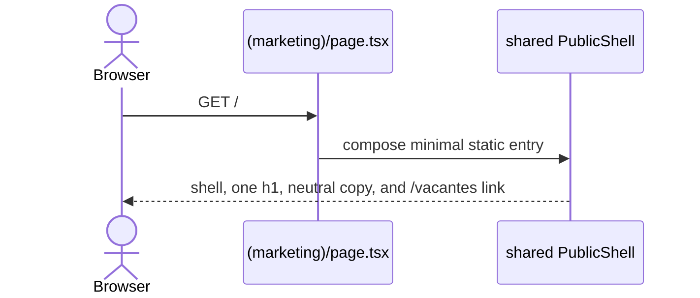
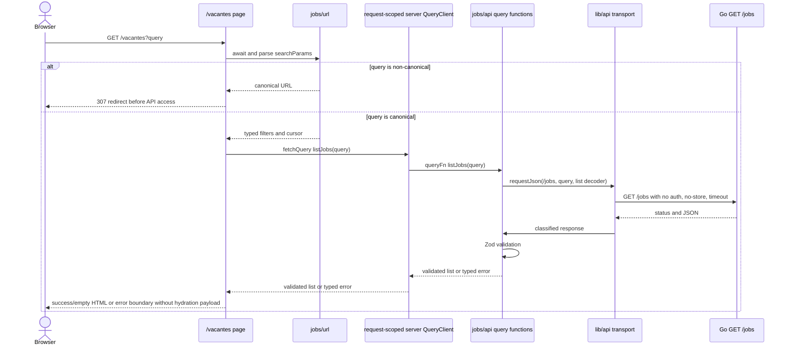
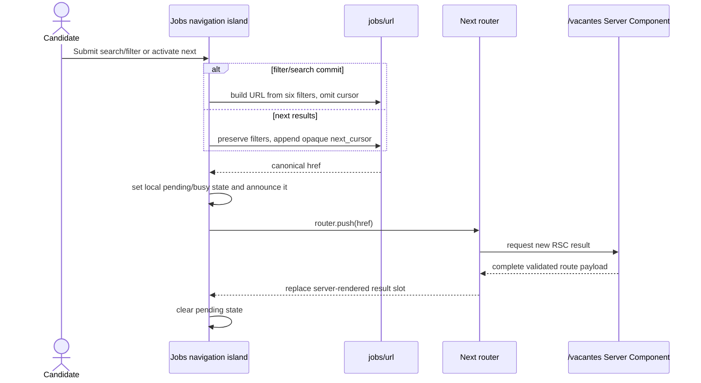
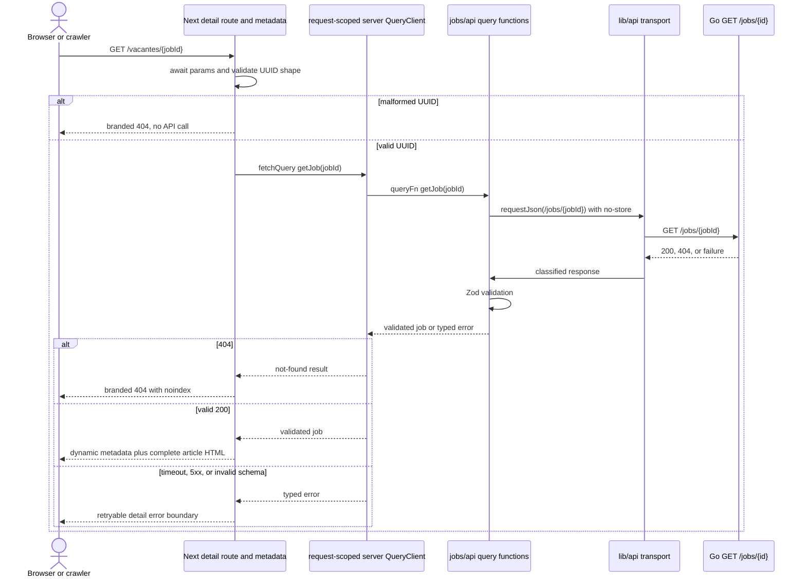

# Design: Frontend Public Job Discovery

## 1. Design intent

**Design read:** This is a public job-discovery product for candidates in Mexico. It should feel trustworthy, focused, and recognizably PeopleFlow, with the confirmed shadcn preset `b27M1Ev2` as its visual foundation rather than a literal port of the richer mockups or an agent-invented restyle.

Design dials for this product surface are `DESIGN_VARIANCE: 4`, `MOTION_INTENSITY: 2`, and `VISUAL_DENSITY: 5`. The list is an information product, so predictable scanning, low motion, and readable density take priority over marketing-page effects. Production UI/UX quality includes fidelity to the chosen preset: its Rhea style, Neutral base color, Violet theme, Neutral chart color, Inter heading and body typography, Lucide icons, Default radius, Default/Solid menu treatment, and Subtle menu accent are authoritative inputs, not suggestions to approximate or replace.

This change introduces one standalone Next.js application under `frontend/`. It implements a deliberately minimal anonymous root entry at `/` plus the anonymous `/vacantes` and `/vacantes/[jobId]` job routes. The root is only a public navigation point into vacancy discovery, not the completed landing page. Authentication, application, candidate, employer, company-profile, and full landing behavior remain outside implementation scope.

## 2. Repository evidence and constraints

- No `frontend/`, JavaScript package manifest, pnpm lockfile, component registry, or frontend test stack exists today.
- The public backend exposes root-level `GET /jobs` and `GET /jobs/{id}`. List responses are `{ items, next_cursor? }`; detail is the same bare job shape as a list item.
- `location`, salary bounds, and `published_at` can be omitted. `salary_currency`, company identity, and the scalar enum fields are required.
- Backend filters are scalar and combine with AND: `q`, `seniority`, `work_mode`, `employment_type`, `location`, and `currency`. Currency is exactly `MXN` or `USD`.
- Pagination is forward-only. The backend cursor is opaque even though its backend implementation currently uses encoded keyset data.
- The backend returns `400` for malformed detail UUIDs and `404` for every non-visible job. The frontend must prevalidate malformed IDs and present both cases as not found.
- The HTML screens provide visual evidence but include unsupported totals, sorting, multi-select controls, technology and area filters, application actions, fabricated metadata, and structured job sections. None of those transfer into this slice.
- The confirmed shadcn builder preset is `b27M1Ev2`: Rhea style, Neutral base color, Violet theme, Neutral chart color, Inter for headings and body, Lucide icons, Default radius, Default/Solid menu, and Subtle menu accent. The preset is the authoritative visual bootstrap input. The existing PeopleFlow design corpus independently supports the Lucide choice, but neither source authorizes the corpus's theme toggle or unsupported actions.
- Preset codes do not encode the primitive base. Base UI remains a separate explicit architecture choice that must be supplied and verified during initialization rather than inferred from the preset or a CLI default.
- The preset's menu and chart settings are retained for visual-system continuity on future surfaces. They do not authorize charts, employer navigation, or employer menus in this public-vacancy slice.
- `openspec/config.yaml` is backend-only. Its Go runner remains unchanged; this change defines and runs frontend-local TDD commands.
- The repository hosting decision remains Amplify, but its on-demand ISR and streaming claims are stale for this slice. Fresh uncached SSR is the compatibility baseline.

## 3. Architecture decisions

| ID | Decision | Rationale | Alternatives rejected |
| --- | --- | --- | --- |
| D1 | Create a standalone pnpm workspace at `frontend/`, pinned to Next.js 15 and Node.js 22. | Node 22 is one of Amplify's supported 20/22/24 runtimes and is the conservative LTS choice. An exact Next 15 release plus lockfile prevents an accidental Next 16 migration. | Next 16 is outside the accepted hosting policy. Node 18 is unsupported. npm/yarn would violate the package-manager decision. |
| D2 | Use App Router Server Components for the static root entry, job route reads, and metadata. TanStack Query orchestrates every application-facing API request entirely server-side: SSR-first list/detail reads execute feature-owned `queryOptions` through a fresh request-scoped server `QueryClient` (`fetchQuery` or equivalent), whose server-only `queryFn` is the only caller of the `requestJson` transport and whose successful payloads are decoded by feature-owned Zod schemas. Route Server Components render the returned validated data directly; no client query cache is hydrated in this slice. Keep route files thin and all job behavior in `src/features/jobs`. | Secrets remain server-side, SSR-first HTML is useful without JavaScript, and TanStack Query provides one canonical request orchestration layer (dedupe, retry policy) instead of ad hoc per-page server reads; `requestJson` stays the low-level server-only transport beneath that orchestration. Route Server Components remain thin: they parse URL state, execute the feature query through the request-scoped `QueryClient`, and render the returned validated data directly. Hydration is unnecessary here because result rendering remains server-side and the navigation island owns no job data, so `QueryClientProvider`, `HydrationBoundary`, and dehydrated state are not used; a client cache would require a future demonstrated client data consumer with a separately designed browser-safe query function and refetch policy. An earlier revision of this decision rejected TanStack Query in favor of plain server reads; that rejection is superseded by the authoritative maintainer decision recorded here. | A client SPA without SSR, browser-direct data fetching, a Next route-handler proxy, or a hand-rolled server read that bypasses TanStack Query creates competing request paths. Zustand is rejected as a job-data or filter store: the URL owns filters/cursors and TanStack Query orchestrates fetched job data server-side. |
| D3 | Call the Go API directly from the server through the shared server-only `requestJson` transport, which sits beneath TanStack Query orchestration as its low-level fetch boundary. | It avoids CORS and one unnecessary HTTP hop while preserving the backend as the source of truth; the query layer adds orchestration, never a second transport or a browser-reachable path. | Browser-direct calls and a Next route-handler proxy are explicitly excluded. |
| D4 | Validate all successful API payloads at runtime with Zod job schemas. | TypeScript types do not validate JSON. One malformed item invalidates the response, preventing partially trusted rendering. | Type assertions provide no runtime safety. Hand-written validation is more error-prone. |
| D5 | Make the URL the only durable list state and canonicalize it before fetching. | Refresh, sharing, crawlability, and browser history work without a client store. Zustand is reserved for a demonstrated client-local cross-component need that neither the URL nor TanStack Query can own; no such need exists in this slice, so no Zustand store or dependency is added. | React context, Zustand, URL-plus-store mirroring, and uncontrolled implicit form state create competing sources of truth. |
| D6 | Treat cursor as a non-empty opaque scalar and only serialize it through `URLSearchParams`. | Percent encoding may change URL spelling, but the decoded cursor value is preserved byte-for-byte as a string. No code inspects or manufactures cursor contents. | Page numbers, reverse cursors, cursor decoding, and append-in-place infinite scrolling are unsupported. |
| D7 | Render every jobs request dynamically with `cache: "no-store"`, Node runtime, and forced dynamic route policy. | The next request reflects current vacancy visibility and the production build never fetches job data. | ISR, on-demand revalidation, static generation, Edge runtime, and freshness TTLs conflict with the accepted Amplify policy. |
| D8 | Do not use streaming for correctness and do not add route `loading.tsx` files in this slice. Use route-local client pending feedback for user-initiated navigation. | Amplify may buffer RSC output. Final success, empty, error, and not-found states are complete without Suspense delivery. | A streamed skeleton would be unreliable as the only loading experience. |
| D9 | Use shadcn preset `b27M1Ev2` as the authoritative visual bootstrap, with Base UI selected separately and explicitly, Tailwind CSS v4, and Lucide as the only icon family. Require CLI-decoded and CLI-resolved project context before component work; only CLI-managed primitives live in `src/components/ui`. | The preset preserves the user-selected Rhea/Neutral/Violet/Inter/Default-radius/menu treatment without agent approximation. The separate Base UI decision prevents an unencoded primitive default from silently changing component APIs, while the ownership boundary preserves screaming architecture. | Recreating the preset by hand, silently substituting typography/theme/radius/style/menu/icon choices, relying on an implicit primitive base, Radix semantics, Tailwind v3, mixed icon systems, or job compositions under `components/ui` are rejected. |
| D10 | Split tests between Vitest/React Testing Library and Playwright. | Vitest is suitable for pure modules and synchronous components, while official Next.js guidance does not support unit-testing async Server Components with Vitest. Playwright exercises those components through a real Next server. | Forcing async pages into jsdom creates false confidence. Using only E2E makes pure logic feedback too slow. |
| D11 | Support light and dark themes from system preference using CSS variables, without a theme store or toggle in this slice. | Both themes work before hydration with no flash, provider, cookie, or global client state. | A custom localStorage bootstrap and theme context add hydration and CSP complexity. A toggle can be added later without changing token names. |
| D12 | Index the minimal root entry, the unfiltered first list page, and valid detail pages only. | The root is a stable public navigation point; filter and cursor combinations can create unbounded duplicate discovery URLs, while details are stable public resources while visible. | Indexing every filtered/cursor URL wastes crawl budget. Disabling all indexing defeats public discovery. |

### 3.1 Runtime and package policy

`frontend/package.json` will declare:

- an exact Next.js `15.x.y` version, React versions compatible with that release, and a committed `pnpm-lock.yaml`;
- `packageManager` pinned to the selected pnpm 10 release so Corepack resolves the same tool locally and in Amplify;
- `engines.node` constrained to Node 22 and `frontend/.nvmrc` set to `22`;
- local scripts for dev, lint, type-check, unit tests, E2E, accessibility, and build;
- Tailwind CSS v4 with `@tailwindcss/postcss`, using the CLI-resolved global CSS location and v4 `@theme inline` token mapping rather than a Tailwind v3 configuration file;
- `lucide-react` as the only icon package, with its locked version resolved through pnpm and no second icon family or hand-authored icon SVGs;
- `@tanstack/react-query` as the only data-fetching orchestration dependency for application-facing API requests, with its locked version resolved through pnpm; no Zustand or other client state-store dependency is added in this slice — Zustand is reserved for a future demonstrated client-local need that URL state and TanStack Query cannot satisfy;
- Inter for both heading and body roles through the preset-compatible `next/font` integration, with no typography override.

The application uses the default Node.js runtime, not Edge. Amplify's app root must be `frontend`, its build runtime must be Node 22, and its build commands must use Corepack and `pnpm install --frozen-lockfile`. That hosting-console or deployment-pipeline coordination is outside this repository change. Upgrades may take security and bug-fix releases within Next 15 after tests pass. Moving to Next 16 requires an explicit hosting compatibility review and a separate change.

### 3.2 Safe greenfield bootstrap sequence

Because `frontend/` does not exist, initialization must preserve both the exact application shape and the user-selected preset. Implementation follows this order and stops on any mismatch:

1. Create the standalone `frontend/` application first with an exact Next.js 15 release, App Router, `src/` directory, pnpm, and the TypeScript alias `@/*` mapped to `./src/*`. Do not ask shadcn to choose or regenerate the application framework.
2. From `frontend/`, use the current project package runner to inspect the current CLI and decode the preset with `pnpm dlx shadcn@latest preset decode b27M1Ev2`. Treat the decoded Rhea/Neutral/Violet/Inter/Lucide/Default-radius/menu/chart values as the review baseline; do not manually decode the code or construct preset URLs.
3. Initialize that existing Next project through the current documented `pnpm dlx shadcn@latest init --preset b27M1Ev2` route while selecting Base UI explicitly through the CLI's currently supported option. Check `init --help` at implementation time and pass the explicit Base UI flag when supported (currently the `--base base` form), or make the explicit Base UI interactive selection if the current CLI requires it. A non-interactive run must never inherit an assumed default.
4. Before adding components, inspect `components.json` and `tsconfig.json`. The aliases must resolve `components` to `@/components`, `ui` to `@/components/ui`, and `@/*` to `./src/*`; resolved UI output must therefore be `frontend/src/components/ui/`. Correct configuration drift before any generated primitive is accepted.
5. Run `pnpm dlx shadcn@latest info --json` and `pnpm dlx shadcn@latest preset resolve --json`. Block further work unless the resolved framework is Next.js App Router with RSC, the base is Base UI, Tailwind is v4, the icon library is Lucide, aliases and resolved paths match this design, and the resolved preset identity/values match `b27M1Ev2`.
6. For each needed primitive, inspect current documentation with `pnpm dlx shadcn@latest docs <component...>`, inspect registry output, and preview with the current CLI's `view`, `add --dry-run`, and applicable `add --diff <file>` routes before adding it. Add only primitives required by this slice, then read the generated files and re-run the information checks.

`pnpm dlx shadcn@latest apply b27M1Ev2` is reserved for a project that already has an initialized shadcn `components.json`; it is not the primary blank-project path. The outdated or ambiguous `apply --preset ... .` form must not be used or recommended. Generated lockfile and shadcn output may be accepted only as one coherent reviewed initialization result, not as unrelated generated churn.

No root package files, OpenSpec config, README, CI, or Amplify shared configuration are modified.

## 4. Source topology and ownership

```text
frontend/
├── package.json, pnpm-lock.yaml, .nvmrc
├── next.config.ts, tsconfig.json, eslint.config.mjs, postcss.config.mjs
├── components.json, vitest.config.ts, playwright.config.ts
├── public/brand/                         # approved PeopleFlow wordmarks
├── tests/{e2e,fixtures}/                 # browser tests and test-only HTTP API
└── src/
    ├── app/{layout.tsx,globals.css}
    ├── app/(marketing)/page.tsx           # `/`: minimal static entry composing PublicShell
    ├── app/(public)/layout.tsx             # PublicShell composition for vacancy routes
    ├── app/(public)/vacantes/
    │   ├── page.tsx                       # await searchParams, compose list
    │   ├── error.tsx                      # list retry boundary
    │   └── [jobId]/{page,error,not-found}.tsx
    ├── features/jobs/
    │   ├── api/                           # TanStack Query query functions over server-only requestJson
    │   ├── components/                    # search, filters, rows, detail, states
    │   ├── schemas/                       # runtime wire schemas
    │   ├── url/                           # canonical query parse/build
    │   ├── formatters/                    # es-MX labels/date/salary
    │   └── types.ts                       # schema-inferred types
    ├── components/{ui,brand,shells}/      # CLI primitives, logo, PublicShell
    └── lib/{api,env}/                     # generic transport and server env
```

`components.json` must map `components` to `@/components` and `ui` to `@/components/ui`; `tsconfig.json` must map `@/*` to `./src/*`. The resolved shadcn UI destination is therefore exactly `frontend/src/components/ui/`. That directory contains CLI-managed primitives only. Product-specific search, filter, result, detail, loading, empty, and error compositions remain in `frontend/src/features/jobs/components/` even when they compose shadcn primitives.

The `(marketing)` group is created only for `page.tsx` at `/`; it does not add a marketing layout, landing sections, or a second shell implementation. That page composes the same shared `PublicShell` used by `(public)/layout.tsx`. Route groups `(candidate)` and `(employer)` are documented as the future topology but are not created merely as empty folders. Candidate and employer shells are not implemented. There is no `services`, `helpers`, `shared`, `components/jobs`, or `lib/jobs` dumping ground.

The marketing root route may only compose the shared shell and its minimal static entry. Job route files may await Next.js 15 `params` or `searchParams`, invoke one feature operation, map `notFound()`, and compose feature views. Route files must not own query rules, schemas, formatters, or endpoint construction.

TanStack Query orchestration stays entirely server-side. Each request/render boundary creates one fresh server `QueryClient` — never a module-global or cross-request shared client — and route Server Components stay Server Components: they execute the feature `queryOptions` through that request-scoped client with `fetchQuery` and render the returned validated data directly. No `QueryClientProvider`, `HydrationBoundary`, dehydrated state, or browser TanStack Query cache exists in this slice; introducing one would require a future demonstrated client data consumer with a separately designed browser-safe query function and refetch policy. No route becomes a Client Component to obtain data, and nothing outside the feature query functions calls `requestJson` or `fetch` for application data.

## 5. Contracts and data flow

### 5.1 Server-only environment

`src/lib/env/server.ts` imports `server-only` and validates once per server process:

- `PEOPLEFLOW_API_BASE_URL`: required absolute URL; HTTPS is required in production, while HTTP is accepted only for loopback development/test fixtures. Credentials, query, and fragment are rejected.
- `PEOPLEFLOW_SITE_URL`: required absolute public origin for canonical metadata, with the same production HTTPS rule.
- `PEOPLEFLOW_API_TIMEOUT_MS`: optional integer from 1,000 to 30,000 ms, default 8,000 ms.

No API URL uses a `NEXT_PUBLIC_` prefix. The environment object cannot be imported by Client Components. Endpoint URLs are created with `new URL()` and `URLSearchParams`, never string-concatenated.

### 5.2 Server-only transport beneath TanStack Query

Application-facing jobs reads are orchestrated server-side by TanStack Query: feature query functions (`queryOptions`) define the list/detail queries and are executed through the fresh request-scoped server `QueryClient` created for the current render, their server-only `queryFn` is the only caller of the transport, and successful network payloads are decoded with the feature-owned Zod schemas. `src/lib/api` exposes a server-only `requestJson` boundary that:

1. starts an abort timeout;
2. calls native `fetch` with `cache: "no-store"` and minimal `Accept: application/json` headers;
3. does not forward browser cookies, authorization, referer, or arbitrary request headers;
4. classifies timeout, network failure, HTTP status, invalid JSON, and schema rejection into typed internal errors;
5. accepts a feature-owned decoder callback, so the shared transport never imports job schemas;
6. logs only safe fields such as operation name, status, error kind, and Next digest correlation. It never logs query text, location, cursor, response bodies, or descriptions.

Status mapping is intentional:

| Condition | Feature result |
| --- | --- |
| List/detail `200` plus valid schema | validated success |
| Detail `404` | `notFound` result; route calls `notFound()` |
| Malformed route UUID | route calls `notFound()` without an API call |
| Timeout, DNS/connect failure, `429`, or `5xx` | retryable unavailable error |
| Unexpected non-2xx such as list `4xx` or detail `400` after local validation | upstream contract error |
| Invalid JSON or successful response failing schema | invalid-response error |

User-facing boundaries map all retryable/internal categories to concise Mexico Spanish and never expose backend English messages, URLs, Zod issues, stack traces, or cursors. Route-specific `error.tsx` files are small Client Components because Next requires that convention; they use `reset()` for “Intentar de nuevo” and provide a regular link to `/vacantes` where useful.

### 5.3 Runtime schemas

Feature-owned Zod schemas validate:

- canonical UUID strings for job and company IDs;
- non-empty title, description, and company name;
- exact enums for work mode, employment type, seniority, and `MXN | USD`;
- integer salary bounds when present;
- ISO timestamp strings with an offset when `published_at` is present;
- `items` as a required array and `next_cursor` as an optional non-empty string.

Contract-optional fields use `.optional()` and do not silently accept `null`. Unknown additive object keys are stripped, not rendered, while missing/invalid known fields reject the whole payload. Types used by views are inferred from schemas so static and runtime contracts cannot drift.

### 5.4 Canonical query model

The typed model contains only:

```text
q, seniority, work_mode, employment_type, location, currency, cursor
```

Parsing rules:

- `q` and `location` trim surrounding Unicode whitespace; empty values are omitted and internal text is preserved.
- Enum values must exactly match backend wire values. Currency remains uppercase `MXN` or `USD`; invalid values are omitted.
- Every key is scalar. A repeated supported key is non-canonical and is omitted rather than choosing hidden multi-value semantics.
- Unknown keys, empty strings, and defaults represented by an empty select value are omitted.
- Cursor is accepted only as one non-empty string. It is not decoded, normalized, logged, or interpreted.
- Canonical serialization always uses key order `q`, `seniority`, `work_mode`, `employment_type`, `location`, `currency`, `cursor` for stable links and tests.

The page compares parsed input shape with canonical shape before data access. Unknown, repeated, invalid, empty, or whitespace-padded input causes a temporary server redirect to the canonical `/vacantes` URL. Key order alone does not cause a redirect. UI-generated destinations are canonical initially and therefore do not incur a redirect.

A search/filter commit serializes the six filter values and always omits cursor, even when only currency changes. A next-results destination starts from the current canonical filters and appends the backend `next_cursor` unchanged as the cursor value. The final page renders no next control. Browser Back is the only reverse navigation model.

### 5.5 Formatting and safe rendering

All date and salary formatting happens in deterministic pure functions used during server rendering:

- dates use `Intl.DateTimeFormat("es-MX", { dateStyle: "long", timeZone: "UTC" })`; relative “hace N horas” copy is not used;
- salary uses `Intl.NumberFormat("es-MX", { style: "currency", currency, currencyDisplay: "code", maximumFractionDigits: 0 })`;
- two bounds render a range, one bound renders “Desde” or “Hasta”, and no bounds omit salary entirely;
- no period such as “por mes” is invented because the API does not define one;
- enum labels are fixed Mexico Spanish mappings, including `Remoto`, `Híbrido`, `Presencial`, and `Tiempo completo`.

Description is always a React text child. It is normalized only for CRLF display, split into paragraphs on blank lines, and preserves single line breaks with CSS. `dangerouslySetInnerHTML`, Markdown parsing, and inferred responsibilities/requirements sections are forbidden. Long unbroken content uses safe overflow wrapping.

## 6. Request sequences

### 6.1 Minimal root request



The root request does not read the jobs API, parse vacancy query state, or introduce a Client Component. Activating its clear vacancy link starts the normal `/vacantes` request flow below.

### 6.2 List request and canonicalization



The query client lives only for this server render and is discarded with it. URL navigation is authoritative and starts a new server render with a fresh request-scoped query client, so freshness remains governed by the underlying `no-store` request. No client query cache exists and the browser never reads job data directly.

### 6.3 Filter and cursor navigation



Forms retain ordinary `method="get"` actions and next controls retain real `href` values, so navigation still works without JavaScript. The client island only enhances pending feedback and holds no job data; fetched job data is read and rendered server-side through the request-scoped TanStack Query `QueryClient`. No Zustand store, client query cache, or other client data store exists in this slice.

### 6.4 Detail and metadata



Request-scoped dedupe for metadata and page reads is preserved within the same server render: the fresh request-scoped `QueryClient` dedupes identical queries, whether through a React `cache()` wrapper or TanStack Query's own request dedupe. The underlying fetch remains `no-store`; there is no persistent data or full-route cache.

## 7. UI composition and state boundaries

### 7.1 Public shell

The root layout sets `lang="es-MX"`, the preset-compatible Inter font variables, metadata title template, semantic body colors, and color scheme. `PublicShell` is a shared Server Component used directly by `(marketing)/page.tsx` and by `(public)/layout.tsx`; navigation markup is not duplicated between route groups. It contains only the approved PeopleFlow logo, one “Vacantes” navigation link to `/vacantes`, a main landmark, and a restrained footer. The vacancy link receives current-page semantics on vacancy routes but remains a normal discovery link at `/`. It does not render company, login, publish, terms, privacy, theme-toggle, or other out-of-scope links.

### 7.2 Minimal root entry

`app/(marketing)/page.tsx` is a synchronous Server Component with no API call, query state, or client boundary. Inside the shared shell it renders one concise `h1` and at most one neutral explanatory sentence. The shell's clearly named “Vacantes” link is the single vacancy-discovery action and points directly to `/vacantes`. The page contains no product claims, application/authentication actions, feature grids, metrics, testimonials, screenshots, or other completed landing-page sections.

### 7.3 List

- Header: one left-aligned `h1`, short factual supporting copy, and always-visible labeled search.
- At `>=768px`: a 240-280px filter column beside a flexible result column.
- Below `768px`: search remains inline; one touch-sized “Filtros” button opens a Base UI shadcn Sheet with a required Sheet title and labeled scalar controls.
- Controls use single Selects with an empty “Todos” option for enum and currency filters, plus a labeled location input. The filter form has “Aplicar filtros” and a regular `/vacantes` reset link when state is active.
- Results use a semantic list of restrained rows. Each row has a descriptive title link, company, supported metadata, optional salary/date, and no fixed height, company-color inference, featured state, tags, or application hint.
- A valid empty `items` array uses the shadcn Empty composition and links to `/vacantes` with “Quitar filtros”.
- A next cursor renders one descriptive “Ver más vacantes” link. No count, page number, previous control, or disabled final-page placeholder appears.

A feature-local `JobsNavigationIsland` owns only ephemeral pending state. It receives server-rendered result content as a slot, intercepts unmodified form/link navigation for `router.push`, and clears pending state when the canonical route key changes. It exposes `aria-busy`, an `aria-live="polite"` Mexico Spanish status, disables only the initiating control, and displays layout-matched row skeletons without making final correctness depend on streaming. This is not global application state and contains no job data; job data is read exclusively server-side through the request-scoped TanStack Query `QueryClient`, and no Zustand store or client query cache is introduced.

### 7.4 Detail

The detail route renders one `article` with:

- a “Volver a vacantes” link;
- one `h1`, company name, and only available contract metadata;
- a readable description column capped near 72 characters;
- no save, share, apply, status, experience-years, applicants, benefits, technology stack, company profile, or response-time UI.

The closest not-found boundary uses PeopleFlow branding, “Esta vacante no está disponible” copy, and a `/vacantes` link. It covers malformed IDs and backend `404` only. Service/schema failures use the separate detail error boundary.

### 7.5 shadcn and accessibility rules

Implementation uses the safe bootstrap sequence in section 3.2. Preset `b27M1Ev2` owns the initial visual system, while Base UI remains an independent explicit primitive decision because the preset code does not encode it. Before any primitive is added, edited, or composed, implementation must run `pnpm dlx shadcn@latest info --json` and `pnpm dlx shadcn@latest preset resolve --json` from `frontend/` and compare them with the decoded preset. It must confirm `framework`, `isRSC`, `base`, `tailwindVersion`, `tailwindCssFile`, `iconLibrary`, `preset`, aliases, and resolved paths match this design. Any mismatch, including preset identity or alias drift, blocks component work until configuration is reconciled. For every selected primitive, implementation must inspect current docs and preview the registry diff before adding only what is needed, then follow the resolved Base UI API rather than guessing from Radix examples. Likely primitives are Button, Field, Input/InputGroup, Select, Sheet, Badge, Alert, Empty, Skeleton, and Separator; the exact set is confirmed from current docs and compositions, not installed wholesale.

- `src/components/ui` contains only CLI-managed primitives; all job compositions stay in `src/features/jobs/components`.
- Base UI custom triggers use its `render` API, not Radix `asChild`.
- Lucide React icons are imported directly as components and remain the only icon family. Icons inside shadcn controls follow the resolved component API, including `data-icon` placement and component-owned sizing; decorative hand-authored SVG paths are not introduced.
- Select items remain inside Select groups; Sheet always has a title.
- Forms use FieldGroup/Field with persistent labels, never placeholders as labels.
- One `h1` exists per route, links are descriptive, results are a list, and detail is an article.
- Focus indicators remain visible at WCAG AA contrast. Controls target approximately 44 CSS pixels.
- Hidden desktop/mobile control copies use unique IDs and are removed from interaction by responsive display rules.
- Motion is limited to focus, hover, pressed, and pending transitions. Reduced-motion disables nonessential transitions.
- Playwright checks keyboard order, Escape-close on Sheet, focus return to its trigger, status announcements, long text, and no horizontal page overflow.

## 8. Theme, typography, and visual tokens

Tailwind CSS v4 is the styling runtime. The shadcn initialization output for preset `b27M1Ev2` is the source of truth for the v4 import, `@theme inline` mapping, semantic CSS variables, light/dark values, Rhea style, Neutral base, Violet theme, Neutral chart palette, Default radius, Default/Solid menu treatment, and Subtle menu accent. No Tailwind v3 configuration bootstrap is introduced. Implementation must preserve and consume those semantic roles such as background, foreground, card, popover, primary, secondary, muted, accent, destructive, border, input, ring, sidebar/menu, and chart tokens rather than scattering raw color utilities or rebuilding the preset from screenshots.

PeopleFlow brand assets and product-specific compositions layer on the preset's semantic tokens. The approved wordmarks are copied to `public/brand`, rendered with `next/image`, dimensioned to prevent layout shift, and selected by media-query visibility. PeopleFlow-specific hierarchy may choose semantic roles and layout composition, but it must not replace the preset wholesale, inject a competing palette, substitute another radius scale, or override primitive typography/colors merely to express agent preference. Result rows continue to rely mainly on spacing and separators rather than a stack of floating cards. Cyan/green prototype accents, large glow fields, decorative grids, per-company colors, hover lift, and a theme toggle remain outside this task.

Typography uses Inter for both heading and body roles, matching preset `b27M1Ev2`. It is loaded through `next/font` so production serves it without a runtime font stylesheet, with an appropriate system sans fallback and preset-consistent variables/weights. No display-font substitution is permitted in this slice. The preset's Default radius remains authoritative for primitives and product surfaces; no separate “medium” or agent-selected radius scale replaces it.

The preset's Neutral chart tokens and Default/Solid menu with Subtle accent remain intact for future compatible surfaces, but this change neither installs a chart component nor creates candidate/employer menus. The public shell's single vacancy link and the scoped mobile filter Sheet remain the only navigation/filter surfaces authorized here. Preset fidelity does not widen product scope.

## 9. Metadata and SEO

- Root metadata uses `PEOPLEFLOW_SITE_URL`, title template `%s | PeopleFlow`, Mexico Spanish description, and a static brand Open Graph image if an approved suitable asset exists.
- `/` has static, neutral vacancy-discovery metadata, a self canonical URL, and `index,follow`; it does not carry completed-landing claims.
- Unfiltered `/vacantes` has a self canonical URL and `index,follow`.
- Any list URL containing `q`, a filter, or cursor is `noindex,follow` and declares `/vacantes` as canonical. Invalid query state redirects before rendering metadata.
- A valid detail is `index,follow`, self-canonical, and uses validated API data for title and a whitespace-collapsed, safely truncated plain-text description.
- Detail `404` receives Next's noindex behavior. Error states are not emitted as successful indexable content.
- Dynamic OG generation and a job sitemap are deferred. They would add request fan-out or require walking all cursors, neither of which is justified in this slice.

## 10. Frontend-local strict TDD and verification

The backend-only OpenSpec runner is not treated as the frontend runner and is not edited. Every frontend production behavior follows RED, GREEN, REFACTOR from `frontend/`, with the failing command and intended assertion recorded during implementation.

### 10.1 Vitest and React Testing Library

Vitest in jsdom covers pure or synchronous units:

- query parsing, exact enum/currency acceptance, canonical ordering, unknown/repeated removal;
- cursor preservation for next URLs and reset for every filter change;
- date, salary-bound, and enum formatting;
- list/detail Zod acceptance and rejection, including omitted optionals and malformed payloads;
- typed timeout/status/schema mapping with mocked native fetch;
- TanStack Query orchestration boundaries: query functions call only the server-only `requestJson` transport, each request/render boundary uses a fresh server `QueryClient` with no module-global or cross-request sharing, no `QueryClientProvider`, `HydrationBoundary`, dehydrated state, or client query cache appears, SSR-first output stays server-rendered, and no browser-direct fetch, Next proxy, or Zustand store appears;
- synchronous result/detail/state rendering and omission behavior;
- configuration invariants that keep `components.json` aliases at `@/components` and `@/components/ui`, `tsconfig` at `@/* -> ./src/*`, and CLI-managed output under `src/components/ui`.

Vitest does not import or render async App Router pages or async Server Components. That limitation is explicit in test documentation and configuration rather than bypassed with unsafe casts.

### 10.2 Playwright

Playwright starts a test-only local jobs HTTP fixture plus the real Next application configured with the fixture's server-only URL. Fixtures are test data only and never enter production bundles. Browser tests cover:

- one focused root-entry smoke expectation at `/`: the shared public shell renders a clearly named vacancy link whose resolved destination is `/vacantes`; this does not expand into a landing-page content suite;
- async list/detail Server Components for success, empty, `404`, `5xx`, timeout, and malformed JSON/schema;
- malformed UUID short-circuit without a backend request;
- filtered canonical URL refresh, share, Back, and Forward;
- exact `currency=MXN|USD`, AND parameter forwarding, filter cursor reset, and opaque next cursor preservation;
- pending feedback without relying on a streamed response;
- mobile Sheet semantics, keyboard operation, visible focus, reduced motion, both color schemes, long content, and not-found/error actions;
- automated accessibility scans with `@axe-core/playwright` on list success, empty/error, detail, and mobile Sheet states;
- visual acceptance at representative desktop/mobile widths and both color schemes, confirming Inter, the preset's semantic Violet/Neutral hierarchy and Default radius, visible focus, and no ad hoc raw-color or primitive-style drift.

The fixture exposes control only on its test process; the application gets no test-only route handler, query key, or browser API path.

### 10.3 Local quality gates

The expected frontend gates are:

```text
cd frontend && corepack pnpm install --frozen-lockfile
cd frontend && pnpm dlx shadcn@latest preset decode b27M1Ev2
cd frontend && pnpm dlx shadcn@latest preset resolve --json
cd frontend && pnpm dlx shadcn@latest info --json
cd frontend && pnpm typecheck
cd frontend && pnpm lint
cd frontend && pnpm test
cd frontend && pnpm test:e2e
cd frontend && pnpm test:a11y
cd frontend && pnpm build
```

The preset checks are blocking configuration gates, not informational output: resolved identity and values must match `b27M1Ev2`, Base UI must be explicit, Tailwind must report v4, Lucide must be the icon library, and aliases/resolved paths must point to `frontend/src/components/ui/`. A committed verification assertion or equivalent reviewed gate compares the JSON output so drift cannot pass because a human skipped reading logs. The production build test runs with the API URL configured but the API process unavailable, proving no build-time vacancy fetch. Backend commands remain unchanged and may be run independently according to existing repository policy.

## 11. Security and privacy

- Public pages send no auth header and create no candidate/session state.
- Server-only API configuration prevents accidental browser exposure and browser CORS coupling.
- Environment URL validation reduces SSRF risk from deployment misconfiguration; production only permits HTTPS.
- URL creation and percent encoding use platform APIs. Cursor content is never decoded or reflected outside an encoded link.
- React escaping and plain-text description rendering prevent stored markup execution.
- Runtime schema validation prevents malformed backend data from becoming trusted UI or metadata.
- Logs exclude search terms, location terms, cursor values, job descriptions, raw bodies, and environment URLs. These URL values can reveal candidate intent even though the pages are anonymous.
- Error UI does not distinguish hidden, closed, draft, deleted, or nonexistent jobs, preserving the backend visibility boundary.
- No third-party analytics, trackers, remote fonts, or browser API calls are introduced.

## 12. Rollout and rollback

1. Complete the safe bootstrap in section 3.2 as one coherent reviewed initialization: exact Next.js 15 app shape first, decoded preset baseline second, existing-project `init --preset b27M1Ev2` with explicit Base UI third, then alias/resolution checks before adding primitives.
2. Build an Amplify preview with app root `frontend`, Node 22, Corepack pnpm, and staging values for the two origins and timeout.
3. Run all frontend-local gates, including blocking preset identity/base/Tailwind/Lucide/alias checks, the API-offline production build, and both-theme accessibility and visual acceptance checks.
4. Smoke-test the minimal `/` entry and its `/vacantes` link, canonical list URLs, one known visible detail, one hidden/missing detail, cursor navigation, mobile Sheet behavior, preset-consistent desktop/mobile rendering, and safe server logs against staging.
5. Promote the same locked artifact and environment shape to the public Amplify branch. Monitor SSR errors, timeout rate, backend status classes, and response latency without logging query content.
6. Keep deployment exposure as the release switch. No database migration, backend flag, cache warming, or ISR invalidation is involved.

The frontend release is successful only when an anonymous request to `/` returns the minimal shared-shell entry and its clear `/vacantes` link, list/detail behavior and all existing quality gates pass, `shadcn preset resolve --json` still resolves to the decoded `b27M1Ev2` choices, and `shadcn info --json` still reports Base UI, Tailwind v4, Lucide, and aliases/resolved paths ending at `frontend/src/components/ui/`. Browser review must also confirm Inter and the preset's semantic style, theme, radius, and permitted menu treatment have not been approximated away. Success does not require or permit charts, completed landing content, employer menus, or any other scope expansion.

Rollback selects the previous Amplify artifact or disables the public frontend branch. Because all job fetches are no-store and the backend is unchanged, rollback requires no cache repair, API compatibility shim, data restoration, or migration down step. A frontend-only defect can also be reverted by route/feature commit before redeployment.

## 13. Risks and safeguards

| Risk | Safeguard |
| --- | --- |
| Accidental Next 16 or unsupported runtime upgrade | Exact Next 15, Node 22, pnpm, and lockfile pins; explicit compatibility gate for major upgrades. |
| API latency makes uncached SSR slow | 8-second bounded timeout, concise retry UI, latency monitoring, and no extra proxy hop. |
| Metadata and page duplicate detail reads | Request-scoped React cache around the same no-store operation. |
| Additive backend fields break the frontend | Schemas strip unknown keys while strictly validating every known rendered field. |
| Filter controls drift into mockup-only behavior | One typed canonical model and tests for only six scalar filters plus cursor. |
| Minimal root entry expands into landing work | Keep `(marketing)/page.tsx` static and shell-only, with one focused `/vacantes` link test and no landing content suite. |
| Client pending state becomes a second data store | Island stores only a boolean/navigation target; URL and server response remain authoritative. |
| Theme or font causes hydration/layout instability | Preserve the preset's semantic light/dark variables, load Inter through `next/font`, keep deterministic server formatting, and reserve image dimensions. |
| Preset is approximated or silently replaced by agent preferences | Treat decoded `b27M1Ev2` as the visual baseline; reject competing raw colors, fonts, radius scales, component styles, menu treatments, or icon families during diff and browser review. |
| Preset initialization silently chooses the wrong primitive base | Select Base UI explicitly with the current CLI and block on `shadcn info --json` unless `base` resolves to Base UI. |
| Alias or resolved-path drift places primitives outside screaming architecture | Assert `components -> @/components`, `ui -> @/components/ui`, `@/* -> ./src/*`, and resolved UI output at `frontend/src/components/ui/` before and after adding components. |
| Preset menu/chart options are mistaken for product scope | Preserve their tokens for future surfaces but install no charts and add no employer or candidate menus in this slice. |
| TanStack Query is bypassed by direct server reads, browser fetches, a Next proxy, or a new client store | Feature query functions are the single application-facing request path over `requestJson`; tests and review block browser-direct access, proxy routes, and Zustand additions without a proven need. |
| Current hosting document misleads future work | This design explicitly forbids ISR/streaming dependence; correcting shared documentation is a separate coordinated change. |

## Task 6.4 typography addendum — 2026-09-10

Task 6.4 MUST retain ClashDisplay headings and the Fontshare stylesheet; this user-approved, scope-specific addendum overrides only the historical Inter-only heading/fontsheet prohibition. Inter remains required for body typography, and every other preset identity check remains binding.
